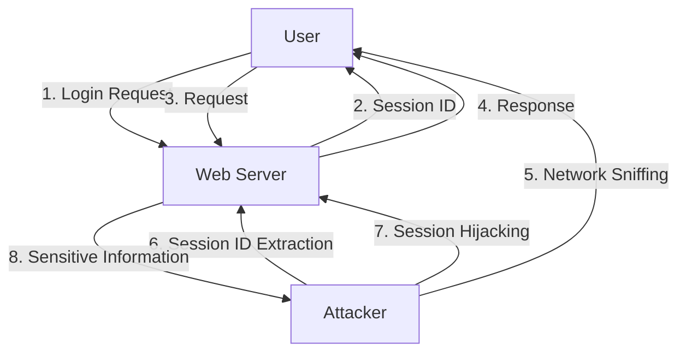

## Introduction
**Session Hijacking**, also known as **Sidejacking**, is a type of cyber attack where an attacker intercepts and takes control of an existing, valid user session, often on a public Wi-Fi network. This allows the attacker to access sensitive information, such as personal data, financial information, or confidential business data. Session Hijacking is a significant concern because it can be used to launch further attacks, such as identity theft, financial fraud, or malware distribution. Every engineer should understand Session Hijacking because it is a common attack vector that can be used to compromise even the most secure systems.

## Core Concepts
- **Session**: A temporary and interactive information exchange between two or more communicating devices (e.g., a user's web browser and a web server).
- **Session ID**: A unique identifier assigned to a user's session, used to authenticate and authorize the user.
- **Cookie**: A small text file stored on a user's device, containing data such as session IDs, authentication tokens, or other sensitive information.
- **Man-in-the-Middle (MitM) Attack**: An attack where an attacker intercepts and alters communication between two parties, often to steal sensitive information.

> **Note:** Session Hijacking is often used in conjunction with other attacks, such as phishing or malware distribution, to increase its effectiveness.

## How It Works Internally
Session Hijacking typically involves the following steps:
1. **Network Sniffing**: The attacker uses specialized software to capture and analyze network traffic on a public Wi-Fi network.
2. **Session ID Extraction**: The attacker extracts the session ID from the captured network traffic, often using techniques such as packet inspection or cookie theft.
3. **Session Hijacking**: The attacker uses the extracted session ID to take control of the user's session, often by sending a request to the web server with the stolen session ID.
4. **Session Fixation**: The attacker may also use session fixation techniques to fixate the user's session ID, making it easier to hijack the session.

> **Warning:** Public Wi-Fi networks are particularly vulnerable to Session Hijacking attacks because they often use unencrypted or poorly encrypted connections.

## Code Examples
### Example 1: Basic Session Hijacking
```python
import requests

# Simulate a user logging in to a web application
username = "user123"
password = "pass123"
session = requests.Session()
login_url = "https://example.com/login"
login_data = {"username": username, "password": password}
response = session.post(login_url, data=login_data)

# Extract the session ID from the response cookies
session_id = session.cookies.get("session_id")

# Simulate an attacker hijacking the user's session
attacker_session = requests.Session()
attacker_session.cookies.set("session_id", session_id)

# Use the hijacked session to access sensitive information
sensitive_url = "https://example.com/sensitive_data"
response = attacker_session.get(sensitive_url)
print(response.text)
```

### Example 2: Real-World Session Hijacking using Cookie Theft
```javascript
const express = require("express");
const app = express();

// Simulate a user logging in to a web application
app.post("/login", (req, res) => {
  const username = req.body.username;
  const password = req.body.password;
  // Authenticate the user and set the session ID cookie
  res.cookie("session_id", "1234567890");
  res.send("Logged in successfully");
});

// Simulate an attacker stealing the user's session ID cookie
app.get("/steal_cookie", (req, res) => {
  const cookie = req.cookies.session_id;
  // Send the stolen cookie to the attacker's server
  res.send(`Stolen cookie: ${cookie}`);
});
```

### Example 3: Advanced Session Hijacking using MitM Attack
```java
import java.net.*;
import java.io.*;

public class MitMAttack {
  public static void main(String[] args) throws Exception {
    // Set up a proxy server to intercept network traffic
    ServerSocket proxyServer = new ServerSocket(8080);
    Socket clientSocket = proxyServer.accept();

    // Intercept and modify the user's requests
    BufferedReader reader = new BufferedReader(new InputStreamReader(clientSocket.getInputStream()));
    String request = reader.readLine();
    // Modify the request to steal the user's session ID
    request = request.replace("GET / HTTP/1.1", "GET /steal_cookie HTTP/1.1");

    // Send the modified request to the web server
    Socket webServerSocket = new Socket("example.com", 80);
    PrintWriter writer = new PrintWriter(webServerSocket.getOutputStream(), true);
    writer.println(request);

    // Read the web server's response and send it back to the user
    BufferedReader webServerReader = new BufferedReader(new InputStreamReader(webServerSocket.getInputStream()));
    String response = webServerReader.readLine();
    writer.println(response);
  }
}
```

## Visual Diagram

This diagram illustrates the steps involved in a Session Hijacking attack, including the user's login request, the web server's response with the session ID, and the attacker's network sniffing and session hijacking.

> **Tip:** To prevent Session Hijacking attacks, use secure protocols such as HTTPS, and implement additional security measures such as session fixation protection and cookie encryption.

## Comparison
| Attack Vector | Time Complexity | Space Complexity | Pros | Cons | Best For |
| --- | --- | --- | --- | --- | --- |
| Session Hijacking | O(1) | O(1) | Easy to launch, high success rate | Limited to public Wi-Fi networks, requires network sniffing | Public Wi-Fi networks, web applications with weak session management |
| Phishing | O(n) | O(n) | Can be launched via email or social media, high success rate | Requires social engineering, can be detected by anti-phishing software | Email or social media platforms, web applications with weak authentication |
| Malware Distribution | O(n) | O(n) | Can be launched via drive-by downloads or exploit kits, high success rate | Requires malware development, can be detected by antivirus software | Web applications with vulnerabilities, drive-by download attacks |
| Man-in-the-Middle Attack | O(1) | O(1) | Can be launched via network sniffing or DNS spoofing, high success rate | Requires network access, can be detected by intrusion detection systems | Public Wi-Fi networks, web applications with weak encryption |

## Real-world Use Cases
1. **Starbucks**: In 2015, a Session Hijacking attack was launched against Starbucks customers using the company's public Wi-Fi network. The attack allowed hackers to steal sensitive information, including credit card numbers and login credentials.
2. **LinkedIn**: In 2012, LinkedIn suffered a Session Hijacking attack that allowed hackers to access sensitive information, including user emails and passwords.
3. **Facebook**: In 2013, Facebook suffered a Session Hijacking attack that allowed hackers to access sensitive information, including user emails and passwords.

> **Interview:** Can you explain the difference between Session Hijacking and Phishing? How would you prevent a Session Hijacking attack on a public Wi-Fi network?

## Common Pitfalls
1. **Weak Session Management**: Failing to implement secure session management practices, such as session fixation protection and cookie encryption, can make it easy for attackers to hijack user sessions.
2. **Unencrypted Connections**: Using unencrypted connections, such as HTTP, can make it easy for attackers to intercept and modify user requests.
3. **Poor Password Management**: Failing to implement strong password management practices, such as password hashing and salting, can make it easy for attackers to access sensitive information.
4. **Lack of Network Segmentation**: Failing to implement network segmentation, such as VLANs or subnets, can make it easy for attackers to move laterally within a network.

## Interview Tips
1. **What is Session Hijacking?**: A Session Hijacking attack is a type of cyber attack where an attacker intercepts and takes control of an existing, valid user session.
2. **How can you prevent Session Hijacking?**: To prevent Session Hijacking, use secure protocols such as HTTPS, implement additional security measures such as session fixation protection and cookie encryption, and use network segmentation to limit lateral movement.
3. **What is the difference between Session Hijacking and Phishing?**: Session Hijacking is a type of attack that involves intercepting and modifying user requests, while Phishing is a type of attack that involves tricking users into revealing sensitive information.

## Key Takeaways
* Session Hijacking is a type of cyber attack that involves intercepting and taking control of an existing, valid user session.
* Session Hijacking can be launched via network sniffing, cookie theft, or MitM attacks.
* To prevent Session Hijacking, use secure protocols such as HTTPS, implement additional security measures such as session fixation protection and cookie encryption, and use network segmentation to limit lateral movement.
* Session Hijacking can be used to launch further attacks, such as identity theft, financial fraud, or malware distribution.
* Session Hijacking is often used in conjunction with other attacks, such as phishing or malware distribution, to increase its effectiveness.
* The time complexity of a Session Hijacking attack is O(1), and the space complexity is O(1).
* The best way to prevent Session Hijacking is to use a combination of security measures, including secure protocols, additional security measures, and network segmentation.