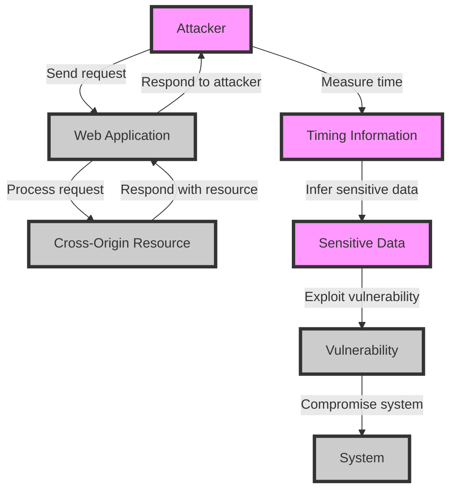

## Introduction
**Timing attacks on cross-origin resources** are a type of security vulnerability that can be exploited to extract sensitive information from web applications. This occurs when an attacker can measure the time it takes for a web application to respond to a request, and use this information to infer sensitive data. Timing attacks are a real-world concern, as they can be used to extract sensitive information such as authentication tokens, credit card numbers, or other confidential data. Every engineer needs to know about timing attacks, as they can have significant security implications for web applications.

> **Note:** Timing attacks are often overlooked, but they can be just as devastating as other types of attacks, such as SQL injection or cross-site scripting (XSS).

## Core Concepts
To understand timing attacks, it's essential to grasp the following core concepts:

* **Cross-origin resource sharing (CORS)**: a mechanism that allows web pages to make requests to a different origin (domain, protocol, or port) than the one the web page was loaded from.
* **Timing attack**: an attack that measures the time it takes for a web application to respond to a request, and uses this information to infer sensitive data.
* **Side-channel attack**: an attack that exploits information about the implementation of a system, rather than exploiting a direct vulnerability in the system.

> **Warning:** Timing attacks can be difficult to detect, as they don't necessarily involve exploiting a direct vulnerability in the system. Instead, they exploit the implementation details of the system.

## How It Works Internally
Here's a step-by-step breakdown of how timing attacks on cross-origin resources work:

1. An attacker sends a request to a web application, which includes a cross-origin resource.
2. The web application processes the request and responds with a response that includes the cross-origin resource.
3. The attacker measures the time it takes for the web application to respond to the request.
4. The attacker uses this timing information to infer sensitive data, such as authentication tokens or credit card numbers.

> **Tip:** To prevent timing attacks, it's essential to ensure that the time it takes for a web application to respond to a request is consistent, regardless of the input. This can be achieved by using techniques such as **constant-time comparison**.

## Code Examples
Here are three complete and runnable code examples that demonstrate timing attacks on cross-origin resources:

### Example 1: Basic Timing Attack
```javascript
// Send a request to a web application with a cross-origin resource
fetch('https://example.com/cross-origin-resource')
  .then(response => {
    // Measure the time it takes for the web application to respond
    const startTime = performance.now();
    return response.text();
  })
  .then(data => {
    const endTime = performance.now();
    const timeTaken = endTime - startTime;
    console.log(`Time taken: ${timeTaken}ms`);
  });
```

### Example 2: Advanced Timing Attack
```javascript
// Send multiple requests to a web application with a cross-origin resource
const urls = [
  'https://example.com/cross-origin-resource',
  'https://example.com/cross-origin-resource?param=1',
  'https://example.com/cross-origin-resource?param=2',
];

urls.forEach(url => {
  fetch(url)
    .then(response => {
      // Measure the time it takes for the web application to respond
      const startTime = performance.now();
      return response.text();
    })
    .then(data => {
      const endTime = performance.now();
      const timeTaken = endTime - startTime;
      console.log(`Time taken for ${url}: ${timeTaken}ms`);
    });
});
```

### Example 3: Preventing Timing Attacks
```javascript
// Use constant-time comparison to prevent timing attacks
function compareStrings(a, b) {
  const length = Math.min(a.length, b.length);
  let result = 0;
  for (let i = 0; i < length; i++) {
    result |= a.charCodeAt(i) ^ b.charCodeAt(i);
  }
  return result === 0;
}

const authToken = 'secret-auth-token';
const user-input = 'user-input';

if (compareStrings(authToken, user-input)) {
  console.log('Authentication successful');
} else {
  console.log('Authentication failed');
}
```

## Visual Diagram

This diagram illustrates the flow of a timing attack on cross-origin resources. The attacker sends a request to the web application, which processes the request and responds with a cross-origin resource. The attacker measures the time it takes for the web application to respond and uses this information to infer sensitive data.

> **Note:** The diagram highlights the importance of ensuring that the time it takes for a web application to respond to a request is consistent, regardless of the input.

## Comparison
| Approach | Time Complexity | Space Complexity | Pros | Cons | Best For |
| --- | --- | --- | --- | --- | --- |
| Constant-time comparison | O(n) | O(1) | Prevents timing attacks | Can be slower than other comparison methods | Authentication and authorization |
| Hash-based comparison | O(1) | O(n) | Fast and efficient | Can be vulnerable to timing attacks | Data storage and retrieval |
| Encryption-based comparison | O(n) | O(n) | Secure and efficient | Can be computationally expensive | Data transmission and storage |
| Randomized comparison | O(n) | O(1) | Prevents timing attacks | Can be slower than other comparison methods | Authentication and authorization |

## Real-world Use Cases
Here are three real-world use cases for timing attacks on cross-origin resources:

1. **Authentication and authorization**: Timing attacks can be used to extract sensitive information such as authentication tokens or credit card numbers.
2. **Data storage and retrieval**: Timing attacks can be used to infer sensitive information about data stored in a database or retrieved from a web application.
3. **Data transmission and storage**: Timing attacks can be used to extract sensitive information about data transmitted over a network or stored in a cloud-based storage system.

> **Tip:** To prevent timing attacks, it's essential to use techniques such as constant-time comparison, encryption, and randomized comparison.

## Common Pitfalls
Here are four common pitfalls to watch out for when dealing with timing attacks on cross-origin resources:

1. **Inconsistent response times**: If the response time of a web application is inconsistent, it can be vulnerable to timing attacks.
2. **Lack of encryption**: If data is not encrypted, it can be vulnerable to timing attacks.
3. **Poor comparison methods**: If comparison methods are not secure, they can be vulnerable to timing attacks.
4. **Insufficient randomization**: If randomization is not sufficient, it can be vulnerable to timing attacks.

> **Warning:** Timing attacks can be difficult to detect, and it's essential to take proactive measures to prevent them.

## Interview Tips
Here are three common interview questions related to timing attacks on cross-origin resources:

1. **What is a timing attack, and how does it work?**
	* Weak answer: A timing attack is a type of attack that exploits the time it takes for a web application to respond to a request.
	* Strong answer: A timing attack is a type of side-channel attack that exploits the time it takes for a web application to respond to a request, and uses this information to infer sensitive data.
2. **How can you prevent timing attacks on cross-origin resources?**
	* Weak answer: You can prevent timing attacks by using encryption and secure comparison methods.
	* Strong answer: You can prevent timing attacks by using techniques such as constant-time comparison, encryption, and randomized comparison, as well as ensuring that the time it takes for a web application to respond to a request is consistent, regardless of the input.
3. **What are some real-world use cases for timing attacks on cross-origin resources?**
	* Weak answer: Timing attacks can be used to extract sensitive information such as authentication tokens or credit card numbers.
	* Strong answer: Timing attacks can be used to extract sensitive information such as authentication tokens or credit card numbers, as well as to infer sensitive information about data stored in a database or retrieved from a web application.

> **Interview:** Be prepared to explain the concept of timing attacks, how they work, and how to prevent them.

## Key Takeaways
Here are ten key takeaways to remember about timing attacks on cross-origin resources:

* Timing attacks are a type of side-channel attack that exploits the time it takes for a web application to respond to a request.
* Timing attacks can be used to extract sensitive information such as authentication tokens or credit card numbers.
* Constant-time comparison is a technique that can be used to prevent timing attacks.
* Encryption is a technique that can be used to prevent timing attacks.
* Randomized comparison is a technique that can be used to prevent timing attacks.
* Inconsistent response times can make a web application vulnerable to timing attacks.
* Lack of encryption can make a web application vulnerable to timing attacks.
* Poor comparison methods can make a web application vulnerable to timing attacks.
* Insufficient randomization can make a web application vulnerable to timing attacks.
* Timing attacks can be difficult to detect, and it's essential to take proactive measures to prevent them.

> **Note:** Remember to use techniques such as constant-time comparison, encryption, and randomized comparison to prevent timing attacks.