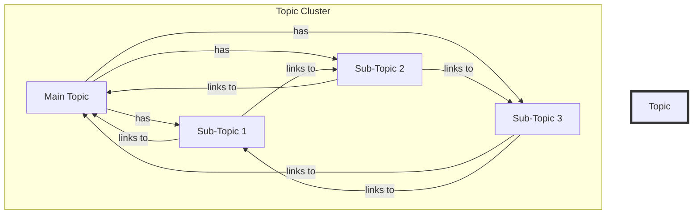

## Introduction
**Topic Clusters and Pillar Content Architecture Strategy** is a content marketing approach that involves creating a series of interconnected articles, guides, and resources centered around a specific topic or theme. This strategy is designed to help businesses and organizations establish themselves as authorities in their industry, improve their search engine optimization (SEO), and provide value to their target audience. In this section, we will explore the concept of topic clusters and pillar content architecture, its importance, and real-world relevance.

> **Note:** The topic cluster model is a strategic approach to content creation that helps businesses to create a comprehensive and cohesive content strategy.

Topic clusters and pillar content architecture strategy is essential for businesses that want to establish a strong online presence, improve their SEO, and provide value to their target audience. This approach helps businesses to create a comprehensive and cohesive content strategy that addresses the needs and concerns of their target audience.

## Core Concepts
To understand the topic cluster and pillar content architecture strategy, it's essential to familiarize yourself with the following core concepts:

* **Topic Cluster:** A topic cluster is a group of related articles, guides, and resources centered around a specific topic or theme.
* **Pillar Content:** Pillar content refers to the central, comprehensive resource that provides in-depth information on a specific topic or theme.
* **Sub-Topics:** Sub-topics are related topics that are connected to the main topic or theme.
* **Internal Linking:** Internal linking refers to the process of linking between different articles, guides, and resources within a topic cluster.

> **Tip:** When creating a topic cluster, it's essential to identify the main topic or theme and then break it down into sub-topics and related topics.

## How It Works Internally
The topic cluster and pillar content architecture strategy works by creating a series of interconnected articles, guides, and resources centered around a specific topic or theme. Here's a step-by-step breakdown of how it works:

1. **Identify the Main Topic:** Identify the main topic or theme that you want to create a topic cluster around.
2. **Research Sub-Topics:** Research sub-topics and related topics that are connected to the main topic or theme.
3. **Create Pillar Content:** Create a comprehensive and in-depth pillar content that provides information on the main topic or theme.
4. **Create Sub-Topic Content:** Create sub-topic content that provides information on the sub-topics and related topics.
5. **Internal Linking:** Link between different articles, guides, and resources within the topic cluster.

> **Warning:** One of the common mistakes businesses make when creating a topic cluster is not providing enough value to their target audience. It's essential to create comprehensive and in-depth content that addresses the needs and concerns of your target audience.

## Code Examples
Here are three code examples that demonstrate how to create a topic cluster and pillar content architecture strategy:

### Example 1: Basic Topic Cluster
```python
# Define the main topic
main_topic = "Topic Clusters and Pillar Content Architecture Strategy"

# Define sub-topics
sub_topics = [
    "Introduction to Topic Clusters",
    "Creating a Pillar Content",
    "Internal Linking and SEO"
]

# Create a topic cluster
topic_cluster = {
    "main_topic": main_topic,
    "sub_topics": sub_topics
}

print(topic_cluster)
```

### Example 2: Advanced Topic Cluster with Sub-Topic Content
```javascript
// Define the main topic
const mainTopic = "Topic Clusters and Pillar Content Architecture Strategy";

// Define sub-topics and related topics
const subTopics = [
    {
        "topic": "Introduction to Topic Clusters",
        "content": "This is an introduction to topic clusters and pillar content architecture strategy."
    },
    {
        "topic": "Creating a Pillar Content",
        "content": "This is a guide on how to create a comprehensive and in-depth pillar content."
    },
    {
        "topic": "Internal Linking and SEO",
        "content": "This is a guide on how to optimize your topic cluster for SEO using internal linking."
    }
];

// Create a topic cluster
const topicCluster = {
    "mainTopic": mainTopic,
    "subTopics": subTopics
};

console.log(topicCluster);
```

### Example 3: Topic Cluster with Internal Linking
```java
// Define the main topic
String mainTopic = "Topic Clusters and Pillar Content Architecture Strategy";

// Define sub-topics and related topics
List<String> subTopics = new ArrayList<>();
subTopics.add("Introduction to Topic Clusters");
subTopics.add("Creating a Pillar Content");
subTopics.add("Internal Linking and SEO");

// Create a topic cluster
Map<String, List<String>> topicCluster = new HashMap<>();
topicCluster.put(mainTopic, subTopics);

// Internal linking
for (String subTopic : subTopics) {
    System.out.println("Link to " + subTopic + ": " + mainTopic + "/" + subTopic);
}
```

## Visual Diagram

The diagram above illustrates a topic cluster with internal linking. The main topic has sub-topics, and each sub-topic links to the main topic and other sub-topics.

> **Interview:** In an interview, you may be asked to explain the concept of topic clusters and pillar content architecture strategy. Be prepared to provide a comprehensive and in-depth explanation of this approach and how it can be used to improve SEO and provide value to the target audience.

## Comparison
| Approach | Time Complexity | Space Complexity | Pros | Cons | Best For |
|----------|----------------|-----------------|------|------|----------|
| Topic Clusters | O(n) | O(n) | Improves SEO, provides value to target audience | Requires comprehensive and in-depth content | Businesses and organizations with a strong online presence |
| Pillar Content | O(1) | O(1) | Provides comprehensive and in-depth information | May not be suitable for all topics or themes | Businesses and organizations with a specific topic or theme |
| Internal Linking | O(n) | O(n) | Improves SEO, reduces bounce rate | May not be suitable for all types of content | Businesses and organizations with a large content library |
| Sub-Topic Content | O(n) | O(n) | Provides additional information and context | May not be suitable for all topics or themes | Businesses and organizations with a specific topic or theme |

## Real-world Use Cases
Here are three real-world use cases of topic clusters and pillar content architecture strategy:

1. **HubSpot:** HubSpot uses a topic cluster approach to create comprehensive and in-depth content on marketing, sales, and customer service.
2. **Moz:** Moz uses a topic cluster approach to create comprehensive and in-depth content on SEO, inbound marketing, and content marketing.
3. **Ahrefs:** Ahrefs uses a topic cluster approach to create comprehensive and in-depth content on SEO, digital marketing, and content marketing.

> **Tip:** When creating a topic cluster, it's essential to identify the main topic or theme and then break it down into sub-topics and related topics.

## Common Pitfalls
Here are four common pitfalls to avoid when creating a topic cluster and pillar content architecture strategy:

1. **Lack of Comprehensive and In-Depth Content:** One of the common mistakes businesses make when creating a topic cluster is not providing enough value to their target audience.
2. **Poor Internal Linking:** Poor internal linking can lead to a high bounce rate and reduced SEO.
3. **Insufficient Sub-Topic Content:** Insufficient sub-topic content can lead to a lack of additional information and context.
4. **Inconsistent Content Quality:** Inconsistent content quality can lead to a lack of trust and credibility with the target audience.

> **Warning:** One of the common mistakes businesses make when creating a topic cluster is not providing enough value to their target audience. It's essential to create comprehensive and in-depth content that addresses the needs and concerns of your target audience.

## Interview Tips
Here are three common interview questions on topic clusters and pillar content architecture strategy:

1. **What is a topic cluster, and how does it work?**
	* Weak answer: "A topic cluster is a group of articles, guides, and resources centered around a specific topic or theme."
	* Strong answer: "A topic cluster is a strategic approach to content creation that involves creating a comprehensive and cohesive content strategy centered around a specific topic or theme. It works by creating a series of interconnected articles, guides, and resources that provide value to the target audience and improve SEO."
2. **How do you create a pillar content?**
	* Weak answer: "I create a pillar content by writing a comprehensive and in-depth article on a specific topic or theme."
	* Strong answer: "I create a pillar content by researching the topic or theme, identifying the target audience, and creating a comprehensive and in-depth resource that provides value to the target audience. I also ensure that the pillar content is optimized for SEO and provides a clear call-to-action."
3. **What is the importance of internal linking in a topic cluster?**
	* Weak answer: "Internal linking is important because it helps to improve SEO."
	* Strong answer: "Internal linking is important because it helps to improve SEO, reduce bounce rate, and provide additional information and context to the target audience. It also helps to create a comprehensive and cohesive content strategy that addresses the needs and concerns of the target audience."

## Key Takeaways
Here are ten key takeaways from this article:

* **Topic clusters and pillar content architecture strategy** is a strategic approach to content creation that involves creating a comprehensive and cohesive content strategy centered around a specific topic or theme.
* **Pillar content** provides comprehensive and in-depth information on a specific topic or theme.
* **Internal linking** is essential for improving SEO, reducing bounce rate, and providing additional information and context to the target audience.
* **Sub-topic content** provides additional information and context to the target audience.
* **Comprehensive and in-depth content** is essential for providing value to the target audience and improving SEO.
* **Poor internal linking** can lead to a high bounce rate and reduced SEO.
* **Insufficient sub-topic content** can lead to a lack of additional information and context.
* **Inconsistent content quality** can lead to a lack of trust and credibility with the target audience.
* **Topic clusters and pillar content architecture strategy** is suitable for businesses and organizations with a strong online presence.
* **Internal linking and sub-topic content** are essential for creating a comprehensive and cohesive content strategy that addresses the needs and concerns of the target audience.