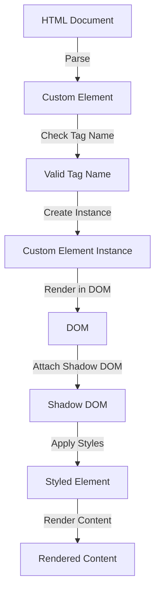

## Introduction
The **Custom Elements** naming convention is a crucial aspect of web development, particularly when working with **Web Components**. It requires that custom element names contain a hyphen (-) to differentiate them from standard HTML elements. This convention is essential for ensuring that custom elements are properly recognized and parsed by web browsers. In real-world applications, custom elements are used to create reusable, modular components that can be easily integrated into web pages. Understanding the custom elements naming convention is vital for any web developer, as it enables them to create custom components that are compatible with various browsers and frameworks.

## Core Concepts
The custom elements naming convention is based on the **Web Components** specification, which provides a set of APIs for creating custom, reusable HTML elements. The key terminology associated with custom elements includes:
* **Custom Element**: A custom, reusable HTML element that is defined using the `customElements` API.
* **Tag Name**: The name of a custom element, which must contain a hyphen (-) to be valid.
* **HTML Element**: A standard HTML element, such as `div` or `span`, which does not contain a hyphen (-) in its name.
A mental model for understanding custom elements is to think of them as ** Lego blocks**, where each custom element is a self-contained block that can be easily combined with other blocks to create complex structures.

## How It Works Internally
When a web browser encounters a custom element in an HTML document, it uses the `customElements` API to determine whether the element is valid and should be rendered. The `customElements` API checks the tag name of the element to ensure that it contains a hyphen (-). If the tag name is valid, the browser creates a new instance of the custom element and renders it in the DOM. The step-by-step process for rendering a custom element is as follows:
1. The browser parses the HTML document and encounters a custom element.
2. The browser checks the tag name of the custom element to ensure that it contains a hyphen (-).
3. If the tag name is valid, the browser creates a new instance of the custom element.
4. The browser renders the custom element in the DOM.
> **Tip:** To ensure that your custom elements are properly recognized by web browsers, always include a hyphen (-) in the tag name.

## Code Examples
### Example 1: Basic Custom Element
```javascript
// Define a basic custom element
class MyElement extends HTMLElement {
  constructor() {
    super();
    this.textContent = 'Hello, World!';
  }
}

// Register the custom element
customElements.define('my-element', MyElement);
```
```html
<!-- Use the custom element in an HTML document -->
<my-element></my-element>
```
### Example 2: Custom Element with Attributes
```javascript
// Define a custom element with attributes
class MyElement extends HTMLElement {
  constructor() {
    super();
    this.textContent = 'Hello, World!';
  }

  static get observedAttributes() {
    return ['name', 'age'];
  }

  attributeChangedCallback(name, oldValue, newValue) {
    if (name === 'name') {
      this.textContent = `Hello, ${newValue}!`;
    } else if (name === 'age') {
      this.textContent = `You are ${newValue} years old!`;
    }
  }
}

// Register the custom element
customElements.define('my-element', MyElement);
```
```html
<!-- Use the custom element with attributes in an HTML document -->
<my-element name="John" age="30"></my-element>
```
### Example 3: Custom Element with Shadow DOM
```javascript
// Define a custom element with shadow DOM
class MyElement extends HTMLElement {
  constructor() {
    super();
    const shadow = this.attachShadow({ mode: 'open' });
    const style = document.createElement('style');
    style.textContent = 'h1 { color: blue; }';
    const h1 = document.createElement('h1');
    h1.textContent = 'Hello, World!';
    shadow.appendChild(style);
    shadow.appendChild(h1);
  }
}

// Register the custom element
customElements.define('my-element', MyElement);
```
```html
<!-- Use the custom element with shadow DOM in an HTML document -->
<my-element></my-element>
```
> **Note:** The `attachShadow` method is used to create a shadow DOM for the custom element, which provides a way to encapsulate the element's content and styles.

## Visual Diagram

The diagram illustrates the process of rendering a custom element, from parsing the HTML document to rendering the styled content.

## Comparison
| Approach | Time Complexity | Space Complexity | Pros | Cons | Best For |
| --- | --- | --- | --- | --- | --- |
| Custom Elements | O(1) | O(1) | Reusable, modular components | Steep learning curve | Complex web applications |
| Web Components | O(1) | O(1) | Encapsulated, reusable components | Browser compatibility issues | Web applications with custom components |
| Vanilla JavaScript | O(n) | O(n) | Lightweight, easy to implement | Limited functionality | Simple web applications |
| Frameworks (e.g. React) | O(n) | O(n) | High-level abstractions, easy to use | Steep learning curve, overhead | Complex web applications |

## Real-world Use Cases
1. **Google's Polymer Library**: Google's Polymer library provides a set of pre-built custom elements for creating web applications.
2. **Microsoft's Fluent UI**: Microsoft's Fluent UI framework uses custom elements to provide a set of reusable, modular components for building web applications.
3. **Salesforce's Lightning Web Components**: Salesforce's Lightning Web Components framework uses custom elements to provide a set of reusable, modular components for building web applications.

## Common Pitfalls
1. **Invalid Tag Name**: Using a tag name without a hyphen (-) can result in the custom element not being recognized by web browsers.
```javascript
// Invalid tag name
class MyElement extends HTMLElement {
  constructor() {
    super();
  }
}

customElements.define('myelement', MyElement); // Invalid tag name
```
```javascript
// Valid tag name
class MyElement extends HTMLElement {
  constructor() {
    super();
  }
}

customElements.define('my-element', MyElement); // Valid tag name
```
2. **Missing `customElements` API**: Failing to use the `customElements` API to define and register custom elements can result in the elements not being recognized by web browsers.
```javascript
// Missing customElements API
class MyElement extends HTMLElement {
  constructor() {
    super();
  }
}

// Register the custom element without using customElements API
document.registerElement('my-element', MyElement); // Invalid registration
```
```javascript
// Using customElements API
class MyElement extends HTMLElement {
  constructor() {
    super();
  }
}

// Register the custom element using customElements API
customElements.define('my-element', MyElement); // Valid registration
```
> **Warning:** Always use the `customElements` API to define and register custom elements.

## Interview Tips
1. **What is the purpose of the `customElements` API?**: The `customElements` API provides a way to define and register custom elements, allowing developers to create reusable, modular components.
2. **How do you define a custom element?**: To define a custom element, you need to create a class that extends the `HTMLElement` class and define the element's properties and methods.
3. **What is the importance of the hyphen (-) in custom element tag names?**: The hyphen (-) is required in custom element tag names to differentiate them from standard HTML elements.

## Key Takeaways
* Custom elements must contain a hyphen (-) in their tag name to be valid.
* The `customElements` API provides a way to define and register custom elements.
* Custom elements can be used to create reusable, modular components for web applications.
* The `attachShadow` method can be used to create a shadow DOM for custom elements.
* Custom elements can be used with frameworks such as React and Angular.
* The time complexity of rendering a custom element is O(1), and the space complexity is O(1).
> **Interview:** Be prepared to explain the importance of the hyphen (-) in custom element tag names and how to define and register custom elements using the `customElements` API.