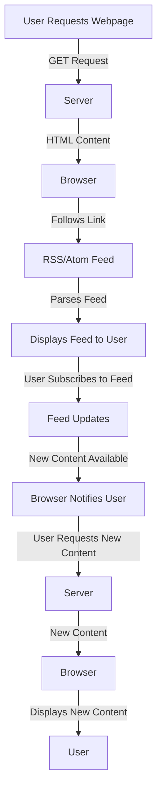

## Introduction
The `rel="alternate"` link relation is a crucial aspect of web development, particularly when it comes to providing alternative representations of a webpage or resource. In the context of RSS/Atom feeds, this link relation plays a vital role in allowing users to subscribe to a feed and receive updates on new content. In this section, we will explore the importance of `rel="alternate"` and its real-world relevance.

The `rel="alternate"` link relation is used to specify an alternative representation of a webpage or resource. This can include different formats, such as RSS or Atom feeds, or even different languages. By providing a link to an alternative representation, web developers can enable users to access the same content in a different format, making it more accessible and user-friendly.

> **Note:** The `rel="alternate"` link relation is not limited to RSS/Atom feeds and can be used in various other contexts, such as providing alternative languages or formats for a webpage.

## Core Concepts
To understand the `rel="alternate"` link relation, it's essential to grasp some key concepts:

* **Link relations**: A link relation is a way to describe the relationship between two resources. In the case of `rel="alternate"`, the relationship is that the linked resource is an alternative representation of the current resource.
* **RSS/Atom feeds**: RSS (Really Simple Syndication) and Atom are two popular formats for syndicating content, such as blog posts or news articles. These feeds allow users to subscribe to a feed and receive updates on new content.
* **Alternative representations**: An alternative representation is a different format or version of a resource. This can include different languages, formats, or even different devices (e.g., mobile vs. desktop).

> **Tip:** When using the `rel="alternate"` link relation, it's essential to ensure that the linked resource is indeed an alternative representation of the current resource.

## How It Works Internally
When a user requests a webpage, the server returns the HTML content, which includes the `rel="alternate"` link relation. The browser then follows this link to retrieve the alternative representation of the resource, which in this case is the RSS/Atom feed.

Here's a step-by-step breakdown of how it works:

1. The user requests a webpage.
2. The server returns the HTML content, which includes the `rel="alternate"` link relation.
3. The browser follows the link to retrieve the alternative representation of the resource (RSS/Atom feed).
4. The browser parses the feed and displays it to the user.

> **Warning:** If the linked resource is not a valid alternative representation of the current resource, it can lead to confusion and errors.

## Code Examples
### Example 1: Basic Usage
```html
<head>
  <link rel="alternate" type="application/rss+xml" title="RSS Feed" href="https://example.com/feed">
</head>
```
This example demonstrates the basic usage of the `rel="alternate"` link relation to specify an RSS feed as an alternative representation of the webpage.

### Example 2: Real-World Pattern
```html
<head>
  <link rel="alternate" type="application/atom+xml" title="Atom Feed" href="https://example.com/atom">
  <link rel="alternate" type="application/rss+xml" title="RSS Feed" href="https://example.com/rss">
</head>
```
This example shows how to use the `rel="alternate"` link relation to specify both Atom and RSS feeds as alternative representations of the webpage.

### Example 3: Advanced Usage
```html
<head>
  <link rel="alternate" type="application/json" title="JSON Feed" href="https://example.com/json">
  <link rel="alternate" type="application/xml" title="XML Feed" href="https://example.com/xml">
</head>
```
This example demonstrates how to use the `rel="alternate"` link relation to specify alternative representations of the webpage in JSON and XML formats.

## Visual Diagram

This diagram illustrates the flow of events when a user requests a webpage and follows the `rel="alternate"` link to retrieve the RSS/Atom feed.

> **Note:** The diagram shows the basic flow of events, but in reality, there may be additional steps or complexities involved.

## Comparison
| Approach | Time Complexity | Space Complexity | Pros | Cons | Best For |
| --- | --- | --- | --- | --- | --- |
| RSS Feed | O(1) | O(n) | Easy to implement, widely supported | Limited functionality, not extensible | Simple blogging platforms |
| Atom Feed | O(1) | O(n) | More extensible than RSS, supports metadata | Less widely supported than RSS | More complex blogging platforms |
| JSON Feed | O(1) | O(n) | Easy to parse, flexible data structure | Not as widely supported as RSS/Atom | Modern web applications |
| XML Feed | O(1) | O(n) | Flexible data structure, supports metadata | Verbose, not as easy to parse as JSON | Legacy systems or complex data structures |

> **Tip:** When choosing an approach, consider the trade-offs between time complexity, space complexity, and the specific requirements of your use case.

## Real-world Use Cases
* **Google News**: Google News uses the `rel="alternate"` link relation to provide an RSS feed of news articles.
* **The New York Times**: The New York Times uses the `rel="alternate"` link relation to provide an Atom feed of news articles.
* **GitHub**: GitHub uses the `rel="alternate"` link relation to provide an Atom feed of repository updates.

> **Interview:** Can you explain how the `rel="alternate"` link relation is used in real-world scenarios, such as providing RSS/Atom feeds?

## Common Pitfalls
* **Incorrect link relation**: Using the wrong link relation, such as `rel="stylesheet"` instead of `rel="alternate"`.
* **Invalid feed format**: Providing an invalid or malformed feed format, such as an RSS feed with incorrect syntax.
* **Missing feed metadata**: Failing to provide essential metadata, such as the feed title or description.
* **Incorrect feed URL**: Providing an incorrect or non-functional feed URL.

> **Warning:** Failing to provide a valid and functional feed can lead to errors and a poor user experience.

## Interview Tips
* **What is the purpose of the `rel="alternate"` link relation?**: The purpose of the `rel="alternate"` link relation is to specify an alternative representation of a webpage or resource.
* **How does the `rel="alternate"` link relation work?**: The `rel="alternate"` link relation works by providing a link to an alternative representation of the webpage or resource, which the browser can follow to retrieve the alternative content.
* **What are some common use cases for the `rel="alternate"` link relation?**: Common use cases include providing RSS/Atom feeds, alternative languages, or formats for a webpage.

> **Tip:** When answering interview questions, be sure to provide specific examples and explanations to demonstrate your understanding of the topic.

## Key Takeaways
* The `rel="alternate"` link relation is used to specify an alternative representation of a webpage or resource.
* The `rel="alternate"` link relation is essential for providing RSS/Atom feeds and other alternative content.
* The `rel="alternate"` link relation must be used correctly, with the correct link relation and a valid feed format.
* The `rel="alternate"` link relation has various use cases, including providing alternative languages, formats, or devices.
* The `rel="alternate"` link relation is widely supported by browsers and feed readers.
* The `rel="alternate"` link relation has a time complexity of O(1) and a space complexity of O(n).
* The `rel="alternate"` link relation is a crucial aspect of web development and should be understood by all web developers.