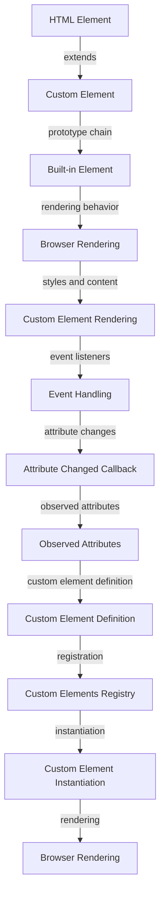

## Introduction
The `is` attribute is a powerful feature in HTML that allows developers to create **customized built-in elements**. It enables extending the functionality of existing HTML elements while maintaining their standard behavior. This feature is part of the **Web Components** specification, which aims to provide a set of APIs for creating custom, reusable, and encapsulated HTML tags. In this section, we will explore the importance of the `is` attribute, its real-world relevance, and why every web developer should understand how to use it.

The `is` attribute is crucial for creating **custom elements** that inherit the behavior of built-in elements. For instance, you can create a custom `button` element that extends the standard `button` element, adding new features while preserving its default behavior. This approach promotes code reuse, simplifies development, and enhances the overall user experience.

> **Note:** The `is` attribute is supported by most modern browsers, including Google Chrome, Mozilla Firefox, and Microsoft Edge. However, it's essential to check the compatibility of this feature before using it in production environments.

## Core Concepts
To work with the `is` attribute, you need to understand the following core concepts:

* **Custom elements**: These are new, user-defined HTML elements that can be created using the `customElements` API.
* **Built-in elements**: These are standard HTML elements, such as `button`, `input`, or `div`, which have predefined behavior and attributes.
* **Extension**: The process of creating a custom element that inherits the behavior of a built-in element using the `is` attribute.
* **Shadow DOM**: A separate DOM tree that can be attached to a custom element, allowing for encapsulation and styling.

> **Warning:** When creating custom elements, it's essential to follow the Web Components guidelines to ensure compatibility and avoid conflicts with existing elements.

## How It Works Internally
When you use the `is` attribute to extend a built-in element, the browser creates a new instance of the custom element and sets its `prototype` to the built-in element's `prototype`. This process is called **prototype chain extension**.

Here's a step-by-step breakdown of how it works:

1. The browser encounters an HTML element with the `is` attribute, such as `<button is="my-button">`.
2. The browser checks if a custom element with the name `my-button` is registered using the `customElements` API.
3. If the custom element is registered, the browser creates a new instance of the custom element and sets its `prototype` to the `prototype` of the built-in `button` element.
4. The browser applies the custom element's constructor and attributes to the new instance.
5. The browser renders the custom element, using the built-in element's rendering behavior and the custom element's styles and content.

> **Tip:** To optimize the performance of custom elements, use the `customElements` API to register your elements and avoid using the `is` attribute excessively.

## Code Examples
### Example 1: Basic Usage
```html
<!-- Register the custom element -->
<script>
  class MyButton extends HTMLButtonElement {
    constructor() {
      super();
      this.textContent = 'Click me!';
    }
  }
  customElements.define('my-button', MyButton, { extends: 'button' });
</script>

<!-- Use the custom element -->
<button is="my-button">Click me!</button>
```
### Example 2: Real-World Pattern
```javascript
// my-button.js
class MyButton extends HTMLButtonElement {
  constructor() {
    super();
    this.textContent = 'Click me!';
    this.addEventListener('click', () => {
      alert('Button clicked!');
    });
  }
}
customElements.define('my-button', MyButton, { extends: 'button' });
```

```html
<!-- index.html -->
<script src="my-button.js" defer></script>
<button is="my-button">Click me!</button>
```
### Example 3: Advanced Usage
```javascript
// my-button.js
class MyButton extends HTMLButtonElement {
  constructor() {
    super();
    this.textContent = 'Click me!';
    this.addEventListener('click', () => {
      alert('Button clicked!');
    });
  }
  static get observedAttributes() {
    return ['disabled'];
  }
  attributeChangedCallback(name, oldValue, newValue) {
    if (name === 'disabled') {
      this.disabled = newValue === 'true';
    }
  }
}
customElements.define('my-button', MyButton, { extends: 'button' });
```

```html
<!-- index.html -->
<script src="my-button.js" defer></script>
<button is="my-button" disabled>Click me!</button>
```
> **Interview:** Can you explain the difference between a custom element and a built-in element? How do you extend a built-in element using the `is` attribute?

## Visual Diagram

The diagram illustrates the process of extending a built-in element using the `is` attribute, from registration to rendering.

## Comparison
| Approach | Time Complexity | Space Complexity | Pros | Cons | Best For |
| --- | --- | --- | --- | --- | --- |
| Custom Elements | O(1) | O(n) | Flexible, reusable, and encapsulated | Steep learning curve, compatibility issues | Complex, reusable UI components |
| Web Components | O(1) | O(n) | Standardized, modular, and efficient | Limited browser support, complexity | Large-scale, modular web applications |
| Polymer | O(1) | O(n) | Simplified, efficient, and easy to use | Limited flexibility, compatibility issues | Simple, reusable UI components |
| React | O(1) | O(n) | Flexible, efficient, and popular | Steep learning curve, complexity | Complex, data-driven web applications |

## Real-world Use Cases
1. **Google's Material Design**: Google uses custom elements to create reusable, modular UI components for their Material Design framework.
2. **Microsoft's Fluent Design**: Microsoft uses custom elements to create reusable, modular UI components for their Fluent Design framework.
3. **Pinterest's Web Components**: Pinterest uses custom elements to create reusable, modular UI components for their web application.

> **Tip:** When creating custom elements, consider using a library or framework like Polymer or React to simplify the development process and improve performance.

## Common Pitfalls
1. **Incorrect registration**: Forgetting to register the custom element using the `customElements` API.
```javascript
// Wrong
class MyButton extends HTMLButtonElement {}
```
```javascript
// Right
class MyButton extends HTMLButtonElement {}
customElements.define('my-button', MyButton, { extends: 'button' });
```
2. **Inconsistent naming**: Using inconsistent naming conventions for custom elements.
```javascript
// Wrong
class myButton extends HTMLButtonElement {}
```
```javascript
// Right
class MyButton extends HTMLButtonElement {}
```
3. **Insufficient testing**: Failing to test custom elements thoroughly, leading to compatibility issues.
```javascript
// Wrong
class MyButton extends HTMLButtonElement {}
```
```javascript
// Right
class MyButton extends HTMLButtonElement {}
// Test the custom element
const button = document.createElement('button', { is: 'my-button' });
```
4. **Overusing the `is` attribute**: Excessively using the `is` attribute, leading to performance issues and complexity.
```javascript
// Wrong
<button is="my-button" is="another-button">Click me!</button>
```
```javascript
// Right
<button is="my-button">Click me!</button>
```
> **Warning:** Avoid using the `is` attribute excessively, as it can lead to performance issues and complexity.

## Interview Tips
1. **What is the difference between a custom element and a built-in element?**: A custom element is a user-defined HTML element, while a built-in element is a standard HTML element.
2. **How do you extend a built-in element using the `is` attribute?**: You can extend a built-in element by creating a custom element that inherits the behavior of the built-in element using the `is` attribute.
3. **What is the purpose of the `customElements` API?**: The `customElements` API is used to register and define custom elements.

> **Interview:** Can you explain the benefits and drawbacks of using custom elements in web development? How do you decide when to use a custom element versus a built-in element?

## Key Takeaways
* The `is` attribute is used to extend built-in elements and create custom elements.
* Custom elements are reusable, modular, and encapsulated.
* The `customElements` API is used to register and define custom elements.
* Prototype chain extension is used to inherit the behavior of built-in elements.
* Shadow DOM is used to encapsulate and style custom elements.
* Custom elements can be used to create complex, reusable UI components.
* The `is` attribute should be used judiciously to avoid performance issues and complexity.
* Testing and debugging custom elements is crucial to ensure compatibility and correctness.
* Custom elements can be used in conjunction with other web development technologies, such as React and Angular.