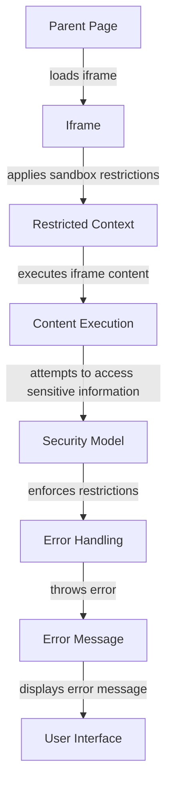

## Introduction
The sandbox attribute is a powerful tool in HTML that allows developers to restrict the functionality of iframes, preventing malicious scripts from executing and protecting users' sensitive information. By setting the sandbox attribute, developers can define the level of access an iframe has to the parent page, controlling what actions it can perform. This attribute is crucial in situations where an iframe is used to display content from an untrusted source, such as a third-party advertisement or a user-generated content platform.

> **Note:** The sandbox attribute is not a substitute for proper input validation and sanitization. It should be used in conjunction with other security measures to ensure the security of your web application.

In real-world scenarios, the sandbox attribute is commonly used in online platforms that allow users to embed content from other sources, such as social media platforms, online forums, or blogs. For example, when a user embeds a YouTube video on their blog, the video is loaded inside an iframe with restricted permissions to prevent any malicious scripts from executing.

## Core Concepts
The sandbox attribute supports several restrictions, including:

* `allow-scripts`: Allows the iframe to execute scripts.
* `allow-forms`: Allows the iframe to submit forms.
* `allow-pointer-lock`: Allows the iframe to lock the pointer.
* `allow-popups`: Allows the iframe to open popups.
* `allow-same-origin`: Allows the iframe to access the parent page's origin.

These restrictions can be combined to define the level of access an iframe has to the parent page.

> **Warning:** Failing to set the sandbox attribute or setting it incorrectly can lead to security vulnerabilities, such as cross-site scripting (XSS) attacks.

## How It Works Internally
When an iframe is loaded with the sandbox attribute, the browser applies the specified restrictions to the iframe's context. The restrictions are enforced by the browser's security model, which ensures that the iframe's content is isolated from the parent page's content.

Here's a step-by-step breakdown of how the sandbox attribute works internally:

1. The browser loads the iframe's content and applies the specified restrictions.
2. The iframe's content is executed in a separate context, isolated from the parent page's context.
3. The browser enforces the restrictions, preventing the iframe's content from accessing sensitive information or performing restricted actions.
4. If the iframe's content attempts to perform a restricted action, the browser blocks the action and throws an error.

## Code Examples
### Example 1: Basic Usage
```html
<iframe src="https://example.com" sandbox="allow-scripts allow-forms"></iframe>
```
This example demonstrates how to set the sandbox attribute to allow scripts and forms.

### Example 2: Real-World Pattern
```html
<iframe src="https://www.youtube.com/embed/VIDEO_ID" 
        sandbox="allow-scripts allow-forms allow-pointer-lock" 
        frameborder="0" 
        allowfullscreen></iframe>
```
This example demonstrates how to set the sandbox attribute for a YouTube video embed.

### Example 3: Advanced Usage
```html
<iframe src="https://example.com" 
        sandbox="allow-scripts allow-forms allow-pointer-lock allow-popups" 
        referrerpolicy="no-referrer" 
        frameborder="0"></iframe>
```
This example demonstrates how to set the sandbox attribute with additional restrictions, such as preventing the iframe from accessing the parent page's referrer policy.

## Visual Diagram

This diagram illustrates the flow of how the sandbox attribute works internally.

> **Tip:** Use the `sandbox` attribute in conjunction with other security measures, such as input validation and sanitization, to ensure the security of your web application.

## Comparison
| Approach | Time Complexity | Space Complexity | Pros | Cons | Best For |
| --- | --- | --- | --- | --- | --- |
| Sandbox Attribute | O(1) | O(1) | Easy to implement, provides fine-grained control over iframe restrictions | Limited to iframes, may not be supported by older browsers | Securing iframes with untrusted content |
| Content Security Policy (CSP) | O(n) | O(n) | Provides comprehensive security features, supports multiple content types | Can be complex to implement, may require significant configuration | Securing web applications with sensitive content |
| Input Validation and Sanitization | O(n) | O(n) | Provides robust security features, supports multiple content types | Can be complex to implement, may require significant configuration | Securing web applications with user-generated content |
| iframe srcdoc Attribute | O(1) | O(1) | Easy to implement, provides basic security features | Limited to iframes, may not be supported by older browsers | Securing iframes with trusted content |

## Real-world Use Cases
1. **YouTube**: YouTube uses the sandbox attribute to restrict the functionality of iframes that embed videos on external websites.
2. **Facebook**: Facebook uses the sandbox attribute to restrict the functionality of iframes that display user-generated content.
3. **Google Maps**: Google Maps uses the sandbox attribute to restrict the functionality of iframes that embed maps on external websites.

## Common Pitfalls
1. **Failing to set the sandbox attribute**: Failing to set the sandbox attribute can lead to security vulnerabilities, such as cross-site scripting (XSS) attacks.
2. **Setting the sandbox attribute incorrectly**: Setting the sandbox attribute incorrectly can lead to security vulnerabilities or functionality issues.
3. **Using the sandbox attribute with incompatible browsers**: Using the sandbox attribute with incompatible browsers can lead to functionality issues or security vulnerabilities.
4. **Failing to validate user input**: Failing to validate user input can lead to security vulnerabilities, such as cross-site scripting (XSS) attacks.

> **Warning:** Failing to set the sandbox attribute or setting it incorrectly can lead to security vulnerabilities. Always test your implementation to ensure that it is secure and functional.

## Interview Tips
1. **What is the purpose of the sandbox attribute?**: The sandbox attribute is used to restrict the functionality of iframes and prevent malicious scripts from executing.
2. **How does the sandbox attribute work internally?**: The sandbox attribute works by applying the specified restrictions to the iframe's context, preventing the iframe's content from accessing sensitive information or performing restricted actions.
3. **What are some common pitfalls when using the sandbox attribute?**: Common pitfalls include failing to set the sandbox attribute, setting it incorrectly, using it with incompatible browsers, and failing to validate user input.

> **Interview:** Be prepared to explain the purpose and functionality of the sandbox attribute, as well as common pitfalls and best practices for implementation.

## Key Takeaways
* The sandbox attribute is used to restrict the functionality of iframes and prevent malicious scripts from executing.
* The sandbox attribute supports several restrictions, including `allow-scripts`, `allow-forms`, `allow-pointer-lock`, `allow-popups`, and `allow-same-origin`.
* The sandbox attribute works by applying the specified restrictions to the iframe's context, preventing the iframe's content from accessing sensitive information or performing restricted actions.
* Common pitfalls include failing to set the sandbox attribute, setting it incorrectly, using it with incompatible browsers, and failing to validate user input.
* The sandbox attribute is supported by most modern browsers, but may not be supported by older browsers.
* The sandbox attribute is an important security feature that should be used in conjunction with other security measures, such as input validation and sanitization.