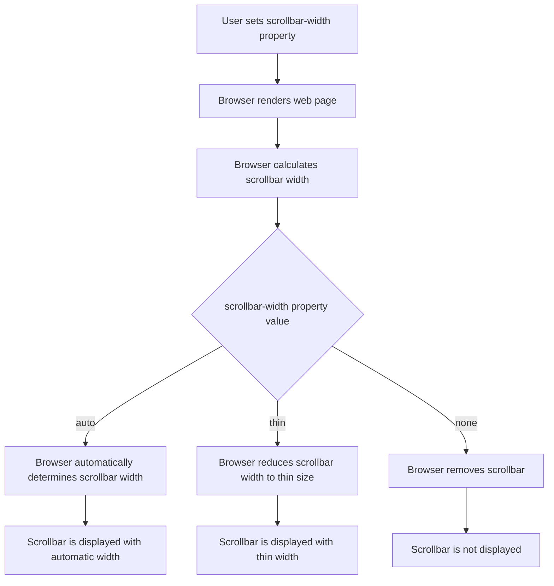

## Introduction
The `scrollbar-width` property is a CSS feature that allows developers to control the width of scrollbars in web pages. It is a part of the **CSS Scrollbars** module, which provides a way to customize the appearance and behavior of scrollbars. The `scrollbar-width` property is supported by most modern browsers, including Chrome, Firefox, and Safari. In this section, we will explore the importance of scrollbar styling, its real-world relevance, and why every engineer needs to know about it.

> **Note:** Scrollbar styling is an essential aspect of web development, as it can significantly impact the user experience. A well-designed scrollbar can enhance the overall aesthetic of a website, while a poorly designed one can be distracting and frustrating for users.

The `scrollbar-width` property is used to set the width of scrollbars in a web page. It can take three values: `auto`, `thin`, and `none`. The `auto` value is the default, which means that the browser will automatically determine the width of the scrollbar. The `thin` value sets the width of the scrollbar to a thin size, while the `none` value removes the scrollbar altogether.

## Core Concepts
To understand how the `scrollbar-width` property works, it's essential to grasp some core concepts. These include:

* **Scrollbar**: A scrollbar is a graphical control element that allows users to navigate through a document or a web page that is larger than the visible area.
* **Scrollbar width**: The width of a scrollbar is the distance between the edge of the scrollbar and the edge of the content area.
* **CSS Scrollbars**: The CSS Scrollbars module provides a way to customize the appearance and behavior of scrollbars using CSS.

> **Tip:** When designing a website, it's crucial to consider the scrollbar width, as it can affect the overall layout and user experience.

## How It Works Internally
The `scrollbar-width` property works by setting the width of the scrollbar in a web page. When a user sets the `scrollbar-width` property to `thin`, the browser will reduce the width of the scrollbar to a thin size. When set to `none`, the browser will remove the scrollbar altogether.

Here's a step-by-step breakdown of how the `scrollbar-width` property works:

1. The browser renders the web page and calculates the width of the scrollbar based on the `scrollbar-width` property.
2. If the `scrollbar-width` property is set to `auto`, the browser will automatically determine the width of the scrollbar.
3. If the `scrollbar-width` property is set to `thin`, the browser will reduce the width of the scrollbar to a thin size.
4. If the `scrollbar-width` property is set to `none`, the browser will remove the scrollbar altogether.

> **Warning:** Setting the `scrollbar-width` property to `none` can cause accessibility issues, as users may not be able to navigate through the content.

## Code Examples
Here are three complete and runnable code examples that demonstrate the use of the `scrollbar-width` property:

### Example 1: Basic Usage
```css
/* Set the scrollbar width to thin */
::-webkit-scrollbar {
  width: 10px;
}

/* Set the scrollbar width to thin for Firefox */
	scrollbar-width: thin;
```
This code sets the scrollbar width to thin for both Chrome and Firefox.

### Example 2: Real-World Pattern
```css
/* Set the scrollbar width to thin for a specific element */
.my-element {
  scrollbar-width: thin;
}

/* Set the scrollbar width to thin for all elements */
* {
  scrollbar-width: thin;
}
```
This code sets the scrollbar width to thin for a specific element and for all elements on the page.

### Example 3: Advanced Usage
```css
/* Set the scrollbar width to thin for a specific media query */
@media (max-width: 768px) {
  ::-webkit-scrollbar {
    width: 5px;
  }
  
  /* Set the scrollbar width to thin for Firefox */
  scrollbar-width: thin;
}
```
This code sets the scrollbar width to thin for a specific media query.

## Visual Diagram

This diagram illustrates the workflow of the `scrollbar-width` property.

## Comparison
Here is a comparison table that highlights the differences between the `auto`, `thin`, and `none` values of the `scrollbar-width` property:

| Value | Description | Pros | Cons |
| --- | --- | --- | --- |
| auto | Browser automatically determines scrollbar width | Easy to use, works well for most use cases | May not work well for custom designs |
| thin | Reduces scrollbar width to a thin size | Provides a more minimalist design, works well for mobile devices | May be difficult to use for users with disabilities |
| none | Removes scrollbar altogether | Provides a more immersive experience, works well for full-screen applications | May cause accessibility issues, may not work well for long content |

## Real-world Use Cases
Here are three real-world use cases that demonstrate the use of the `scrollbar-width` property:

* **Google Maps**: Google Maps uses a custom scrollbar design to provide a more immersive experience for users. The scrollbar is thin and only appears when the user is scrolling.
* **Facebook**: Facebook uses a thin scrollbar design to provide a more minimalist look and feel. The scrollbar is only visible when the user is scrolling.
* **Apple**: Apple uses a custom scrollbar design for their website, which provides a more seamless experience for users. The scrollbar is thin and only appears when the user is scrolling.

## Common Pitfalls
Here are four common pitfalls to watch out for when using the `scrollbar-width` property:

* **Inconsistent design**: Using different scrollbar widths for different elements on the page can create an inconsistent design.
* **Accessibility issues**: Setting the `scrollbar-width` property to `none` can cause accessibility issues for users with disabilities.
* **Browser compatibility**: The `scrollbar-width` property may not work consistently across different browsers.
* **Mobile devices**: The `scrollbar-width` property may not work well on mobile devices, where screen real estate is limited.

> **Tip:** To avoid these pitfalls, it's essential to test the `scrollbar-width` property across different browsers and devices.

## Interview Tips
Here are three common interview questions related to the `scrollbar-width` property, along with weak and strong answers:

* **What is the purpose of the `scrollbar-width` property?**
	+ Weak answer: "It's used to set the width of scrollbars."
	+ Strong answer: "The `scrollbar-width` property is used to control the width of scrollbars in web pages, providing a way to customize the appearance and behavior of scrollbars. It can be used to improve the user experience and create a more consistent design."
* **How does the `scrollbar-width` property work?**
	+ Weak answer: "It just sets the width of the scrollbar."
	+ Strong answer: "The `scrollbar-width` property works by setting the width of the scrollbar in a web page. When set to `thin`, the browser reduces the width of the scrollbar to a thin size. When set to `none`, the browser removes the scrollbar altogether. The property can be used to create a more minimalist design or to provide a more immersive experience for users."
* **What are some common pitfalls to watch out for when using the `scrollbar-width` property?**
	+ Weak answer: "I'm not sure."
	+ Strong answer: "Some common pitfalls to watch out for when using the `scrollbar-width` property include inconsistent design, accessibility issues, browser compatibility issues, and mobile device issues. It's essential to test the property across different browsers and devices to ensure that it works consistently and provides a good user experience."

## Key Takeaways
Here are six key takeaways to remember when using the `scrollbar-width` property:

* The `scrollbar-width` property is used to control the width of scrollbars in web pages.
* The property can take three values: `auto`, `thin`, and `none`.
* Setting the `scrollbar-width` property to `none` can cause accessibility issues.
* The property may not work consistently across different browsers.
* It's essential to test the property across different browsers and devices.
* The `scrollbar-width` property can be used to create a more minimalist design or to provide a more immersive experience for users.