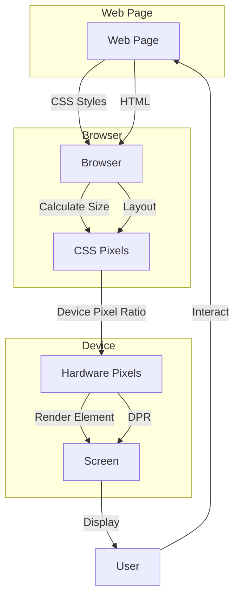

## Introduction
The difference between `px` (CSS) and hardware pixels (device pixel ratio) is a crucial concept in web development, as it affects the way web pages are rendered on various devices. **CSS pixels**, also known as **density-independent pixels**, are a unit of measurement used in CSS to define the size of elements on a web page. On the other hand, **hardware pixels** refer to the actual physical pixels on a device's screen. Understanding the relationship between these two concepts is essential for creating responsive and device-agnostic web applications. In this section, we will delve into the world of CSS pixels and hardware pixels, exploring their definitions, differences, and implications for web development.

## Core Concepts
To grasp the difference between `px` and hardware pixels, we need to understand some key concepts:
* **CSS pixels**: A unit of measurement used in CSS to define the size of elements on a web page. CSS pixels are **density-independent**, meaning they are not directly tied to the physical pixels on a device's screen.
* **Hardware pixels**: The actual physical pixels on a device's screen. Hardware pixels are **density-dependent**, meaning their size and number vary depending on the device's screen resolution and density.
* **Device Pixel Ratio (DPR)**: The ratio of hardware pixels to CSS pixels. DPR is used to determine the number of hardware pixels that are used to render a single CSS pixel.
* **Pixel density**: The number of pixels per inch (PPI) on a device's screen. Pixel density affects the perceived size and sharpness of elements on a web page.

> **Note:** The device pixel ratio is not always an integer value. For example, a device with a DPR of 1.5 would use 1.5 hardware pixels to render a single CSS pixel.

## How It Works Internally
When a web page is rendered, the browser uses the following steps to determine the size of elements:
1. The browser receives the CSS styles and layout information for the web page.
2. The browser calculates the size of elements in CSS pixels.
3. The browser uses the device pixel ratio to determine the number of hardware pixels required to render each CSS pixel.
4. The browser renders the elements on the screen using the calculated number of hardware pixels.

For example, if a device has a DPR of 2 and a web page has an element with a width of 100px, the browser would use 200 hardware pixels to render that element (100px \* 2).

## Code Examples
Here are three complete and runnable code examples that demonstrate the difference between `px` and hardware pixels:

### Example 1: Basic Usage
```html
<!-- index.html -->
<!DOCTYPE html>
<html lang="en">
<head>
    <meta charset="UTF-8">
    <meta name="viewport" content="width=device-width, initial-scale=1.0">
    <title>CSS Pixel vs Hardware Pixel</title>
    <style>
        .box {
            width: 100px; /* CSS pixels */
            height: 100px; /* CSS pixels */
            background-color: #f00;
        }
    </style>
</head>
<body>
    <div class="box"></div>
</body>
</html>
```
This example demonstrates how to define the size of an element using CSS pixels.

### Example 2: Real-World Pattern
```javascript
// script.js
const box = document.querySelector('.box');
const dpr = window.devicePixelRatio;

// Calculate the size of the box in hardware pixels
const widthInHardwarePixels = 100 * dpr;
const heightInHardwarePixels = 100 * dpr;

// Set the size of the box using hardware pixels
box.style.width = `${widthInHardwarePixels}px`;
box.style.height = `${heightInHardwarePixels}px`;
```
This example demonstrates how to calculate the size of an element in hardware pixels using the device pixel ratio.

### Example 3: Advanced Usage
```css
/* styles.css */
.box {
    width: 100vw; /* 100% of the viewport width */
    height: 100vh; /* 100% of the viewport height */
    background-color: #f00;
}

/* Use media queries to adjust the size of the box based on the device pixel ratio */
@media only screen and (min-device-pixel-ratio: 2) {
    .box {
        width: 50vw; /* 50% of the viewport width on high-DPR devices */
        height: 50vh; /* 50% of the viewport height on high-DPR devices */
    }
}
```
This example demonstrates how to use media queries to adjust the size of an element based on the device pixel ratio.

## Visual Diagram

This diagram illustrates the process of rendering a web page, from receiving CSS styles to displaying the rendered element on the screen.

## Comparison
The following table compares different approaches to handling device pixel ratios:
| Approach | Time Complexity | Space Complexity | Pros | Cons | Best For |
|----------|----------------|-----------------|------|------|----------|
| Using CSS pixels | O(1) | O(1) | Simple, consistent | May not account for high-DPR devices | General web development |
| Using hardware pixels | O(n) | O(n) | Accurate, high-quality | Complex, device-dependent | High-performance web applications |
| Using media queries | O(n) | O(n) | Flexible, adaptable | Complex, may require multiple queries | Responsive web design |
| Using JavaScript | O(n) | O(n) | Dynamic, flexible | Complex, may require additional libraries | Interactive web applications |

## Real-world Use Cases
Here are three production examples of companies that have successfully implemented device pixel ratio handling:
* **Apple**: Apple's website uses a combination of CSS pixels and media queries to ensure a responsive and high-quality user experience across various devices.
* **Google**: Google's web applications, such as Google Maps and Google Drive, use a combination of CSS pixels and JavaScript to provide a seamless and interactive user experience.
* **Microsoft**: Microsoft's website uses a combination of CSS pixels and media queries to provide a responsive and accessible user experience across various devices.

## Common Pitfalls
Here are four common mistakes that engineers make when handling device pixel ratios:
* **Not accounting for high-DPR devices**: Failing to consider high-DPR devices can result in low-quality or blurry images.
* **Using only CSS pixels**: Relying solely on CSS pixels can lead to inconsistent rendering across devices with different pixel densities.
* **Not testing on multiple devices**: Failing to test on multiple devices can result in unexpected rendering issues or bugs.
* **Not using media queries**: Not using media queries can limit the flexibility and adaptability of a web application.

> **Warning:** Not accounting for device pixel ratios can result in a poor user experience and negatively impact the overall quality of a web application.

## Interview Tips
Here are three common interview questions related to device pixel ratios, along with weak and strong answers:
* **What is the difference between CSS pixels and hardware pixels?**
	+ Weak answer: "CSS pixels are used for web development, while hardware pixels are used for mobile apps."
	+ Strong answer: "CSS pixels are a unit of measurement used in CSS to define the size of elements on a web page, while hardware pixels refer to the actual physical pixels on a device's screen. The device pixel ratio is used to determine the number of hardware pixels that are used to render a single CSS pixel."
* **How do you handle device pixel ratios in your web applications?**
	+ Weak answer: "I use CSS pixels and hope for the best."
	+ Strong answer: "I use a combination of CSS pixels, media queries, and JavaScript to ensure a responsive and high-quality user experience across various devices. I also test my applications on multiple devices to ensure consistent rendering."
* **What are some common pitfalls when handling device pixel ratios?**
	+ Weak answer: "I'm not sure, but I think it's just a matter of using CSS pixels."
	+ Strong answer: "Some common pitfalls include not accounting for high-DPR devices, relying solely on CSS pixels, not testing on multiple devices, and not using media queries. To avoid these pitfalls, I use a combination of techniques, such as using media queries and testing on multiple devices, to ensure a responsive and high-quality user experience."

## Key Takeaways
Here are ten key takeaways related to device pixel ratios:
* **CSS pixels are density-independent**: CSS pixels are not directly tied to the physical pixels on a device's screen.
* **Hardware pixels are density-dependent**: Hardware pixels are tied to the physical pixels on a device's screen and vary depending on the device's screen resolution and density.
* **Device pixel ratio is used to determine the number of hardware pixels**: The device pixel ratio is used to determine the number of hardware pixels that are used to render a single CSS pixel.
* **Media queries can be used to adjust the size of elements**: Media queries can be used to adjust the size of elements based on the device pixel ratio.
* **Testing on multiple devices is essential**: Testing on multiple devices is essential to ensure consistent rendering and a high-quality user experience.
* **Using a combination of techniques is recommended**: Using a combination of CSS pixels, media queries, and JavaScript is recommended to ensure a responsive and high-quality user experience.
* **Accounting for high-DPR devices is crucial**: Accounting for high-DPR devices is crucial to ensure a high-quality user experience.
* **Not using media queries can limit flexibility**: Not using media queries can limit the flexibility and adaptability of a web application.
* **Device pixel ratios can affect performance**: Device pixel ratios can affect the performance of a web application, especially if not handled properly.
* **Understanding device pixel ratios is essential for web development**: Understanding device pixel ratios is essential for web development, as it affects the way web pages are rendered on various devices.