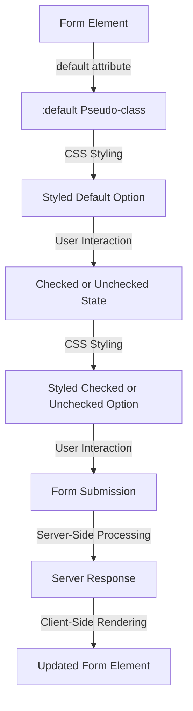

## Introduction
The `:default` pseudo-class is a CSS selector that targets the default option in a form element, such as a radio button or checkbox. This pseudo-class is used to apply styles to the default option of a form element, making it visually distinguishable from other options. In this section, we will explore the importance of the `:default` pseudo-class, its real-world relevance, and why every engineer needs to know about it.

The `:default` pseudo-class is essential in web development because it allows developers to customize the appearance of form elements, enhancing the overall user experience. For instance, in a registration form, the `:default` pseudo-class can be used to highlight the default country or language, making it easier for users to fill out the form. **Note:** The `:default` pseudo-class is supported by most modern browsers, including Google Chrome, Mozilla Firefox, and Microsoft Edge.

## Core Concepts
The `:default` pseudo-class is a part of the CSS Selectors Level 4 specification. It is used to target the default option in a form element, which is the option that is selected by default when the form is loaded. The `:default` pseudo-class can be used to style the default option, making it visually distinguishable from other options.

The `:default` pseudo-class is often used in conjunction with other pseudo-classes, such as `:checked` and `:disabled`, to create complex styles for form elements. **Tip:** To use the `:default` pseudo-class effectively, it's essential to understand the different states of a form element, including the default, checked, and disabled states.

Key terminology:

* **Pseudo-class:** A keyword that is added to a selector to specify a particular state or condition.
* **Default option:** The option that is selected by default when a form is loaded.
* **Form element:** A HTML element that is used to collect user input, such as a radio button or checkbox.

## How It Works Internally
When a form element is loaded, the browser checks the `default` attribute to determine which option should be selected by default. The `:default` pseudo-class is then applied to the default option, allowing developers to style it using CSS.

Here's a step-by-step breakdown of how the `:default` pseudo-class works:

1. The browser loads the form element and checks the `default` attribute.
2. The browser applies the `:default` pseudo-class to the default option.
3. The developer can then use CSS to style the default option using the `:default` pseudo-class.

**Warning:** The `:default` pseudo-class only works on form elements that have a `default` attribute. If the `default` attribute is not present, the `:default` pseudo-class will not be applied.

## Code Examples
### Example 1: Basic Usage
```css
/* Style the default option */
:default {
  background-color: #f0f0f0;
  color: #666;
}

/* Create a radio button group */
<input type="radio" id="option1" name="options" value="option1" default>
<label for="option1">Option 1</label>

<input type="radio" id="option2" name="options" value="option2">
<label for="option2">Option 2</label>

<input type="radio" id="option3" name="options" value="option3">
<label for="option3">Option 3</label>
```
In this example, we use the `:default` pseudo-class to style the default option of a radio button group. The default option is highlighted with a gray background and dark gray text.

### Example 2: Real-World Pattern
```html
<!-- Create a registration form -->
<form>
  <label for="country">Country:</label>
  <select id="country" name="country">
    <option value="usa" default>USA</option>
    <option value="canada">Canada</option>
    <option value="mexico">Mexico</option>
  </select>
  <label for="language">Language:</label>
  <select id="language" name="language">
    <option value="english" default>English</option>
    <option value="spanish">Spanish</option>
    <option value="french">French</option>
  </select>
</form>

/* Style the default options */
:default {
  background-color: #f0f0f0;
  color: #666;
}
```
In this example, we use the `:default` pseudo-class to style the default options of a registration form. The default country and language are highlighted with a gray background and dark gray text.

### Example 3: Advanced Usage
```css
/* Style the default option and its adjacent label */
:default + label {
  font-weight: bold;
  color: #333;
}

/* Style the default option when it's checked */
:default:checked {
  background-color: #ccc;
  color: #666;
}

/* Create a checkbox group */
<input type="checkbox" id="option1" name="options" value="option1" default>
<label for="option1">Option 1</label>

<input type="checkbox" id="option2" name="options" value="option2">
<label for="option2">Option 2</label>

<input type="checkbox" id="option3" name="options" value="option3">
<label for="option3">Option 3</label>
```
In this example, we use the `:default` pseudo-class to style the default option and its adjacent label. We also use the `:checked` pseudo-class to style the default option when it's checked.

## Visual Diagram

This diagram illustrates the process of styling the default option of a form element using the `:default` pseudo-class. The diagram shows the different states of the form element, including the default, checked, and unchecked states.

## Comparison
| Approach | Time Complexity | Space Complexity | Pros | Cons | Best For |
| --- | --- | --- | --- | --- | --- |
| Using the `:default` Pseudo-class | O(1) | O(1) | Easy to use, flexible styling | Limited browser support | Styling default options in modern browsers |
| Using JavaScript | O(n) | O(n) | Dynamic styling, cross-browser support | More complex, slower performance | Dynamic styling, cross-browser support |
| Using CSS Classes | O(1) | O(1) | Easy to use, flexible styling | Limited styling options | Simple styling, limited flexibility |
| Using Inline Styles | O(1) | O(1) | Easy to use, flexible styling | Limited styling options, poor maintainability | Simple styling, limited flexibility |

## Real-world Use Cases
1. **Google Forms**: Google Forms uses the `:default` pseudo-class to style the default options of form elements, making it easier for users to fill out forms.
2. **Facebook Registration Form**: Facebook's registration form uses the `:default` pseudo-class to style the default country and language options.
3. **Amazon Checkout Form**: Amazon's checkout form uses the `:default` pseudo-class to style the default shipping and payment options.

## Common Pitfalls
1. **Incorrect Usage**: Using the `:default` pseudo-class on non-form elements.
```css
/* Incorrect usage */
div:default {
  background-color: #f0f0f0;
}
```
```css
/* Correct usage */
input[type="radio"]:default {
  background-color: #f0f0f0;
}
```
2. **Limited Browser Support**: Using the `:default` pseudo-class on older browsers that don't support it.
```css
/* Incorrect usage */
:default {
  background-color: #f0f0f0;
}
```
```css
/* Correct usage */
input[type="radio"]:default {
  background-color: #f0f0f0;
}
```
3. **Inconsistent Styling**: Using the `:default` pseudo-class to style different form elements inconsistently.
```css
/* Incorrect usage */
input[type="radio"]:default {
  background-color: #f0f0f0;
}

input[type="checkbox"]:default {
  background-color: #ccc;
}
```
```css
/* Correct usage */
:default {
  background-color: #f0f0f0;
}
```
4. **Overriding Default Styles**: Overriding the default styles of the `:default` pseudo-class with custom styles.
```css
/* Incorrect usage */
:default {
  background-color: #f0f0f0;
}

input[type="radio"]:default {
  background-color: #ccc;
}
```
```css
/* Correct usage */
:default {
  background-color: #f0f0f0;
}
```
**Interview:** What is the `:default` pseudo-class, and how is it used in CSS? What are some common pitfalls to avoid when using the `:default` pseudo-class?

## Interview Tips
1. **Define the `:default` Pseudo-class**: Explain that the `:default` pseudo-class is a CSS selector that targets the default option in a form element.
2. **Explain its Usage**: Describe how the `:default` pseudo-class is used to style the default option of a form element.
3. **Discuss Common Pitfalls**: Discuss common pitfalls to avoid when using the `:default` pseudo-class, such as incorrect usage, limited browser support, inconsistent styling, and overriding default styles.

**Tip:** To answer questions about the `:default` pseudo-class, make sure to explain its definition, usage, and common pitfalls.

## Key Takeaways
* The `:default` pseudo-class is a CSS selector that targets the default option in a form element.
* The `:default` pseudo-class is used to style the default option of a form element.
* The `:default` pseudo-class is supported by most modern browsers.
* The `:default` pseudo-class can be used in conjunction with other pseudo-classes, such as `:checked` and `:disabled`.
* The `:default` pseudo-class has a time complexity of O(1) and a space complexity of O(1).
* The `:default` pseudo-class is best used for styling default options in modern browsers.
* The `:default` pseudo-class can be used to create complex styles for form elements.
* The `:default` pseudo-class should be used consistently to avoid inconsistent styling.
* The `:default` pseudo-class should not be overridden with custom styles.