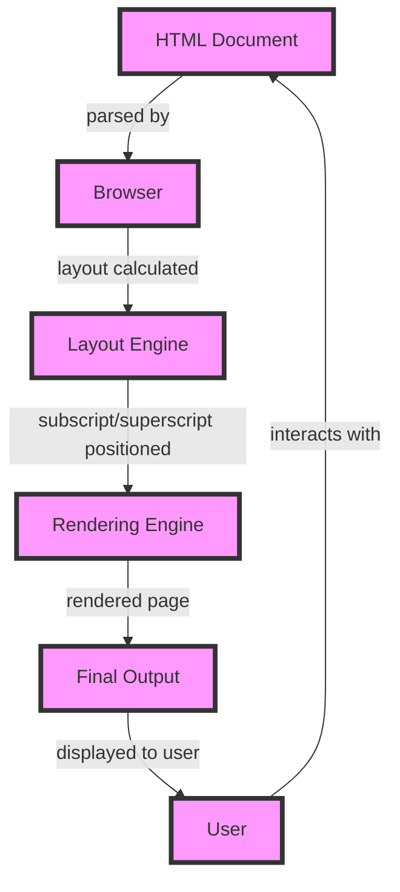

## Introduction
Vertical alignment with subscript and superscript is a crucial aspect of web development, particularly when working with mathematical expressions, chemical formulas, or any content that requires precise vertical positioning of text. In this study, we will delve into the world of `sub` and `super` elements, exploring their significance, real-world applications, and the underlying mechanics that make them work. Every engineer should have a solid understanding of these concepts to create visually appealing and semantically correct web pages.

## Core Concepts
- **Subscript**: A subscript is a character or string of characters that is typeset below the baseline of the surrounding text. It is commonly used in mathematical expressions, chemical formulas, and notation systems.
- **Superscript**: A superscript is a character or string of characters that is typeset above the baseline of the surrounding text. Like subscripts, superscripts are used in various contexts, including mathematical expressions, chemical formulas, and citation references.
- **Baseline**: The baseline is an imaginary line that runs along the bottom of a line of text. It serves as a reference point for determining the position of subscripts and superscripts.
- **Vertical alignment**: Vertical alignment refers to the process of adjusting the position of text or other elements along the vertical axis. In the context of subscripts and superscripts, vertical alignment is critical for ensuring that these elements are properly positioned relative to the surrounding text.

## How It Works Internally
When a browser renders a web page, it uses a complex set of algorithms to determine the position of each element, including subscripts and superscripts. Here's a step-by-step breakdown of the process:
1. **Parsing**: The browser parses the HTML document, identifying the `sub` and `super` elements and their contents.
2. **Layout**: The browser calculates the layout of the page, including the position and size of each element. For subscripts and superscripts, the browser must determine the baseline of the surrounding text and adjust the position of the subscript or superscript accordingly.
3. **Rendering**: The browser renders the page, using the calculated layout to position each element. Subscripts and superscripts are rendered with their respective vertical offsets, which are typically defined in the CSS stylesheet.

> **Note:** The browser's rendering engine uses a combination of font metrics and CSS styles to determine the position of subscripts and superscripts. The `font-size` property, in particular, plays a critical role in determining the vertical offset of these elements.

## Code Examples
### Example 1: Basic Subscript and Superscript
```html
<p>The chemical formula for water is H<sub>2</sub>O.</p>
<p>The equation for the area of a circle is A = πr<sup>2</sup>.</p>
```
This example demonstrates the basic usage of `sub` and `super` elements in HTML.

### Example 2: Customizing Subscript and Superscript Styles
```css
sub {
  font-size: 0.7em;
  vertical-align: sub;
}

super {
  font-size: 0.7em;
  vertical-align: super;
}
```
```html
<p>The chemical formula for water is H<sub>2</sub>O.</p>
<p>The equation for the area of a circle is A = πr<sup>2</sup>.</p>
```
This example shows how to customize the styles of subscripts and superscripts using CSS.

### Example 3: Advanced Subscript and Superscript Usage
```html
<p>The equation for the motion of an object under constant acceleration is s = s<sub>0</sub> + v<sub>0</sub>t + (1/2)at<sup>2</sup>.</p>
```
This example demonstrates the use of subscripts and superscripts in a more complex mathematical expression.

## Visual Diagram

This diagram illustrates the process of rendering a web page with subscripts and superscripts.

## Comparison
| Approach | Time Complexity | Space Complexity | Pros | Cons | Best For |
| --- | --- | --- | --- | --- | --- |
| Using `sub` and `super` elements | O(1) | O(1) | Semantic meaning, easy to use | Limited styling options | Simple mathematical expressions |
| Using CSS `vertical-align` property | O(1) | O(1) | More styling options, flexible | Less semantic meaning | Complex mathematical expressions |
| Using JavaScript to position subscripts and superscripts | O(n) | O(n) | Complete control over positioning | More complex, slower performance | Dynamic or interactive content |
| Using a dedicated math typesetting library | O(n) | O(n) | High-quality math typesetting, flexible | Steeper learning curve, larger file size | Advanced mathematical expressions |

> **Warning:** Using JavaScript to position subscripts and superscripts can lead to performance issues and should be avoided unless necessary.

## Real-world Use Cases
1. **MathJax**: MathJax is a popular JavaScript library for typesetting mathematical expressions on the web. It uses a combination of `sub` and `super` elements, CSS styles, and JavaScript to position subscripts and superscripts correctly.
2. **Wikipedia**: Wikipedia uses a custom implementation of `sub` and `super` elements to render mathematical expressions and chemical formulas.
3. **Google Docs**: Google Docs uses a dedicated math typesetting library to render mathematical expressions, including subscripts and superscripts.

## Common Pitfalls
1. **Insufficient font size**: Using a font size that is too small can make subscripts and superscripts difficult to read.
2. **Incorrect vertical alignment**: Failing to properly align subscripts and superscripts can lead to a visually unappealing and semantically incorrect representation of mathematical expressions.
3. **Inconsistent styling**: Using inconsistent styling for subscripts and superscripts can make a web page look unprofessional and confusing.
4. **Lack of semantic meaning**: Using non-semantic elements, such as `span` or `div`, to represent subscripts and superscripts can make a web page less accessible and less readable.

> **Tip:** Use the `sub` and `super` elements to add semantic meaning to your mathematical expressions, and use CSS styles to customize their appearance.

## Interview Tips
1. **What is the difference between `sub` and `super` elements?**: A good answer should explain the semantic meaning and visual differences between the two elements.
2. **How do you customize the styles of subscripts and superscripts?**: A good answer should demonstrate a solid understanding of CSS styles and how to apply them to `sub` and `super` elements.
3. **What are some common pitfalls when working with subscripts and superscripts?**: A good answer should identify common mistakes, such as insufficient font size or incorrect vertical alignment, and explain how to avoid them.

> **Interview:** Can you explain the difference between `sub` and `super` elements, and how you would customize their styles using CSS?

## Key Takeaways
* Use `sub` and `super` elements to add semantic meaning to mathematical expressions.
* Customize the styles of subscripts and superscripts using CSS.
* Ensure sufficient font size and correct vertical alignment for subscripts and superscripts.
* Use a dedicated math typesetting library for advanced mathematical expressions.
* Avoid using non-semantic elements to represent subscripts and superscripts.
* Test your implementation for accessibility and readability.
* Use `vertical-align` property to adjust the position of subscripts and superscripts.
* Be aware of common pitfalls, such as inconsistent styling and lack of semantic meaning.