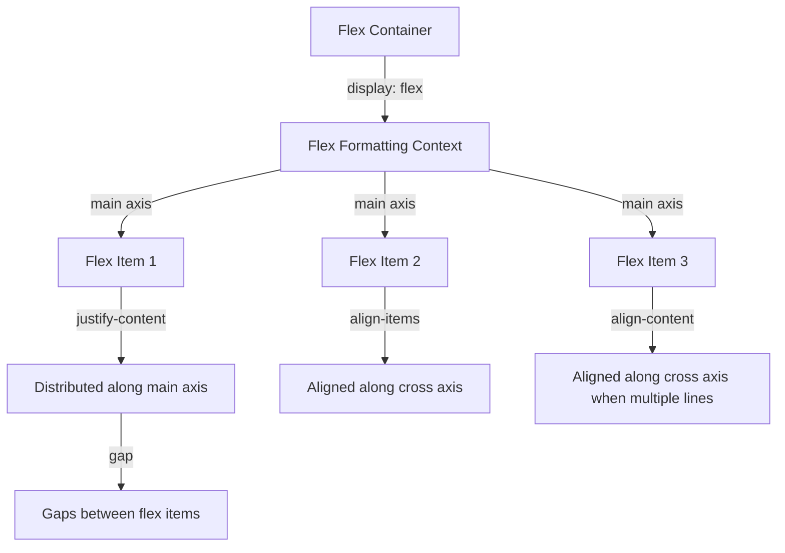

## Introduction
Flexbox is a powerful CSS layout system that enables you to easily create complex, flexible, and responsive layouts. It was introduced in the CSS3 specification and has gained widespread adoption due to its ease of use and flexibility. Flexbox is particularly useful for creating grid-like layouts, navigation bars, and responsive designs. In this article, we will delve into the key concepts of Flexbox, including `justify-content`, `align-items`, `align-content`, and `gap`, and explore how to use them to create robust and responsive layouts.

> **Note:** Flexbox is a one-dimensional layout system, meaning it can be used to create either a row or a column layout, but not both at the same time. For two-dimensional layouts, you may need to use Grid or a combination of Flexbox and other layout techniques.

## Core Concepts
The core concepts of Flexbox can be summarized as follows:

* **Flex container**: The element that contains the flex items. It is defined by setting `display: flex` or `display: inline-flex` on the element.
* **Flex item**: The elements that are direct children of the flex container.
* **Main axis**: The primary axis of the flex container, which can be either horizontal (for a row layout) or vertical (for a column layout).
* **Cross axis**: The secondary axis of the flex container, which is perpendicular to the main axis.

The key properties used to control the layout of flex items are:

* `justify-content`: controls the distribution of flex items along the main axis.
* `align-items`: controls the alignment of flex items along the cross axis.
* `align-content`: controls the alignment of flex items along the cross axis when there are multiple lines of flex items.
* `gap`: controls the spacing between flex items.

## How It Works Internally
When you set `display: flex` on an element, the browser creates a flex formatting context, which is a special type of layout context that is used to layout flex items. The flex formatting context is responsible for determining the size and position of each flex item, as well as the distribution of space between them.

Here is a step-by-step breakdown of how the flex formatting context works:

1. The browser determines the main axis and cross axis of the flex container based on the `flex-direction` property.
2. The browser calculates the size of each flex item based on its content and any explicit sizing properties (such as `width` or `height`).
3. The browser determines the total size of the flex container based on the sizes of its flex items and any explicit sizing properties.
4. The browser distributes the flex items along the main axis using the `justify-content` property.
5. The browser aligns the flex items along the cross axis using the `align-items` property.
6. If there are multiple lines of flex items, the browser aligns them along the cross axis using the `align-content` property.
7. The browser adds any gaps between flex items using the `gap` property.

## Code Examples
### Example 1: Basic Flexbox Layout
```html
<style>
  .container {
    display: flex;
    justify-content: space-between;
    align-items: center;
    gap: 10px;
  }
  .item {
    width: 100px;
    height: 100px;
    background-color: #ccc;
  }
</style>
<div class="container">
  <div class="item">Item 1</div>
  <div class="item">Item 2</div>
  <div class="item">Item 3</div>
</div>
```
This example creates a basic flexbox layout with three flex items that are distributed evenly along the main axis.

### Example 2: Responsive Flexbox Layout
```html
<style>
  .container {
    display: flex;
    flex-wrap: wrap;
    justify-content: center;
    align-items: center;
    gap: 10px;
  }
  .item {
    width: 200px;
    height: 200px;
    background-color: #ccc;
  }
  @media (max-width: 600px) {
    .container {
      flex-direction: column;
    }
  }
</style>
<div class="container">
  <div class="item">Item 1</div>
  <div class="item">Item 2</div>
  <div class="item">Item 3</div>
</div>
```
This example creates a responsive flexbox layout that wraps to multiple lines on smaller screens and changes to a column layout.

### Example 3: Advanced Flexbox Layout
```html
<style>
  .container {
    display: flex;
    flex-direction: row;
    justify-content: space-around;
    align-items: stretch;
    gap: 20px;
  }
  .item {
    width: 150px;
    height: 150px;
    background-color: #ccc;
  }
  .item:first-child {
    align-self: flex-start;
  }
  .item:last-child {
    align-self: flex-end;
  }
</style>
<div class="container">
  <div class="item">Item 1</div>
  <div class="item">Item 2</div>
  <div class="item">Item 3</div>
</div>
```
This example creates an advanced flexbox layout with multiple flex items that are aligned differently along the cross axis.

## Visual Diagram

This diagram illustrates the key concepts of Flexbox, including the flex container, flex formatting context, main axis, cross axis, and the properties used to control the layout of flex items.

## Comparison
| Layout System | Time Complexity | Space Complexity | Pros | Cons | Best For |
| --- | --- | --- | --- | --- | --- |
| Flexbox | O(n) | O(n) | Easy to use, flexible, responsive | Limited to one-dimensional layouts | Grid-like layouts, navigation bars, responsive designs |
| Grid | O(n^2) | O(n^2) | Powerful, two-dimensional layouts | Steeper learning curve | Complex, two-dimensional layouts |
| Floats | O(n) | O(n) | Simple, easy to use | Limited control over layout, can be brittle | Simple layouts, legacy browsers |
| Tables | O(n) | O(n) | Simple, easy to use | Limited control over layout, can be inaccessible | Simple layouts, legacy browsers |

## Real-world Use Cases
* **Google**: uses Flexbox to create responsive and flexible layouts for its search results page.
* **Facebook**: uses Flexbox to create complex and responsive layouts for its news feed and profile pages.
* **Twitter**: uses Flexbox to create responsive and flexible layouts for its timeline and profile pages.

## Common Pitfalls
* **Incorrect use of `flex-direction`**: using `flex-direction: column` when you meant to use `flex-direction: row` can cause unexpected layout issues.
* **Forgetting to set `display: flex`**: forgetting to set `display: flex` on the flex container can cause the flex items to not be laid out correctly.
* **Using `floats` instead of `flexbox`**: using `floats` instead of `flexbox` can cause layout issues and make it harder to create responsive designs.
* **Not using `gap`**: not using `gap` can cause flex items to be too close together and make the layout look cluttered.

## Interview Tips
* **What is Flexbox and how does it work?**: be prepared to explain the basics of Flexbox, including the flex container, flex items, and the properties used to control the layout.
* **How do you create a responsive layout using Flexbox?**: be prepared to explain how to use Flexbox to create responsive layouts, including how to use `flex-wrap` and `flex-direction`.
* **What are some common pitfalls when using Flexbox?**: be prepared to explain some common pitfalls when using Flexbox, including incorrect use of `flex-direction` and forgetting to set `display: flex`.

## Key Takeaways
* **Flexbox is a one-dimensional layout system**: Flexbox is best used for creating layouts that are either rows or columns, but not both.
* **Use `display: flex` to create a flex container**: setting `display: flex` on an element creates a flex container and allows you to use Flexbox properties.
* **Use `justify-content` to control the distribution of flex items**: `justify-content` controls the distribution of flex items along the main axis.
* **Use `align-items` to control the alignment of flex items**: `align-items` controls the alignment of flex items along the cross axis.
* **Use `align-content` to control the alignment of flex items when multiple lines**: `align-content` controls the alignment of flex items along the cross axis when there are multiple lines of flex items.
* **Use `gap` to control the spacing between flex items**: `gap` controls the spacing between flex items.
* **Flexbox is easy to use and flexible**: Flexbox is a powerful and flexible layout system that is easy to use and can be used to create a wide range of layouts.
* **Flexbox is responsive**: Flexbox is a responsive layout system that can be used to create layouts that adapt to different screen sizes and devices.