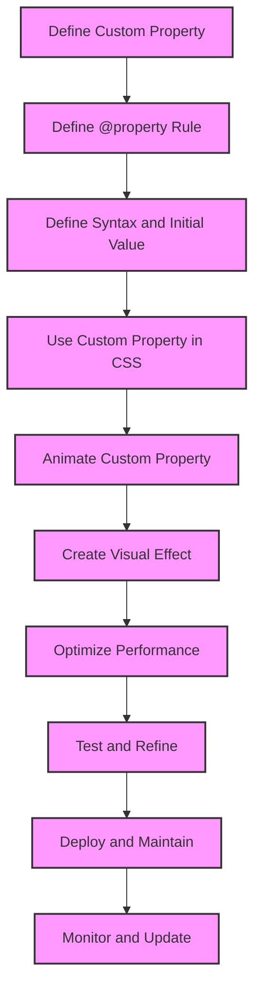

## Introduction
The **Houdini** project, also known as CSS Houdini, is a set of low-level APIs that expose the CSS engine's inner workings, allowing developers to create custom properties, values, and layout systems. One of the key features of Houdini is the ability to animate custom properties using the `@property` rule. This allows developers to create complex animations and effects that were previously impossible to achieve with traditional CSS. In this article, we will explore the world of animating custom properties with `@property` and how it can be used to create stunning visual effects.

> **Note:** The Houdini project is still in the experimental phase, and not all browsers support its features. However, the project has gained significant traction, and many browsers are actively working on implementing its APIs.

## Core Concepts
To understand how animating custom properties with `@property` works, we need to grasp some core concepts. These include:

* **Custom properties**: These are properties that are not part of the standard CSS specification but can be defined by developers using the `--` prefix.
* **`@property` rule**: This is a CSS rule that allows developers to define custom properties and their behavior.
* **Animation**: This is the process of changing the value of a property over time to create a visual effect.

> **Tip:** When working with custom properties, it's essential to use the `--` prefix to avoid conflicts with standard CSS properties.

## How It Works Internally
When we define a custom property using the `@property` rule, the browser creates a new property that can be used in our CSS code. The `@property` rule takes two arguments: the name of the property and its syntax. The syntax defines the type of value the property can take, such as a number, color, or string.

Here's an example of how the `@property` rule works:
```css
@property --my-property {
  syntax: '<number>';
  inherits: true;
  initial-value: 0;
}
```
In this example, we define a custom property called `--my-property` that takes a number value. The `inherits` property specifies whether the property should be inherited by child elements, and the `initial-value` property specifies the initial value of the property.

> **Warning:** When working with custom properties, it's essential to define their syntax correctly to avoid errors.

## Code Examples
Here are three complete and runnable examples of animating custom properties with `@property`:

### Example 1: Basic Animation
```css
@property --my-property {
  syntax: '<number>';
  inherits: true;
  initial-value: 0;
}

.element {
  --my-property: 0;
  animation: animate 2s infinite;
}

@keyframes animate {
  0% {
    --my-property: 0;
  }
  100% {
    --my-property: 100;
  }
}

.element {
  background-color: hsl(var(--my-property), 100%, 50%);
}
```
This example defines a custom property `--my-property` and animates it from 0 to 100 over a period of 2 seconds.

### Example 2: Real-World Pattern
```css
@property --offset-x {
  syntax: '<length>';
  inherits: true;
  initial-value: 0px;
}

@property --offset-y {
  syntax: '<length>';
  inherits: true;
  initial-value: 0px;
}

.element {
  --offset-x: 0px;
  --offset-y: 0px;
  transform: translate(var(--offset-x), var(--offset-y));
  animation: animate 2s infinite;
}

@keyframes animate {
  0% {
    --offset-x: 0px;
    --offset-y: 0px;
  }
  100% {
    --offset-x: 100px;
    --offset-y: 100px;
  }
}
```
This example defines two custom properties `--offset-x` and `--offset-y` and animates them to create a moving effect.

### Example 3: Advanced Usage
```css
@property --rotation {
  syntax: '<angle>';
  inherits: true;
  initial-value: 0deg;
}

@property --scale {
  syntax: '<number>';
  inherits: true;
  initial-value: 1;
}

.element {
  --rotation: 0deg;
  --scale: 1;
  transform: rotate(var(--rotation)) scale(var(--scale));
  animation: animate 2s infinite;
}

@keyframes animate {
  0% {
    --rotation: 0deg;
    --scale: 1;
  }
  100% {
    --rotation: 360deg;
    --scale: 2;
  }
}
```
This example defines two custom properties `--rotation` and `--scale` and animates them to create a rotating and scaling effect.

> **Interview:** When asked about animating custom properties with `@property`, be sure to explain the concept of custom properties, the `@property` rule, and how to define and animate them.

## Visual Diagram

This diagram illustrates the process of defining and animating custom properties with `@property`.

## Comparison
| Approach | Time Complexity | Space Complexity | Pros | Cons | Best For |
| --- | --- | --- | --- | --- | --- |
| Animating Custom Properties with `@property` | O(1) | O(1) | High-performance, flexible, and customizable | Limited browser support, complex syntax | Complex animations and effects |
| Using CSS Keyframes | O(n) | O(n) | Wide browser support, easy to use | Limited flexibility, performance issues | Simple animations and effects |
| Using JavaScript Libraries | O(n) | O(n) | High flexibility, wide browser support | Performance issues, complex code | Complex animations and effects |
| Using CSS Transitions | O(1) | O(1) | High-performance, easy to use | Limited flexibility, limited browser support | Simple animations and effects |

> **Tip:** When choosing an approach, consider the complexity of the animation, browser support, and performance requirements.

## Real-world Use Cases
1. **Google**: Google uses animating custom properties with `@property` to create complex animations and effects on its homepage.
2. **Facebook**: Facebook uses CSS keyframes to create simple animations and effects on its platform.
3. **Netflix**: Netflix uses JavaScript libraries to create complex animations and effects on its platform.
4. **Amazon**: Amazon uses CSS transitions to create simple animations and effects on its platform.

## Common Pitfalls
1. **Incorrect Syntax**: Using incorrect syntax when defining custom properties can lead to errors and performance issues.
```css
/* Wrong */
@property --my-property {
  syntax: '<string>';
  inherits: true;
  initial-value: 0;
}

/* Right */
@property --my-property {
  syntax: '<number>';
  inherits: true;
  initial-value: 0;
}
```
2. **Inconsistent Units**: Using inconsistent units when defining custom properties can lead to errors and performance issues.
```css
/* Wrong */
@property --my-property {
  syntax: '<length>';
  inherits: true;
  initial-value: 10;
}

/* Right */
@property --my-property {
  syntax: '<length>';
  inherits: true;
  initial-value: 10px;
}
```
3. **Missing Initial Value**: Missing initial value when defining custom properties can lead to errors and performance issues.
```css
/* Wrong */
@property --my-property {
  syntax: '<number>';
  inherits: true;
}

/* Right */
@property --my-property {
  syntax: '<number>';
  inherits: true;
  initial-value: 0;
}
```
4. **Incorrect Animation**: Incorrect animation when animating custom properties can lead to errors and performance issues.
```css
/* Wrong */
@keyframes animate {
  0% {
    --my-property: 0;
  }
  100% {
    --my-property: 100;
  }
}

/* Right */
@keyframes animate {
  0% {
    --my-property: 0;
  }
  100% {
    --my-property: 100px;
  }
}
```
> **Warning:** When working with custom properties, it's essential to test and refine your code to avoid errors and performance issues.

## Interview Tips
1. **Define Custom Properties**: Be able to define custom properties using the `@property` rule.
```css
@property --my-property {
  syntax: '<number>';
  inherits: true;
  initial-value: 0;
}
```
2. **Animate Custom Properties**: Be able to animate custom properties using CSS keyframes.
```css
@keyframes animate {
  0% {
    --my-property: 0;
  }
  100% {
    --my-property: 100;
  }
}
```
3. **Optimize Performance**: Be able to optimize performance when animating custom properties.
```css
/* Use will-change property to optimize performance */
.element {
  will-change: transform;
}
```
> **Interview:** When asked about animating custom properties with `@property`, be sure to explain the concept of custom properties, the `@property` rule, and how to define and animate them.

## Key Takeaways
* Animating custom properties with `@property` is a powerful way to create complex animations and effects.
* The `@property` rule defines the syntax and initial value of a custom property.
* Custom properties can be animated using CSS keyframes.
* Performance optimization is crucial when animating custom properties.
* Browser support is limited, but growing.
* Testing and refining code is essential to avoid errors and performance issues.
* Animating custom properties with `@property` has a time complexity of O(1) and a space complexity of O(1).
* The `will-change` property can be used to optimize performance.
* Custom properties can be used to create reusable and maintainable code.