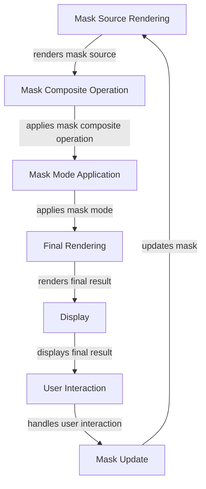

## Introduction
CSS Mask Compositing, also known as `mask-composite` operations, is a powerful feature in CSS that allows you to combine multiple masks to create complex, layered visual effects. This feature is a part of the CSS Masking specification, which provides a way to apply a mask to an element, hiding or revealing parts of its content. CSS Mask Compositing is essential for creating intricate, high-contrast designs, and it's widely used in web development, especially in modern web applications and responsive designs. Every web developer should be familiar with CSS Mask Compositing, as it provides a flexible and efficient way to create visually appealing, interactive user interfaces.

> **Note:** CSS Mask Compositing is supported in most modern browsers, including Google Chrome, Mozilla Firefox, and Microsoft Edge. However, older browsers may not support this feature, so it's essential to ensure cross-browser compatibility when using CSS Mask Compositing in production environments.

## Core Concepts
To work with CSS Mask Compositing, you need to understand the following core concepts:
* **Masking**: The process of applying a mask to an element, hiding or revealing parts of its content.
* **Mask Source**: The image or gradient used as a mask.
* **Mask Composite Operation**: The operation used to combine multiple masks.
* **Mask Mode**: The mode in which the mask is applied (e.g., `alpha`, `luminance`, or `match-source`).

> **Warning:** When working with CSS Mask Compositing, it's essential to consider the performance implications of complex mask operations. Excessive use of mask compositing can lead to slow rendering and decreased browser performance.

## How It Works Internally
When you apply a mask to an element using CSS Mask Compositing, the browser performs the following steps:
1. **Mask Source Rendering**: The browser renders the mask source (image or gradient) and stores it in memory.
2. **Mask Composite Operation**: The browser applies the specified mask composite operation to combine the mask source with the element's content.
3. **Mask Mode Application**: The browser applies the specified mask mode to the combined mask.
4. **Final Rendering**: The browser renders the final result, applying the mask to the element's content.

The time complexity of CSS Mask Compositing operations depends on the complexity of the mask composite operation and the size of the mask source. In general, the time complexity is O(n), where n is the number of pixels in the mask source. The space complexity is O(n), where n is the size of the mask source in memory.

## Code Examples
Here are three complete, runnable examples of CSS Mask Compositing:
### Example 1: Basic Masking
```css
/* Create a simple mask */
.mask {
  mask-image: linear-gradient(to bottom, black, white);
  mask-mode: alpha;
  mask-composite: source-over;
}

/* Apply the mask to an element */
.element {
  background-color: blue;
  width: 200px;
  height: 200px;
}

/* Combine the mask and element styles */
.masked-element {
  background-color: blue;
  width: 200px;
  height: 200px;
  mask-image: linear-gradient(to bottom, black, white);
  mask-mode: alpha;
  mask-composite: source-over;
}
```
```html
<div class="masked-element"></div>
```
### Example 2: Advanced Masking with Multiple Masks
```css
/* Create multiple masks */
.mask-1 {
  mask-image: linear-gradient(to bottom, black, white);
  mask-mode: alpha;
}

.mask-2 {
  mask-image: linear-gradient(to top, black, white);
  mask-mode: alpha;
}

/* Apply the masks to an element using mask-composite */
.masked-element-advanced {
  background-color: blue;
  width: 200px;
  height: 200px;
  mask-image: linear-gradient(to bottom, black, white), linear-gradient(to top, black, white);
  mask-mode: alpha;
  mask-composite: source-over, destination-over;
}
```
```html
<div class="masked-element-advanced"></div>
```
### Example 3: Masking with Gradients and Images
```css
/* Create a mask with a gradient and an image */
.mask-3 {
  mask-image: linear-gradient(to bottom, black, white), url('image.png');
  mask-mode: alpha, luminance;
  mask-composite: source-over, destination-over;
}

/* Apply the mask to an element */
.masked-element-advanced-2 {
  background-color: blue;
  width: 200px;
  height: 200px;
  mask-image: linear-gradient(to bottom, black, white), url('image.png');
  mask-mode: alpha, luminance;
  mask-composite: source-over, destination-over;
}
```
```html
<div class="masked-element-advanced-2"></div>
```
> **Tip:** When working with CSS Mask Compositing, it's essential to use the `mask-composite` property to specify the composite operation for each mask. This allows you to create complex, layered visual effects.

## Visual Diagram

The diagram illustrates the internal workflow of CSS Mask Compositing, from mask source rendering to final rendering and user interaction.

## Comparison
Here's a comparison of different mask composite operations:
| Operation | Time Complexity | Space Complexity | Pros | Cons |
| --- | --- | --- | --- | --- |
| `source-over` | O(n) | O(n) | Simple, efficient | Limited flexibility |
| `destination-over` | O(n) | O(n) | Simple, efficient | Limited flexibility |
| `source-in` | O(n) | O(n) | Allows for complex masking | Can be slow for large masks |
| `destination-in` | O(n) | O(n) | Allows for complex masking | Can be slow for large masks |
| `source-out` | O(n) | O(n) | Allows for complex masking | Can be slow for large masks |
| `destination-out` | O(n) | O(n) | Allows for complex masking | Can be slow for large masks |

> **Interview:** When asked about CSS Mask Compositing in an interview, be prepared to explain the different mask composite operations and their use cases. For example, you might be asked to describe the difference between `source-over` and `destination-over`, or to explain how to use `source-in` to create a complex mask.

## Real-world Use Cases
Here are three real-world use cases for CSS Mask Compositing:
1. **Google Maps**: Google Maps uses CSS Mask Compositing to create interactive, layered maps with complex masking effects.
2. **Facebook**: Facebook uses CSS Mask Compositing to create visually appealing, interactive user interfaces with complex masking effects.
3. **Apple**: Apple uses CSS Mask Compositing in their web applications to create high-contrast, visually appealing designs with complex masking effects.

## Common Pitfalls
Here are four common pitfalls to avoid when working with CSS Mask Compositing:
1. **Incorrect Mask Mode**: Using the wrong mask mode can lead to unexpected results. For example, using `alpha` instead of `luminance` can cause the mask to be applied incorrectly.
```css
/* Incorrect mask mode */
.mask-incorrect {
  mask-image: linear-gradient(to bottom, black, white);
  mask-mode: alpha; /* should be luminance */
}
```
2. **Insufficient Mask Composite Operation**: Using an insufficient mask composite operation can lead to limited flexibility. For example, using `source-over` instead of `source-in` can limit the complexity of the mask.
```css
/* Insufficient mask composite operation */
.mask-insufficient {
  mask-image: linear-gradient(to bottom, black, white);
  mask-composite: source-over; /* should be source-in */
}
```
3. **Incorrect Mask Source**: Using an incorrect mask source can lead to unexpected results. For example, using a gradient instead of an image can cause the mask to be applied incorrectly.
```css
/* Incorrect mask source */
.mask-incorrect-source {
  mask-image: linear-gradient(to bottom, black, white); /* should be url('image.png') */
}
```
4. **Inconsistent Mask Updates**: Failing to update the mask consistently can lead to visual artifacts and performance issues. For example, failing to update the mask when the element's content changes can cause the mask to become outdated.
```css
/* Inconsistent mask updates */
.mask-inconsistent {
  mask-image: linear-gradient(to bottom, black, white);
  /* fails to update mask when element's content changes */
}
```
> **Warning:** When working with CSS Mask Compositing, it's essential to avoid common pitfalls by using the correct mask mode, mask composite operation, and mask source, and by updating the mask consistently.

## Interview Tips
Here are three common interview questions related to CSS Mask Compositing, along with sample answers:
1. **What is CSS Mask Compositing, and how does it work?**
* Weak answer: "CSS Mask Compositing is a way to apply a mask to an element. It works by... um... applying the mask to the element."
* Strong answer: "CSS Mask Compositing is a powerful feature in CSS that allows you to combine multiple masks to create complex, layered visual effects. It works by rendering the mask source, applying the mask composite operation, and then applying the mask mode to the combined mask. The final result is then rendered to the screen."
2. **How do you use CSS Mask Compositing to create a complex mask?**
* Weak answer: "I'm not sure. I think you just use the `mask-image` property and... um... maybe some other properties?"
* Strong answer: "To create a complex mask using CSS Mask Compositing, you can use the `mask-image` property to specify multiple masks, and then use the `mask-composite` property to specify the composite operation for each mask. You can also use the `mask-mode` property to specify the mask mode for each mask. For example, you can use `source-in` to create a complex mask with multiple layers."
3. **What are some common pitfalls to avoid when working with CSS Mask Compositing?**
* Weak answer: "I'm not sure. I think you just need to... um... use the right properties and stuff."
* Strong answer: "Some common pitfalls to avoid when working with CSS Mask Compositing include using the wrong mask mode, using an insufficient mask composite operation, using an incorrect mask source, and failing to update the mask consistently. For example, using `alpha` instead of `luminance` can cause the mask to be applied incorrectly, and failing to update the mask when the element's content changes can cause visual artifacts and performance issues."

## Key Takeaways
Here are ten key takeaways to remember when working with CSS Mask Compositing:
* CSS Mask Compositing is a powerful feature in CSS that allows you to combine multiple masks to create complex, layered visual effects.
* The `mask-image` property specifies the mask source.
* The `mask-composite` property specifies the composite operation for each mask.
* The `mask-mode` property specifies the mask mode for each mask.
* The time complexity of CSS Mask Compositing operations is O(n), where n is the number of pixels in the mask source.
* The space complexity of CSS Mask Compositing operations is O(n), where n is the size of the mask source in memory.
* Common pitfalls to avoid include using the wrong mask mode, using an insufficient mask composite operation, using an incorrect mask source, and failing to update the mask consistently.
* CSS Mask Compositing is supported in most modern browsers, but older browsers may not support this feature.
* The `source-over` composite operation is the default operation used by CSS Mask Compositing.
* The `luminance` mask mode is often used to create high-contrast, visually appealing designs.