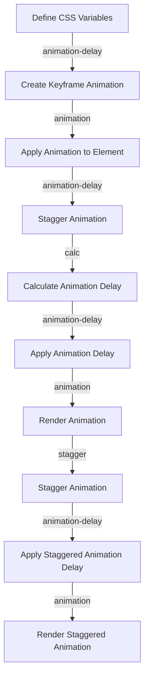

## Introduction
Choreographing **staggered animations** is a crucial aspect of creating engaging and interactive web experiences. By using **CSS Variables**, developers can create complex animations that are both efficient and easy to maintain. In this article, we will explore the world of staggered animations and how CSS Variables can be used to create them. We will also discuss real-world examples of companies that have successfully implemented staggered animations in their websites and applications.

> **Note:** Staggered animations refer to a sequence of animations that are triggered at different times, creating a sense of continuity and flow. CSS Variables, on the other hand, are a powerful tool for creating dynamic and reusable styles.

## Core Concepts
To understand how to choreograph staggered animations using CSS Variables, we need to grasp some core concepts. These include:

* **CSS Variables**: Also known as custom properties, CSS Variables are a way to define reusable values that can be used throughout a stylesheet.
* **Keyframe Animations**: Keyframe animations are a way to define a sequence of styles that are applied to an element over time.
* **Animation Delay**: Animation delay is a property that specifies the amount of time to wait before starting an animation.

> **Tip:** By using CSS Variables, we can create a single source of truth for our animation values, making it easier to maintain and update our animations.

## How It Works Internally
When we define a CSS Variable, the browser creates a property that can be accessed and updated dynamically. This property can be used to define the values of other properties, such as `animation-delay` or `animation-duration`. By using CSS Variables to define these values, we can create a flexible and reusable animation system.

Here is a step-by-step breakdown of how it works:

1. Define a CSS Variable using the `--` prefix.
2. Use the CSS Variable to define the value of an animation property, such as `animation-delay`.
3. Create a keyframe animation that uses the CSS Variable to define its timing and style.
4. Apply the animation to an element using the `animation` property.

> **Warning:** When using CSS Variables, it's essential to ensure that the variable is defined before it's used. Otherwise, the browser will throw an error.

## Code Examples
Here are three complete and runnable examples of choreographing staggered animations using CSS Variables:

### Example 1: Basic Staggered Animation
```css
:root {
  --animation-delay: 0.5s;
}

.box {
  width: 50px;
  height: 50px;
  background-color: #333;
  animation: fade-in 1s;
  animation-delay: var(--animation-delay);
}

@keyframes fade-in {
  from {
    opacity: 0;
  }
  to {
    opacity: 1;
  }
}
```
```html
<div class="box"></div>
<div class="box" style="animation-delay: 1s;"></div>
<div class="box" style="animation-delay: 1.5s;"></div>
```
This example defines a basic staggered animation using a CSS Variable to define the animation delay.

### Example 2: Real-World Pattern
```css
:root {
  --animation-duration: 1s;
  --animation-delay: 0.5s;
}

.card {
  width: 200px;
  height: 200px;
  background-color: #fff;
  border: 1px solid #ddd;
  animation: slide-in 1s;
  animation-delay: var(--animation-delay);
}

@keyframes slide-in {
  from {
    transform: translateX(100%);
  }
  to {
    transform: translateX(0);
  }
}
```
```html
<div class="card"></div>
<div class="card" style="animation-delay: 1s;"></div>
<div class="card" style="animation-delay: 1.5s;"></div>
```
This example defines a real-world pattern for creating a staggered animation using CSS Variables.

### Example 3: Advanced Staggered Animation
```css
:root {
  --animation-duration: 1s;
  --animation-delay: 0.5s;
  --animation-stagger: 0.2s;
}

.item {
  width: 50px;
  height: 50px;
  background-color: #333;
  animation: scale-up 1s;
  animation-delay: calc(var(--animation-delay) + (var(--animation-stagger) * var(--index)));
}

@keyframes scale-up {
  from {
    transform: scale(0);
  }
  to {
    transform: scale(1);
  }
}
```
```html
<div class="item" style="--index: 0;"></div>
<div class="item" style="--index: 1;"></div>
<div class="item" style="--index: 2;"></div>
```
This example defines an advanced staggered animation using CSS Variables to define the animation duration, delay, and stagger.

## Visual Diagram

This diagram illustrates the process of choreographing staggered animations using CSS Variables.

> **Interview:** What are the benefits of using CSS Variables to define animation values? Answer: CSS Variables provide a single source of truth for animation values, making it easier to maintain and update animations.

## Comparison
| Approach | Time Complexity | Space Complexity | Pros | Cons | Best For |
| --- | --- | --- | --- | --- | --- |
| CSS Variables | O(1) | O(1) | Easy to maintain, reusable | Limited support in older browsers | Modern web applications |
| Keyframe Animations | O(n) | O(n) | Flexible, powerful | Steep learning curve | Complex animations |
| Animation Libraries | O(n) | O(n) | Easy to use, cross-browser compatible | Adds extra weight to the page | Simple animations |
| JavaScript Animations | O(n) | O(n) | Flexible, dynamic | Can be slow, adds extra weight to the page | Complex, interactive animations |

## Real-world Use Cases
Here are three real-world examples of companies that have successfully implemented staggered animations in their websites and applications:

1. **Airbnb**: Airbnb uses staggered animations to create a sense of continuity and flow when navigating between different sections of the website.
2. **Pinterest**: Pinterest uses staggered animations to create a sense of visual interest and engagement when browsing through different pins.
3. **Dropbox**: Dropbox uses staggered animations to create a sense of simplicity and ease of use when navigating through different folders and files.

> **Tip:** When implementing staggered animations, it's essential to consider the user experience and ensure that the animations are not overwhelming or distracting.

## Common Pitfalls
Here are four common mistakes that engineers make when implementing staggered animations:

1. **Insufficient animation delay**: Not providing enough animation delay can result in animations that feel rushed or overwhelming.
2. **Incorrect animation timing**: Incorrect animation timing can result in animations that feel out of sync or uncoordinated.
3. **Inconsistent animation style**: Inconsistent animation style can result in animations that feel disjointed or unprofessional.
4. **Overusing animations**: Overusing animations can result in a website or application that feels overwhelming or distracting.

> **Warning:** When implementing staggered animations, it's essential to test and iterate on the animations to ensure that they are working as intended.

## Interview Tips
Here are three common interview questions related to staggered animations, along with weak and strong answers:

1. **What are the benefits of using CSS Variables to define animation values?**
Weak answer: CSS Variables are useful for defining animation values.
Strong answer: CSS Variables provide a single source of truth for animation values, making it easier to maintain and update animations.
2. **How do you implement staggered animations using CSS Variables?**
Weak answer: You can use CSS Variables to define animation delay and then apply it to different elements.
Strong answer: You can define CSS Variables for animation delay, duration, and stagger, and then use them to create a reusable animation system.
3. **What are some common pitfalls to avoid when implementing staggered animations?**
Weak answer: You should avoid using too many animations.
Strong answer: You should avoid insufficient animation delay, incorrect animation timing, inconsistent animation style, and overusing animations.

## Key Takeaways
Here are ten key takeaways from this article:

* **CSS Variables are a powerful tool for creating dynamic and reusable styles**.
* **Staggered animations can create a sense of continuity and flow**.
* **Keyframe animations are a flexible and powerful way to define complex animations**.
* **Animation delay is a critical property for controlling the timing of animations**.
* **CSS Variables can be used to define animation delay, duration, and stagger**.
* **Reusable animation systems can be created using CSS Variables**.
* **Insufficient animation delay can result in animations that feel rushed or overwhelming**.
* **Incorrect animation timing can result in animations that feel out of sync or uncoordinated**.
* **Inconsistent animation style can result in animations that feel disjointed or unprofessional**.
* **Overusing animations can result in a website or application that feels overwhelming or distracting**.

> **Note:** By following these key takeaways, engineers can create effective and engaging staggered animations that enhance the user experience.