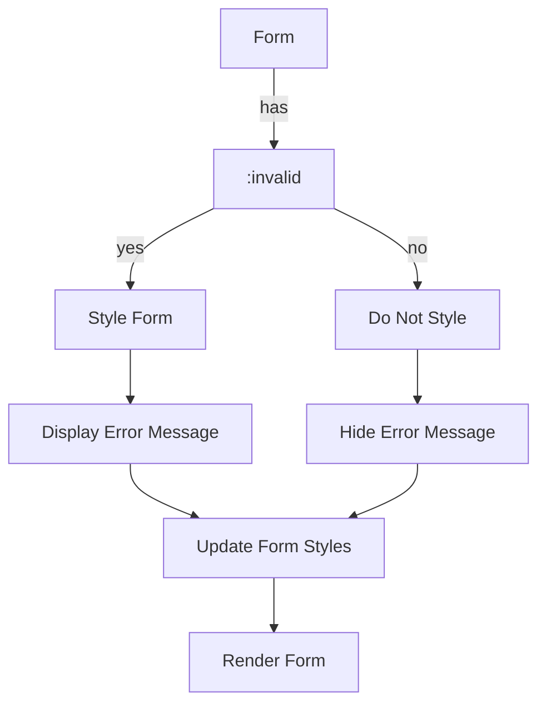

## Introduction
The `:has()` pseudo-class in CSS is a powerful tool for styling elements based on their descendants. One common use case is styling a form based on the validity of its descendants, using `form:has(:invalid)`. This allows developers to provide visual feedback to users when a form contains invalid input, without requiring complex JavaScript logic. In this article, we'll explore the `form:has(:invalid)` pseudo-class, its real-world relevance, and why every engineer needs to know about it.

> **Note:** The `:has()` pseudo-class is supported in most modern browsers, but older browsers may not support it. Be sure to check the compatibility of your target browsers before using this feature.

## Core Concepts
To understand `form:has(:invalid)`, we need to break down the individual components:

* `:has()`: a pseudo-class that allows us to select an element based on the presence of a specific descendant.
* `:invalid`: a pseudo-class that selects an element that is invalid, typically used with form elements.
* `form`: the element we're styling, which contains the invalid descendants.

The mental model for `form:has(:invalid)` is to imagine a form as a container that can have multiple children, some of which may be invalid. When any of these children are invalid, the form itself should be styled to indicate this.

> **Tip:** To make the most of `form:has(:invalid)`, combine it with other pseudo-classes like `:valid` and `:required` to create a robust form validation system.

## How It Works Internally
When a browser renders a form with `form:has(:invalid)`, it follows these steps:

1. Parse the CSS rules and identify the `:has()` pseudo-class.
2. Check if the form element has any descendants that match the `:invalid` pseudo-class.
3. If an invalid descendant is found, apply the styles defined for `form:has(:invalid)`.
4. If no invalid descendants are found, do not apply the styles.

The time complexity of this process is O(n), where n is the number of descendants in the form. This is because the browser needs to traverse the DOM tree to find all invalid descendants.

## Code Examples
### Example 1: Basic Usage
```html
<!-- index.html -->
<form id="myForm">
  <input type="email" required>
  <button type="submit">Submit</button>
</form>
```

```css
/* styles.css */
form:has(:invalid) {
  border: 1px solid red;
}

input:invalid {
  border: 1px solid red;
}
```
In this example, we define a basic form with an email input field. When the input field is invalid (e.g., when the user enters an invalid email address), the form will have a red border.

### Example 2: Real-World Pattern
```html
<!-- index.html -->
<form id="myForm">
  <label for="username">Username:</label>
  <input type="text" id="username" required pattern="[a-zA-Z0-9]+">
  <label for="password">Password:</label>
  <input type="password" id="password" required>
  <button type="submit">Submit</button>
</form>
```

```css
/* styles.css */
form:has(:invalid) {
  background-color: #fcc;
}

input:invalid {
  border: 1px solid red;
}

input:valid {
  border: 1px solid green;
}
```
In this example, we define a form with multiple input fields, each with its own validation rules. When any of the input fields are invalid, the form will have a yellow background, and the invalid input fields will have a red border.

### Example 3: Advanced Usage
```html
<!-- index.html -->
<form id="myForm">
  <label for="username">Username:</label>
  <input type="text" id="username" required pattern="[a-zA-Z0-9]+">
  <label for="password">Password:</label>
  <input type="password" id="password" required>
  <label for="confirmPassword">Confirm Password:</label>
  <input type="password" id="confirmPassword" required>
  <button type="submit">Submit</button>
</form>
```

```css
/* styles.css */
form:has(:invalid) {
  background-color: #fcc;
}

input:invalid {
  border: 1px solid red;
}

input:valid {
  border: 1px solid green;
}

#confirmPassword:invalid + label::after {
  content: "Passwords do not match";
  color: red;
}
```
In this example, we define a form with multiple input fields, including a confirm password field. When the confirm password field is invalid (e.g., when the passwords do not match), we display an error message next to the confirm password field.

## Visual Diagram

This diagram illustrates the process of styling a form based on the validity of its descendants. The form is checked for invalid descendants, and if any are found, the form is styled accordingly.

> **Warning:** When using `form:has(:invalid)`, be careful not to create circular dependencies between styles. For example, if you style the form to have a red border when it contains an invalid input field, and then style the input field to have a red border when it is invalid, you may create a circular dependency that causes the browser to crash.

## Comparison
| Approach | Time Complexity | Space Complexity | Pros | Cons | Best For |
| --- | --- | --- | --- | --- | --- |
| `form:has(:invalid)` | O(n) | O(1) | Easy to use, flexible | Limited support in older browsers | Modern web applications |
| JavaScript validation | O(n) | O(n) | More control over validation logic | More complex to implement | Complex web applications |
| Server-side validation | O(1) | O(1) | More secure | Slower, less responsive | High-security web applications |
| HTML5 validation | O(1) | O(1) | Easy to use, built-in | Limited flexibility | Simple web forms |

## Real-world Use Cases
* **Google Forms**: Google Forms uses `form:has(:invalid)` to style forms based on the validity of their descendants. When a user enters invalid data, the form is styled to indicate the error.
* **Facebook Login**: Facebook uses a combination of `form:has(:invalid)` and JavaScript validation to ensure that user input is valid before submitting the form.
* **Amazon Checkout**: Amazon uses server-side validation to ensure that user input is valid before completing the checkout process.

## Common Pitfalls
* **Circular dependencies**: When using `form:has(:invalid)`, be careful not to create circular dependencies between styles.
* **Limited support**: `form:has(:invalid)` may not be supported in older browsers. Be sure to check the compatibility of your target browsers before using this feature.
* **Performance issues**: When using `form:has(:invalid)`, be aware of the potential performance issues that can arise from traversing the DOM tree.
* **Invalid HTML**: When using `form:has(:invalid)`, be sure to validate your HTML to ensure that it is correct and consistent.

> **Tip:** To avoid performance issues when using `form:has(:invalid)`, consider using a library like jQuery to simplify the process of traversing the DOM tree.

## Interview Tips
* **What is `form:has(:invalid)`?**: Be prepared to explain the purpose and syntax of `form:has(:invalid)`.
* **How does `form:has(:invalid)` work?**: Be prepared to explain the internal mechanics of `form:has(:invalid)`, including the time complexity and space complexity.
* **What are some common use cases for `form:has(:invalid)`?**: Be prepared to provide examples of real-world use cases for `form:has(:invalid)`, such as styling forms based on the validity of their descendants.

> **Interview:** Be prepared to answer questions like "What is the difference between `form:has(:invalid)` and JavaScript validation?" or "How would you implement `form:has(:invalid)` in a real-world web application?"

## Key Takeaways
* `form:has(:invalid)` is a powerful tool for styling forms based on the validity of their descendants.
* The time complexity of `form:has(:invalid)` is O(n), where n is the number of descendants in the form.
* The space complexity of `form:has(:invalid)` is O(1), making it a efficient solution for styling forms.
* `form:has(:invalid)` is supported in most modern browsers, but older browsers may not support it.
* Be careful not to create circular dependencies between styles when using `form:has(:invalid)`.
* Consider using a library like jQuery to simplify the process of traversing the DOM tree when using `form:has(:invalid)`.
* `form:has(:invalid)` is a flexible solution that can be used in a variety of real-world use cases, from simple web forms to complex web applications.