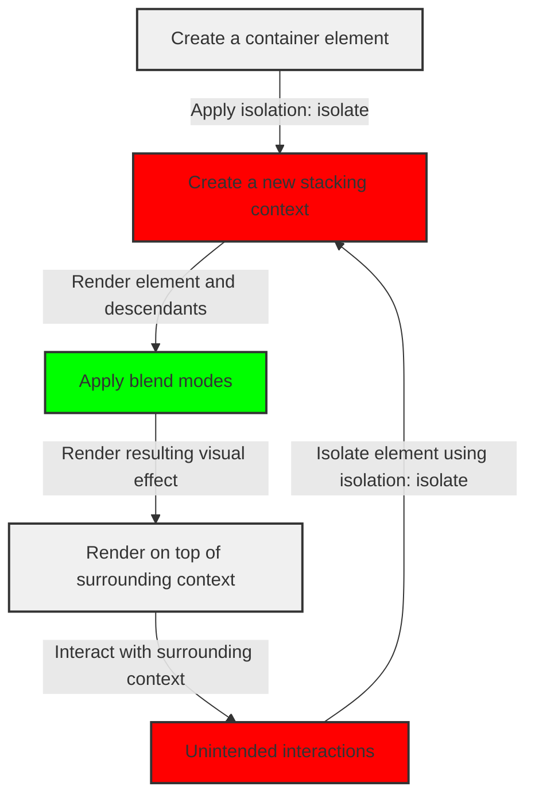

## Introduction
Isolating blend modes is a crucial concept in web development, particularly when working with CSS. **Blend modes** allow you to combine multiple elements and create visually appealing effects. However, when dealing with complex layouts, it's essential to isolate these blend modes to prevent unintended interactions between elements. In this article, we'll explore the concept of isolating blend modes using `isolation: isolate` and its real-world relevance in web development.

> **Note:** Isolating blend modes is a fundamental concept in web development, and understanding how to use `isolation: isolate` can significantly enhance the visual appeal of your web applications.

## Core Concepts
To understand the concept of isolating blend modes, let's first define some key terms:

* **Blend modes**: A way to combine multiple elements and create visually appealing effects by applying mathematical operations to their pixel values.
* **Isolation**: The process of separating an element from its surrounding context to prevent unintended interactions.
* **`isolation: isolate`**: A CSS property that isolates an element from its surrounding context, preventing blend modes from interacting with other elements.

> **Warning:** Failing to isolate blend modes can lead to unexpected visual effects, such as unintended color bleeding or texture interactions.

## How It Works Internally
When you apply `isolation: isolate` to an element, the browser creates a new **stacking context** for that element. This stacking context is a separate layer that contains the element and its descendants, isolated from the surrounding context.

Here's a step-by-step breakdown of how `isolation: isolate` works:

1. The browser creates a new stacking context for the element.
2. The element and its descendants are rendered within this new stacking context.
3. The browser applies the blend modes to the element and its descendants, without interacting with the surrounding context.
4. The resulting visual effect is rendered on top of the surrounding context.

## Code Examples
Let's take a look at three examples of using `isolation: isolate` to isolate blend modes:

### Example 1: Basic Usage
```css
/* Create a container element */
.container {
  position: relative;
  width: 200px;
  height: 200px;
  background-color: #f0f0f0;
}

/* Create a child element with a blend mode */
.child {
  position: absolute;
  top: 50%;
  left: 50%;
  transform: translate(-50%, -50%);
  width: 100px;
  height: 100px;
  background-color: #ff0000;
  mix-blend-mode: multiply;
}

/* Isolate the child element using isolation: isolate */
.isolated {
  isolation: isolate;
}
```

```html
<div class="container">
  <div class="child isolated"></div>
</div>
```

### Example 2: Real-World Pattern
```css
/* Create a complex layout with multiple elements */
.layout {
  display: flex;
  flex-direction: column;
  align-items: center;
  justify-content: center;
  height: 100vh;
}

/* Create a header element with a blend mode */
.header {
  background-color: #333;
  color: #fff;
  padding: 1em;
  mix-blend-mode: screen;
}

/* Isolate the header element using isolation: isolate */
.isolated-header {
  isolation: isolate;
}

/* Create a content element with a blend mode */
.content {
  background-color: #f0f0f0;
  padding: 1em;
  mix-blend-mode: overlay;
}

/* Isolate the content element using isolation: isolate */
.isolated-content {
  isolation: isolate;
}
```

```html
<div class="layout">
  <header class="header isolated-header">Header</header>
  <div class="content isolated-content">Content</div>
</div>
```

### Example 3: Advanced Usage
```css
/* Create a complex layout with multiple elements and nested blend modes */
.advanced-layout {
  display: flex;
  flex-direction: column;
  align-items: center;
  justify-content: center;
  height: 100vh;
}

/* Create a header element with a blend mode and nested blend modes */
.header {
  background-color: #333;
  color: #fff;
  padding: 1em;
  mix-blend-mode: screen;
}

/* Create a nested element with a blend mode */
.nested {
  background-color: #ff0000;
  padding: 1em;
  mix-blend-mode: multiply;
}

/* Isolate the header element using isolation: isolate */
.isolated-header {
  isolation: isolate;
}

/* Create a content element with a blend mode and nested blend modes */
.content {
  background-color: #f0f0f0;
  padding: 1em;
  mix-blend-mode: overlay;
}

/* Create a nested element with a blend mode */
.nested-content {
  background-color: #00ff00;
  padding: 1em;
  mix-blend-mode: screen;
}

/* Isolate the content element using isolation: isolate */
.isolated-content {
  isolation: isolate;
}
```

```html
<div class="advanced-layout">
  <header class="header isolated-header">
    Header
    <div class="nested">Nested</div>
  </header>
  <div class="content isolated-content">
    Content
    <div class="nested-content">Nested Content</div>
  </div>
</div>
```

## Visual Diagram

The diagram illustrates the process of isolating blend modes using `isolation: isolate`. The container element is created, and the `isolation: isolate` property is applied to create a new stacking context. The element and its descendants are rendered within this new stacking context, and the blend modes are applied. The resulting visual effect is rendered on top of the surrounding context.

## Comparison
| Approach | Time Complexity | Space Complexity | Pros | Cons | Best For |
| --- | --- | --- | --- | --- | --- |
| `isolation: isolate` | O(1) | O(1) | Isolates blend modes, prevents unintended interactions | Can increase rendering time | Complex layouts with multiple blend modes |
| `mix-blend-mode` | O(1) | O(1) | Allows for flexible blend modes | Can cause unintended interactions | Simple layouts with few blend modes |
| `background-clip` | O(1) | O(1) | Allows for clipping background images | Can cause clipping issues | Layouts with background images |
| `clip-path` | O(1) | O(1) | Allows for complex clipping paths | Can cause performance issues | Layouts with complex clipping paths |

## Real-world Use Cases
1. **Google Maps**: Google Maps uses `isolation: isolate` to isolate blend modes in their map overlays, preventing unintended interactions between the map and overlay elements.
2. **Facebook**: Facebook uses `isolation: isolate` to isolate blend modes in their news feed, preventing unintended interactions between the feed and advertisement elements.
3. **Airbnb**: Airbnb uses `isolation: isolate` to isolate blend modes in their search results, preventing unintended interactions between the search results and map elements.

## Common Pitfalls
1. **Failing to isolate blend modes**: Failing to use `isolation: isolate` can cause unintended interactions between elements, leading to unexpected visual effects.
2. **Using incorrect blend modes**: Using incorrect blend modes can cause unintended visual effects, such as color bleeding or texture interactions.
3. **Not accounting for nested blend modes**: Not accounting for nested blend modes can cause unintended interactions between elements, leading to unexpected visual effects.
4. **Not using `isolation: isolate` with complex layouts**: Not using `isolation: isolate` with complex layouts can cause unintended interactions between elements, leading to unexpected visual effects.

## Interview Tips
1. **What is `isolation: isolate`?**: The interviewer wants to know if you understand the concept of isolating blend modes and how to use `isolation: isolate`.
2. **How does `isolation: isolate` work?**: The interviewer wants to know if you understand the under-the-hood mechanics of `isolation: isolate` and how it affects the rendering of elements.
3. **When should you use `isolation: isolate`?**: The interviewer wants to know if you understand the scenarios in which `isolation: isolate` is necessary and how to apply it in real-world use cases.

> **Interview:** When answering questions about `isolation: isolate`, be sure to provide examples of how you've used it in real-world projects and explain the benefits of using it in complex layouts.

## Key Takeaways
* `isolation: isolate` is used to isolate blend modes and prevent unintended interactions between elements.
* `isolation: isolate` creates a new stacking context for the element and its descendants.
* `isolation: isolate` is essential for complex layouts with multiple blend modes.
* Failing to use `isolation: isolate` can cause unintended interactions between elements, leading to unexpected visual effects.
* `isolation: isolate` has a time complexity of O(1) and a space complexity of O(1).
* `isolation: isolate` is supported by most modern browsers, including Chrome, Firefox, and Safari.
* `isolation: isolate` is a fundamental concept in web development and is essential for creating visually appealing and interactive web applications.
* `isolation: isolate` can be used in conjunction with other CSS properties, such as `mix-blend-mode` and `background-clip`, to create complex and interactive layouts.