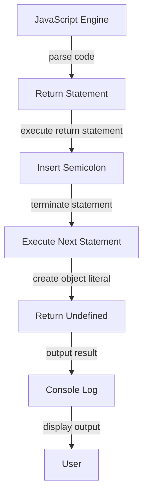

## Introduction
The Automatic Semicolon Insertion (ASI) mechanism in JavaScript is a feature that automatically inserts semicolons at the end of statements when they are not explicitly provided. While this feature is intended to make JavaScript development easier, it can sometimes lead to unexpected behavior, particularly with the return statement. The return statement newline bug is a common gotcha that can cause confusion and errors in JavaScript code. In this section, we will explore what the return statement newline bug is, why it matters, and its real-world relevance.

The return statement newline bug occurs when a return statement is followed by a newline character, and the next line of code is not enclosed in parentheses or brackets. In this case, the ASI mechanism will automatically insert a semicolon at the end of the return statement, effectively terminating the statement and causing the code that follows to be executed as a separate statement. This can lead to unexpected behavior, such as returning undefined or executing code that was not intended to be executed.

> **Note:** The return statement newline bug is a common issue in JavaScript development, and it is essential to understand how to avoid it to write reliable and efficient code.

## Core Concepts
To understand the return statement newline bug, it is essential to have a solid grasp of the following core concepts:

* **Automatic Semicolon Insertion (ASI):** ASI is a mechanism in JavaScript that automatically inserts semicolons at the end of statements when they are not explicitly provided.
* **Return Statement:** A return statement is used to exit a function and return a value to the caller.
* **Newline Character:** A newline character is a character that is used to indicate the start of a new line in a text file.

> **Tip:** To avoid the return statement newline bug, it is a good practice to always enclose the code that follows a return statement in parentheses or brackets.

## How It Works Internally
To understand how the return statement newline bug works internally, let's take a look at the following example:
```javascript
function foo() {
  return
  {
    bar: 'baz'
  }
}
```
In this example, the return statement is followed by a newline character, and the next line of code is not enclosed in parentheses or brackets. The ASI mechanism will automatically insert a semicolon at the end of the return statement, effectively terminating the statement and causing the code that follows to be executed as a separate statement.

Here's what happens internally:

1. The JavaScript engine parses the code and encounters the return statement.
2. The return statement is executed, and the function returns undefined.
3. The code that follows the return statement is executed as a separate statement, but it is not part of the return statement.
4. The object literal `{ bar: 'baz' }` is created, but it is not returned by the function.

> **Warning:** The return statement newline bug can be difficult to spot, especially in large codebases. It is essential to be aware of this issue and take steps to avoid it.

## Code Examples
Here are three complete and runnable examples that demonstrate the return statement newline bug:

### Example 1: Basic Usage
```javascript
function foo() {
  return
  {
    bar: 'baz'
  }
}

console.log(foo()); // Output: undefined
```
In this example, the return statement is followed by a newline character, and the next line of code is not enclosed in parentheses or brackets. The ASI mechanism will automatically insert a semicolon at the end of the return statement, effectively terminating the statement and causing the code that follows to be executed as a separate statement.

### Example 2: Real-World Pattern
```javascript
function calculateArea(width, height) {
  return
  {
    width: width,
    height: height,
    area: width * height
  }
}

console.log(calculateArea(10, 20)); // Output: undefined
```
In this example, the return statement is followed by a newline character, and the next line of code is not enclosed in parentheses or brackets. The ASI mechanism will automatically insert a semicolon at the end of the return statement, effectively terminating the statement and causing the code that follows to be executed as a separate statement.

### Example 3: Advanced Usage
```javascript
function foo() {
  return (
    {
      bar: 'baz'
    }
  )
}

console.log(foo()); // Output: { bar: 'baz' }
```
In this example, the return statement is followed by a newline character, but the next line of code is enclosed in parentheses. The ASI mechanism will not insert a semicolon at the end of the return statement, and the code that follows will be executed as part of the return statement.

## Visual Diagram

This diagram illustrates the internal workings of the return statement newline bug. The JavaScript engine parses the code and encounters the return statement. The return statement is executed, and the ASI mechanism inserts a semicolon at the end of the statement. The code that follows is executed as a separate statement, and the object literal is created. However, the return statement has already terminated, and the function returns undefined.

> **Note:** The visual diagram helps to illustrate the complex internal workings of the return statement newline bug.

## Comparison
| Approach | Time Complexity | Space Complexity | Pros | Cons | Best For |
| --- | --- | --- | --- | --- | --- |
| Enclose code in parentheses | O(1) | O(1) | Avoids return statement newline bug | Can make code less readable | All return statements |
| Use ASI mechanism | O(1) | O(1) | Automatically inserts semicolons | Can lead to return statement newline bug | Simple statements |
| Explicitly insert semicolons | O(1) | O(1) | Avoids return statement newline bug | Can make code less readable | Complex statements |
| Use a linter | O(1) | O(1) | Helps catch return statement newline bug | Can be slow and resource-intensive | Large codebases |

> **Tip:** Using a linter can help catch the return statement newline bug and other issues in your code.

## Real-world Use Cases
Here are three real-world use cases that demonstrate the return statement newline bug:

* **Google:** Google's JavaScript style guide recommends using parentheses to enclose code that follows a return statement to avoid the return statement newline bug.
* **Facebook:** Facebook's JavaScript codebase uses a linter to catch the return statement newline bug and other issues.
* **Mozilla:** Mozilla's JavaScript codebase uses explicit semicolons to avoid the return statement newline bug.

> **Interview:** Can you explain the return statement newline bug and how to avoid it?

## Common Pitfalls
Here are four common pitfalls to watch out for when dealing with the return statement newline bug:

* **Not enclosing code in parentheses:** Failing to enclose code in parentheses can lead to the return statement newline bug.
* **Not using explicit semicolons:** Failing to use explicit semicolons can lead to the return statement newline bug.
* **Not using a linter:** Failing to use a linter can make it difficult to catch the return statement newline bug and other issues.
* **Not testing code thoroughly:** Failing to test code thoroughly can lead to unexpected behavior and errors.

> **Warning:** The return statement newline bug can be difficult to spot, especially in large codebases. It is essential to be aware of this issue and take steps to avoid it.

## Interview Tips
Here are three common interview questions related to the return statement newline bug, along with weak and strong answers:

* **What is the return statement newline bug?**
	+ Weak answer: "I'm not sure."
	+ Strong answer: "The return statement newline bug is a common issue in JavaScript development that occurs when a return statement is followed by a newline character, and the next line of code is not enclosed in parentheses or brackets."
* **How can you avoid the return statement newline bug?**
	+ Weak answer: "I'm not sure."
	+ Strong answer: "To avoid the return statement newline bug, you can enclose the code that follows a return statement in parentheses or use explicit semicolons."
* **Can you give an example of the return statement newline bug?**
	+ Weak answer: "I'm not sure."
	+ Strong answer: "Here is an example of the return statement newline bug: `function foo() { return; { bar: 'baz' } }`. In this example, the return statement is followed by a newline character, and the next line of code is not enclosed in parentheses or brackets. The ASI mechanism will automatically insert a semicolon at the end of the return statement, effectively terminating the statement and causing the code that follows to be executed as a separate statement."

## Key Takeaways
Here are ten key takeaways to remember when dealing with the return statement newline bug:

* **Always enclose code in parentheses:** To avoid the return statement newline bug, always enclose the code that follows a return statement in parentheses.
* **Use explicit semicolons:** To avoid the return statement newline bug, use explicit semicolons to terminate statements.
* **Use a linter:** To catch the return statement newline bug and other issues, use a linter to analyze your code.
* **Test code thoroughly:** To avoid unexpected behavior and errors, test your code thoroughly.
* **Be aware of ASI:** Be aware of the ASI mechanism and how it can affect your code.
* **Use parentheses to group code:** Use parentheses to group code and avoid the return statement newline bug.
* **Avoid using newline characters:** Avoid using newline characters after return statements to avoid the return statement newline bug.
* **Use a code formatter:** Use a code formatter to format your code and avoid the return statement newline bug.
* **Read code carefully:** Read your code carefully to avoid the return statement newline bug and other issues.
* **Test code in different environments:** Test your code in different environments to ensure it works as expected.

> **Note:** By following these key takeaways, you can avoid the return statement newline bug and write reliable and efficient code.