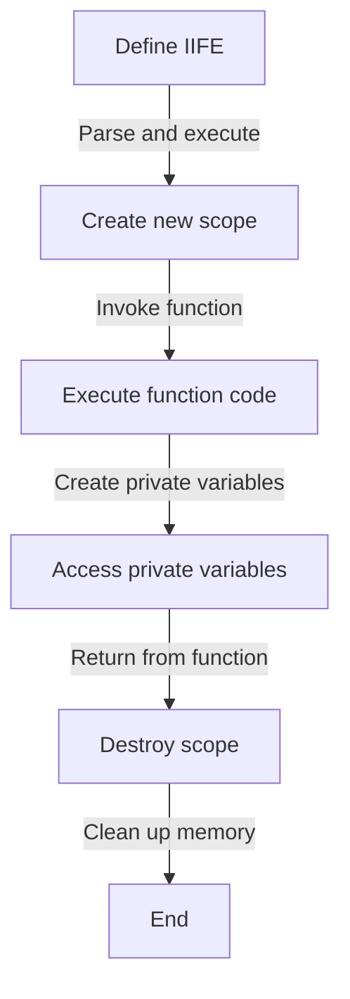

## Introduction
An **IIFE (Immediately Invoked Function Expression)** is a design pattern in JavaScript that allows you to create a function and execute it immediately. This pattern is useful for encapsulating code, avoiding global variable pollution, and creating private variables. IIFEs are commonly used in web development to create modular, self-contained code that can be easily reused. In this section, we will explore the basics of IIFEs, their benefits, and why they are an essential tool for any JavaScript developer.

> **Note:** IIFEs are often used to create a scope for variables that should not be accessible from outside the function. This helps to prevent global variable pollution and reduces the risk of naming conflicts.

## Core Concepts
To understand IIFEs, you need to grasp the following core concepts:
* **Function Expression:** A function expression is a function that is defined as an expression, rather than a statement. This means that it is assigned to a variable or passed as an argument to another function.
* **Immediately Invoked:** An IIFE is invoked immediately after it is defined. This is typically done by adding parentheses at the end of the function expression, which calls the function.
* **Scope:** IIFEs create a new scope for the variables defined inside them. This means that variables defined inside an IIFE are not accessible from outside the function.

> **Tip:** IIFEs are a great way to create modular code that is easy to maintain and reuse. By encapsulating code in an IIFE, you can avoid global variable pollution and reduce the risk of naming conflicts.

## How It Works Internally
When an IIFE is executed, the following steps occur:
1. The function expression is parsed and executed.
2. A new scope is created for the variables defined inside the IIFE.
3. The function is invoked immediately, with the specified arguments.
4. The function executes, and any variables defined inside the function are created in the new scope.
5. When the function completes, the scope is destroyed, and any variables defined inside the function are no longer accessible.

> **Warning:** Be careful when using IIFEs, as they can create a new scope for every invocation. This can lead to memory leaks if not managed properly.

## Code Examples
### Example 1: Basic IIFE
```javascript
// Define an IIFE that logs a message to the console
(function() {
  console.log("Hello, World!");
})();
```
This example demonstrates a basic IIFE that logs a message to the console.

### Example 2: IIFE with Arguments
```javascript
// Define an IIFE that takes an argument and logs it to the console
(function(name) {
  console.log(`Hello, ${name}!`);
})("John");
```
This example demonstrates an IIFE that takes an argument and logs it to the console.

### Example 3: IIFE with Private Variables
```javascript
// Define an IIFE that creates a private variable and returns a function that accesses it
var counter = (function() {
  var privateCounter = 0;
  return function() {
    privateCounter++;
    console.log(`Counter: ${privateCounter}`);
  };
})();

// Invoke the function returned by the IIFE
counter(); // Output: Counter: 1
counter(); // Output: Counter: 2
```
This example demonstrates an IIFE that creates a private variable and returns a function that accesses it.

## Visual Diagram

This diagram illustrates the steps involved in executing an IIFE.

## Comparison
| Approach | Time Complexity | Space Complexity | Pros | Cons | Best For |
| --- | --- | --- | --- | --- | --- |
| IIFE | O(1) | O(1) | Encapsulates code, avoids global variable pollution | Can create memory leaks if not managed properly | Creating modular, self-contained code |
| Global Variables | O(1) | O(1) | Easy to access and modify | Can lead to naming conflicts and global variable pollution | Simple scripts or prototypes |
| Closures | O(1) | O(1) | Can create private variables and functions | Can be difficult to understand and manage | Creating complex, modular code |
| Modules | O(1) | O(1) | Encapsulates code, avoids global variable pollution | Can be overkill for small projects | Creating large, complex applications |

## Real-world Use Cases
1. **Google Maps:** Google Maps uses IIFEs to create modular, self-contained code that can be easily reused.
2. **Facebook:** Facebook uses IIFEs to create private variables and functions that are not accessible from outside the module.
3. **jQuery:** jQuery uses IIFEs to create a scope for its internal variables and functions, avoiding global variable pollution.

> **Interview:** Can you explain the benefits of using IIFEs in JavaScript? How do they help to avoid global variable pollution?

## Common Pitfalls
1. **Memory Leaks:** IIFEs can create memory leaks if not managed properly.
2. **Naming Conflicts:** IIFEs can lead to naming conflicts if not properly scoped.
3. **Complexity:** IIFEs can be difficult to understand and manage, especially for complex codebases.
4. **Performance:** IIFEs can impact performance if not optimized properly.

> **Warning:** Be careful when using IIFEs, as they can create a new scope for every invocation. This can lead to memory leaks if not managed properly.

## Interview Tips
1. **What is an IIFE?** An IIFE is a design pattern in JavaScript that allows you to create a function and execute it immediately.
2. **What are the benefits of using IIFEs?** IIFEs help to avoid global variable pollution, create private variables and functions, and encapsulate code.
3. **How do IIFEs work internally?** IIFEs create a new scope for the variables defined inside them, and the function is invoked immediately after it is defined.

> **Tip:** When answering questions about IIFEs, be sure to explain the benefits and how they work internally. This will demonstrate your understanding of the concept and its applications.

## Key Takeaways
* IIFEs are a design pattern in JavaScript that allows you to create a function and execute it immediately.
* IIFEs help to avoid global variable pollution, create private variables and functions, and encapsulate code.
* IIFEs create a new scope for the variables defined inside them, and the function is invoked immediately after it is defined.
* IIFEs can be used to create modular, self-contained code that can be easily reused.
* IIFEs can be difficult to understand and manage, especially for complex codebases.
* IIFEs can impact performance if not optimized properly.
* IIFEs are commonly used in web development to create modular, self-contained code that can be easily reused.
* IIFEs are a great way to create private variables and functions that are not accessible from outside the module.