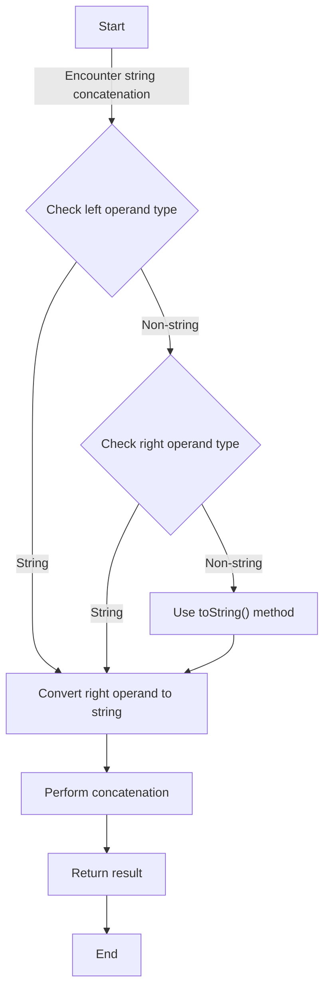

## Introduction
**Implicit type coercion** is a fundamental concept in JavaScript that refers to the automatic conversion of a value from one data type to another. This occurs when the JavaScript engine encounters an operation that involves values of different types, such as during string concatenation using the `+` operator. Understanding implicit type coercion is crucial for writing robust and predictable JavaScript code, as it can significantly impact the behavior of your programs. In this section, we will delve into the world of implicit type coercion, exploring its core concepts, internal mechanics, and real-world implications.

## Core Concepts
At its core, implicit type coercion involves the conversion of a value from one data type to another, without explicit instruction from the developer. This process is driven by the JavaScript engine's need to perform operations on values of different types. In the context of string concatenation, implicit type coercion occurs when the `+` operator is used to combine a string with a value of a different type, such as a number or an object. The key terminology to understand here includes:

* **Type coercion**: The process of converting a value from one data type to another.
* **Implicit coercion**: The automatic conversion of a value from one data type to another, without explicit instruction from the developer.
* **Explicit coercion**: The explicit conversion of a value from one data type to another, using methods such as `toString()` or `parseInt()`.

> **Note:** Implicit type coercion can be a powerful tool for simplifying code, but it can also lead to unexpected behavior if not understood properly.

## How It Works Internally
When the JavaScript engine encounters a string concatenation operation using the `+` operator, it follows a specific set of steps to perform the implicit type coercion:

1. **Check the type of the left operand**: If the left operand is a string, the engine will attempt to convert the right operand to a string.
2. **Check the type of the right operand**: If the right operand is not a string, the engine will attempt to convert it to a string using the `toString()` method.
3. **Perform the concatenation**: Once both operands are strings, the engine will concatenate them using the `+` operator.

> **Warning:** Be aware that implicit type coercion can lead to unexpected behavior when working with objects, as the `toString()` method may return a string that is not what you expect.

## Code Examples
### Example 1: Basic String Concatenation
```javascript
// Define two variables
let name = 'John';
let age = 30;

// Concatenate the variables using the + operator
let result = 'My name is ' + name + ' and I am ' + age + ' years old.';

// Log the result to the console
console.log(result); // Output: "My name is John and I am 30 years old."
```
### Example 2: Implicit Type Coercion with Numbers
```javascript
// Define two variables
let num1 = 10;
let num2 = 20;

// Concatenate the variables using the + operator
let result = 'The sum of ' + num1 + ' and ' + num2 + ' is ' + (num1 + num2);

// Log the result to the console
console.log(result); // Output: "The sum of 10 and 20 is 30"
```
### Example 3: Implicit Type Coercion with Objects
```javascript
// Define an object
let person = {
  name: 'Jane',
  age: 25
};

// Concatenate the object with a string using the + operator
let result = 'My name is ' + person + ' and I am a person.';

// Log the result to the console
console.log(result); // Output: "My name is [object Object] and I am a person."
```
> **Tip:** When working with objects, use the `JSON.stringify()` method to convert the object to a string, rather than relying on implicit type coercion.

## Visual Diagram

The diagram illustrates the step-by-step process of implicit type coercion during string concatenation.

## Comparison
| Approach | Time Complexity | Space Complexity | Pros | Cons | Best For |
| --- | --- | --- | --- | --- | --- |
| Implicit Type Coercion | O(1) | O(1) | Convenient, simplifies code | Can lead to unexpected behavior | Simple string concatenation operations |
| Explicit Type Coercion | O(1) | O(1) | More predictable, easier to debug | More verbose, requires more code | Complex operations, working with objects |
| JSON.stringify() | O(n) | O(n) | Converts objects to strings, predictable | Slower, more memory-intensive | Working with objects, logging data |
| toString() method | O(1) | O(1) | Converts values to strings, predictable | Can return unexpected strings | Working with primitive values, logging data |

## Real-world Use Cases
1. **Logging data**: Implicit type coercion is often used when logging data to the console, as it simplifies the code and makes it more readable.
2. **String templating**: Implicit type coercion is used in string templating engines, such as Handlebars, to simplify the process of generating dynamic strings.
3. **API responses**: Implicit type coercion is used when handling API responses, as it allows developers to easily concatenate strings and values.

> **Interview:** Be prepared to explain the differences between implicit and explicit type coercion, and how to use them effectively in your code.

## Common Pitfalls
1. **Unexpected behavior with objects**: Implicit type coercion can lead to unexpected behavior when working with objects, as the `toString()` method may return a string that is not what you expect.
2. **Performance issues**: Implicit type coercion can lead to performance issues when working with large datasets, as it can create temporary strings and objects.
3. **Debugging challenges**: Implicit type coercion can make it more difficult to debug your code, as it can be harder to understand what is happening behind the scenes.
4. **Security vulnerabilities**: Implicit type coercion can lead to security vulnerabilities, such as XSS attacks, if not handled properly.

> **Warning:** Be aware of the potential pitfalls of implicit type coercion and take steps to avoid them in your code.

## Interview Tips
1. **Be prepared to explain implicit type coercion**: Make sure you can explain how implicit type coercion works, and how to use it effectively in your code.
2. **Understand the differences between implicit and explicit type coercion**: Be able to explain the differences between implicit and explicit type coercion, and how to use them in different situations.
3. **Know how to handle objects and arrays**: Be prepared to explain how to handle objects and arrays when using implicit type coercion.

> **Tip:** Practice explaining complex concepts, such as implicit type coercion, to improve your communication skills and prepare for technical interviews.

## Key Takeaways
* Implicit type coercion is a powerful tool for simplifying code, but it can lead to unexpected behavior if not understood properly.
* Use explicit type coercion when working with complex operations or objects.
* Be aware of the potential pitfalls of implicit type coercion, such as performance issues and security vulnerabilities.
* Practice explaining complex concepts, such as implicit type coercion, to improve your communication skills and prepare for technical interviews.
* Use `JSON.stringify()` or `toString()` methods when working with objects or arrays.
* Understand the differences between implicit and explicit type coercion, and how to use them in different situations.
* Be prepared to explain how implicit type coercion works, and how to use it effectively in your code.