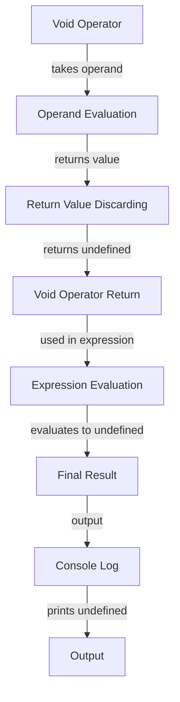

## Introduction
The **void operator** is a fundamental concept in JavaScript that allows developers to explicitly specify the return value of a function or expression. It is a unary operator that takes an operand and returns **undefined**. The void operator is often used to prevent a function from returning a value, or to discard the return value of a function. In this section, we will explore the importance of the void operator, its real-world relevance, and why every engineer needs to know about it.

> **Note:** The void operator is not to be confused with the **void** keyword in other programming languages, which is used to declare a function that does not return a value.

## Core Concepts
The void operator is a simple yet powerful concept that can be understood through a few key definitions and mental models.

* **Unary operator:** The void operator is a unary operator, meaning it takes only one operand.
* **Return value:** The return value of the void operator is always **undefined**.
* **Discarding return values:** The void operator can be used to discard the return value of a function or expression.

> **Tip:** When using the void operator, keep in mind that it will always return **undefined**, regardless of the operand.

## How It Works Internally
To understand how the void operator works internally, let's take a look at the step-by-step process of how it is executed.

1. The void operator is encountered in the code.
2. The operand is evaluated and its return value is determined.
3. The return value of the operand is discarded.
4. The void operator returns **undefined**.

> **Warning:** Be careful when using the void operator, as it can lead to unexpected behavior if not used correctly.

## Code Examples
Here are three complete and runnable code examples that demonstrate the usage of the void operator.

### Example 1: Basic Usage
```javascript
// Define a function that returns a value
function add(a, b) {
  return a + b;
}

// Use the void operator to discard the return value
void add(2, 3);

console.log(typeof add(2, 3)); // Output: number
console.log(typeof void add(2, 3)); // Output: undefined
```

### Example 2: Real-World Pattern
```javascript
// Define a function that returns an object
function createPerson(name, age) {
  return { name, age };
}

// Use the void operator to discard the return value
void createPerson('John Doe', 30);

// Define a function that uses the void operator
function printPerson(name, age) {
  void console.log(`Name: ${name}, Age: ${age}`);
}

printPerson('Jane Doe', 25);
```

### Example 3: Advanced Usage
```javascript
// Define a function that returns a promise
function fetchUser(id) {
  return new Promise((resolve, reject) => {
    // Simulate a network request
    setTimeout(() => {
      resolve({ id, name: 'John Doe' });
    }, 2000);
  });
}

// Use the void operator to discard the return value
void fetchUser(1).then((user) => {
  console.log(user);
});
```

## Visual Diagram


The void operator works by taking an operand, evaluating its return value, discarding the return value, and returning **undefined**. This process is illustrated in the above diagram, which shows the step-by-step execution of the void operator.

## Comparison
Here is a comparison table that highlights the differences between the void operator and other related concepts.

| Approach | Time Complexity | Space Complexity | Pros | Cons | Best For |
|----------|----------------|-----------------|------|------|----------|
| Void Operator | O(1) | O(1) | Discards return value, returns undefined | Can lead to unexpected behavior if not used correctly | Preventing a function from returning a value, discarding return values |
| Nullish Coalescing Operator | O(1) | O(1) | Returns the first operand if it is not null or undefined, otherwise returns the second operand | Can be confusing if not used correctly | Handling null or undefined values |
| Optional Chaining Operator | O(1) | O(1) | Returns the value of the property if it exists, otherwise returns undefined | Can be confusing if not used correctly | Handling nested properties |
| Function Return Type | O(1) | O(1) | Specifies the return type of a function | Can be verbose if not used correctly | Specifying the return type of a function |

> **Interview:** Can you explain the difference between the void operator and the nullish coalescing operator?

## Real-world Use Cases
Here are three real-world use cases that demonstrate the usage of the void operator.

1. **Preventing a function from returning a value:** In some cases, you may want to prevent a function from returning a value. The void operator can be used to achieve this.
2. **Discarding return values:** The void operator can be used to discard the return value of a function or expression.
3. **Handling asynchronous code:** The void operator can be used to handle asynchronous code, such as promises or callbacks.

> **Note:** The void operator is not commonly used in real-world applications, but it can be useful in certain situations.

## Common Pitfalls
Here are four common pitfalls to watch out for when using the void operator.

1. **Unexpected behavior:** The void operator can lead to unexpected behavior if not used correctly.
2. **Discarding important values:** The void operator can discard important values if not used carefully.
3. **Confusing code:** The void operator can make code confusing if not used correctly.
4. **Performance issues:** The void operator can lead to performance issues if not used efficiently.

> **Warning:** Be careful when using the void operator, as it can lead to unexpected behavior or performance issues if not used correctly.

## Interview Tips
Here are three common interview questions related to the void operator, along with weak and strong answers.

1. **What is the purpose of the void operator?**
	* Weak answer: The void operator is used to return undefined.
	* Strong answer: The void operator is used to discard the return value of a function or expression, and return undefined.
2. **How does the void operator work internally?**
	* Weak answer: The void operator takes an operand and returns undefined.
	* Strong answer: The void operator takes an operand, evaluates its return value, discards the return value, and returns undefined.
3. **Can you give an example of using the void operator in a real-world scenario?**
	* Weak answer: The void operator can be used to prevent a function from returning a value.
	* Strong answer: The void operator can be used to discard the return value of a function or expression, such as when handling asynchronous code or preventing a function from returning a value.

> **Tip:** When answering interview questions related to the void operator, be sure to provide clear and concise explanations, and use examples to illustrate your points.

## Key Takeaways
Here are ten key takeaways to remember about the void operator.

* The void operator is a unary operator that takes an operand and returns undefined.
* The void operator discards the return value of a function or expression.
* The void operator can be used to prevent a function from returning a value.
* The void operator can be used to handle asynchronous code.
* The void operator can lead to unexpected behavior if not used correctly.
* The void operator can discard important values if not used carefully.
* The void operator can make code confusing if not used correctly.
* The void operator can lead to performance issues if not used efficiently.
* The void operator is not commonly used in real-world applications, but it can be useful in certain situations.
* The void operator should be used with caution and care, as it can have unintended consequences if not used correctly.

> **Note:** The void operator is a powerful tool that can be used to achieve specific goals, but it should be used with caution and care.