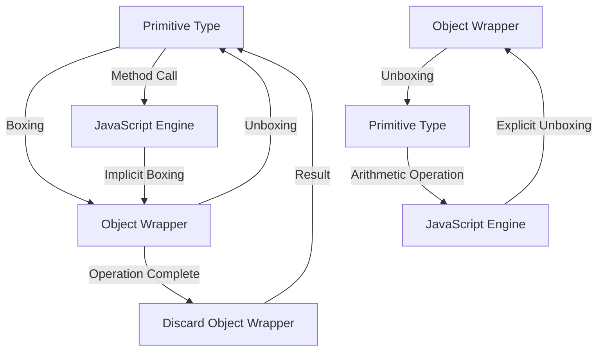

## Introduction
**Boxing and Unboxing**, also known as **Primitive Wrapper Objects** generation, is a fundamental concept in JavaScript that deals with the conversion of primitive data types to their corresponding object wrappers and vice versa. This process is crucial in understanding how JavaScript handles data types, especially when working with primitives and objects. In real-world scenarios, boxing and unboxing are encountered in various aspects of web development, such as data manipulation, function arguments, and property access. Every engineer needs to understand this concept to write efficient, bug-free code.

## Core Concepts
- **Primitive Types**: These are the basic data types in JavaScript, including `number`, `string`, `boolean`, `null`, and `undefined`. They are immutable and have no methods.
- **Object Wrappers**: These are objects that wrap around primitive types, providing methods and properties. For example, `Number`, `String`, and `Boolean` are object wrappers for `number`, `string`, and `boolean` primitives, respectively.
- **Boxing**: The process of converting a primitive type to its corresponding object wrapper. This is done implicitly by JavaScript when a method is called on a primitive type.
- **Unboxing**: The process of converting an object wrapper back to its primitive type. This occurs when a value is needed in its primitive form, such as in arithmetic operations.

## How It Works Internally
When a primitive type is used in a context where an object is expected (e.g., calling a method on a primitive), JavaScript implicitly creates an object wrapper around the primitive. This object wrapper is then used for the operation, and after the operation is complete, the object wrapper is discarded, leaving the original primitive unchanged. This process is known as **boxing**. Conversely, when an object wrapper is used in a context where a primitive is expected, JavaScript **unboxes** the object wrapper, returning its primitive value.

```javascript
// Example of implicit boxing
let num = 5;
console.log(num.toString()); // Implicitly boxes num to a Number object

// Example of explicit unboxing
let numObj = new Number(5);
console.log(+numObj); // Explicitly unboxes numObj to a number primitive
```

## Code Examples
### Example 1: Basic Boxing
```javascript
// Basic usage of boxing
let primitiveString = "Hello";
console.log(primitiveString.toUpperCase()); // Implicitly boxes the string to a String object
```

### Example 2: Real-world Pattern with Unboxing
```javascript
// Real-world example involving unboxing
function sum(a, b) {
    return +a + +b; // Explicitly unboxes a and b to numbers
}

console.log(sum("5", "10")); // Outputs: 15
```

### Example 3: Advanced Usage with Custom Object
```javascript
// Advanced example: Creating a custom object that boxes and unboxes
class CustomNumber {
    constructor(value) {
        this.value = value;
    }

    // Method to box the value
    toString() {
        return `CustomNumber(${this.value})`;
    }

    // Method to unbox the value
    valueOf() {
        return this.value;
    }
}

let customNum = new CustomNumber(10);
console.log(customNum.toString()); // Outputs: CustomNumber(10)
console.log(+customNum); // Outputs: 10
```

## Visual Diagram

This diagram illustrates the process of boxing and unboxing, showing how JavaScript handles the conversion between primitive types and object wrappers.

## Comparison
| Approach | Time Complexity | Space Complexity | Pros | Cons | Best For |
|----------|----------------|-----------------|------|------|----------|
| Implicit Boxing | O(1) | O(1) | Convenient, less code | Potential performance impact | General development |
| Explicit Unboxing | O(1) | O(1) | Control over data types, performance | More verbose | Performance-critical code |
| Custom Object Wrappers | O(n) | O(n) | Flexibility, custom behavior | Complex, potential overhead | Advanced, specialized use cases |
| Primitive Types Only | O(1) | O(1) | Simple, lightweight | Limited functionality | Simple scripts, prototyping |

## Real-world Use Cases
1. **Google Maps**: When working with geographic coordinates, Google Maps uses a combination of primitive types and object wrappers to efficiently handle location data.
2. **Facebook's React**: React utilizes JavaScript's boxing and unboxing mechanisms to optimize the rendering of components, ensuring fast and efficient updates to the DOM.
3. **Node.js**: Node.js relies heavily on JavaScript's ability to box and unbox data types, particularly when working with network requests and responses, to handle the dynamic nature of web development.

## Common Pitfalls
- **Incorrect Type Assumptions**: Assuming a variable is a primitive when it's actually an object wrapper, or vice versa, can lead to unexpected behavior.
- **Performance Issues**: Over-reliance on implicit boxing can lead to performance issues, especially in loops or critical code paths.
- **Method Call Errors**: Calling methods on primitives without proper boxing can result in errors.
- **Unintended Conversions**: Unintentionally converting between primitives and object wrappers can lead to bugs that are difficult to track down.

```javascript
// Wrong way: Incorrect type assumption
let num = new Number(5);
if (typeof num === 'number') { // This will be false
    console.log('num is a number');
}

// Right way: Correct type checking
let num = new Number(5);
if (typeof +num === 'number') { // This will be true
    console.log('num is a number');
}
```

## Interview Tips
- **What is the difference between == and ===?**: Be prepared to explain how boxing and unboxing affect equality checks.
- **How does JavaScript handle primitive types and object wrappers?**: Show understanding of the implicit boxing and explicit unboxing processes.
- **Can you give an example of a scenario where explicit unboxing is necessary?**: Provide a code example demonstrating the use of explicit unboxing for performance or control reasons.

> **Interview:** A common interview question is to ask the candidate to explain the output of `console.log(null == undefined)`. The correct answer involves understanding how JavaScript boxes and unboxes `null` and `undefined` during the equality check.

## Key Takeaways
- **Boxing is implicit**: JavaScript automatically boxes primitives to object wrappers when necessary.
- **Unboxing can be explicit or implicit**: Depending on the context, unboxing can be controlled by the developer or handled automatically by JavaScript.
- **Performance impact**: Frequent implicit boxing can have a performance impact, especially in critical code paths.
- **Type checking is crucial**: Always verify the type of variables, especially when working with primitives and object wrappers.
- **Custom object wrappers offer flexibility**: Creating custom object wrappers can provide advanced functionality and control over data types.
- **Understanding the difference between primitives and object wrappers is fundamental**: Recognizing how and when JavaScript boxes and unboxes data types is essential for writing efficient and bug-free code.