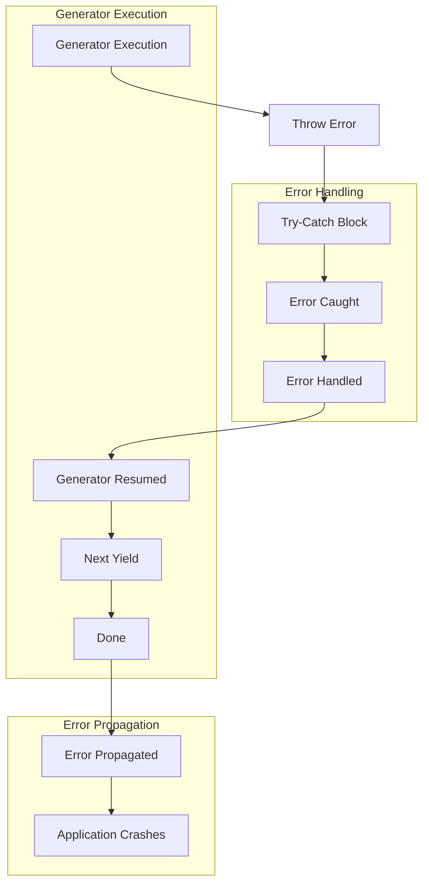

## Introduction
**Error handling** is a crucial aspect of robust programming, and when working with **generators** in JavaScript, it's essential to understand how to properly handle errors that may occur during the execution of a generator. The `Generator.prototype.throw()` method allows you to throw an error into a generator, which can be caught and handled within the generator itself. In this article, we'll delve into the world of generator error handling, exploring the core concepts, internal mechanics, and providing practical code examples to help you master this essential skill.

> **Note:** Error handling is a critical aspect of programming, and generators are no exception. Understanding how to handle errors in generators will help you write more robust and reliable code.

## Core Concepts
To understand error handling in generators, it's essential to grasp the following core concepts:

* **Generator**: A generator is a special type of function that can be paused and resumed during execution, allowing for efficient handling of asynchronous operations.
* **Error handling**: Error handling refers to the process of catching and handling errors that occur during the execution of a program.
* **`Generator.prototype.throw()`**: The `throw()` method is used to throw an error into a generator, which can be caught and handled within the generator itself.

> **Tip:** When working with generators, it's essential to remember that errors can occur at any point during the execution of the generator. Using `try`-`catch` blocks and the `throw()` method can help you handle errors effectively.

## How It Works Internally
When you call `Generator.prototype.throw()` on a generator, the following steps occur:

1. The error is thrown into the generator, and the current execution context is paused.
2. The generator's `try`-`catch` block is executed, and the error is caught.
3. If the error is caught, the generator's execution context is resumed, and the error is handled accordingly.
4. If the error is not caught, the generator's execution context is terminated, and the error is propagated to the caller.

> **Warning:** If an error occurs during the execution of a generator and is not caught, it can lead to unpredictable behavior and potentially crash your application.

## Code Examples
Here are three complete and runnable code examples that demonstrate error handling in generators:

### Example 1: Basic Error Handling
```javascript
function* generator() {
  try {
    yield 1;
    throw new Error('Error occurred');
  } catch (error) {
    console.error(error);
  }
}

const gen = generator();
console.log(gen.next()); // { value: 1, done: false }
console.log(gen.next()); // Error occurred
console.log(gen.next()); // { value: undefined, done: true }
```

### Example 2: Advanced Error Handling
```javascript
function* generator() {
  try {
    yield 1;
    yield 2;
    throw new Error('Error occurred');
  } catch (error) {
    console.error(error);
    yield 3;
  }
}

const gen = generator();
console.log(gen.next()); // { value: 1, done: false }
console.log(gen.next()); // { value: 2, done: false }
console.log(gen.next()); // Error occurred
console.log(gen.next()); // { value: 3, done: false }
console.log(gen.next()); // { value: undefined, done: true }
```

### Example 3: Using `Generator.prototype.throw()` to Throw an Error
```javascript
function* generator() {
  try {
    yield 1;
    yield 2;
  } catch (error) {
    console.error(error);
  }
}

const gen = generator();
console.log(gen.next()); // { value: 1, done: false }
console.log(gen.next()); // { value: 2, done: false }
gen.throw(new Error('Error occurred')); // Error occurred
console.log(gen.next()); // { value: undefined, done: true }
```

## Visual Diagram

The diagram above illustrates the error handling process in generators. When an error occurs, the generator's execution context is paused, and the error is thrown into the generator using `Generator.prototype.throw()`. The error is then caught by the generator's `try`-`catch` block, and the error is handled accordingly. If the error is not caught, it is propagated to the caller, potentially leading to application crashes.

## Comparison
| Approach | Time Complexity | Space Complexity | Pros | Cons | Best For |
| --- | --- | --- | --- | --- | --- |
| Try-Catch Blocks | O(1) | O(1) | Simple, effective | Limited control | Simple error handling |
| `Generator.prototype.throw()` | O(1) | O(1) | Flexible, powerful | Steeper learning curve | Advanced error handling |
| Error Handling Libraries | O(n) | O(n) | Convenient, feature-rich | Overhead, dependencies | Large-scale applications |
| Manual Error Handling | O(n) | O(n) | Customizable, lightweight | Error-prone, tedious | Small-scale applications |

## Real-world Use Cases
Error handling in generators is used in various real-world applications, including:

* **Async operations**: Generators are often used to handle asynchronous operations, such as API calls or database queries. Error handling is critical in these scenarios to ensure that errors are properly handled and propagated.
* **Data processing**: Generators can be used to process large datasets, and error handling is essential to handle errors that may occur during processing.
* **Web development**: Generators are used in web development to handle asynchronous operations, such as fetching data from APIs or rendering templates. Error handling is critical in these scenarios to ensure that errors are properly handled and propagated.

## Common Pitfalls
Here are some common pitfalls to watch out for when handling errors in generators:

* **Not catching errors**: Failing to catch errors can lead to unpredictable behavior and potentially crash your application.
* **Not handling errors**: Failing to handle errors can lead to errors being propagated to the caller, potentially causing application crashes.
* **Using `try`-`catch` blocks incorrectly**: Using `try`-`catch` blocks incorrectly can lead to errors being swallowed or not properly handled.
* **Not using `Generator.prototype.throw()` correctly**: Not using `Generator.prototype.throw()` correctly can lead to errors being thrown incorrectly or not being caught.

> **Interview:** Can you explain how error handling works in generators? How do you use `Generator.prototype.throw()` to throw an error into a generator?

## Interview Tips
Here are some common interview questions related to error handling in generators:

* **What is the difference between `try`-`catch` blocks and `Generator.prototype.throw()`?**: A strong answer would explain the difference between `try`-`catch` blocks and `Generator.prototype.throw()`, highlighting the use cases for each.
* **How do you handle errors in generators?**: A strong answer would explain the importance of error handling in generators, highlighting the use of `try`-`catch` blocks and `Generator.prototype.throw()`.
* **Can you give an example of using `Generator.prototype.throw()` to throw an error into a generator?**: A strong answer would provide a complete and runnable code example demonstrating the use of `Generator.prototype.throw()` to throw an error into a generator.

## Key Takeaways
Here are the key takeaways from this article:

* **Error handling is critical in generators**: Error handling is essential to ensure that errors are properly handled and propagated.
* **Use `try`-`catch` blocks and `Generator.prototype.throw()` correctly**: Using `try`-`catch` blocks and `Generator.prototype.throw()` correctly is essential to handle errors effectively.
* **Understand the difference between `try`-`catch` blocks and `Generator.prototype.throw()`**: Understanding the difference between `try`-`catch` blocks and `Generator.prototype.throw()` is essential to use them effectively.
* **Use error handling libraries and frameworks**: Using error handling libraries and frameworks can simplify error handling and provide additional features.
* **Test and debug error handling**: Testing and debugging error handling is essential to ensure that errors are properly handled and propagated.
* **Use logging and monitoring to track errors**: Using logging and monitoring to track errors is essential to identify and fix errors.
* **Follow best practices for error handling**: Following best practices for error handling is essential to ensure that errors are properly handled and propagated.
* **Use code reviews and pair programming to ensure error handling is correct**: Using code reviews and pair programming to ensure error handling is correct is essential to catch errors and improve code quality.
* **Continuously test and improve error handling**: Continuously testing and improving error handling is essential to ensure that errors are properly handled and propagated.