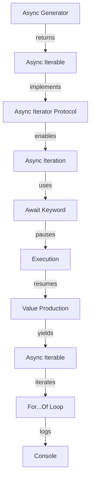

## Introduction
**Async generators**, introduced in ECMAScript 2018, are a powerful feature that enables developers to create asynchronous iterables. In essence, an async generator is an asynchronous function that returns an iterable object, allowing you to write asynchronous code that's easier to read and maintain. This concept is crucial in modern web development, especially when dealing with large datasets, streaming data, or handling concurrent operations.

> **Note:** Async generators are built on top of the existing generator function syntax, but with the added benefit of supporting asynchronous operations. This means you can use the `await` keyword inside an async generator to pause and resume execution.

In real-world scenarios, async generators are particularly useful when working with APIs that return paginated data, processing large files, or handling WebSockets. By leveraging async generators, you can write more efficient and scalable code that's better equipped to handle the demands of modern web applications.

## Core Concepts
To grasp the concept of async generators, it's essential to understand the following key terms:

* **Generator function**: A special type of function that returns an iterable object, allowing you to generate a sequence of values on-the-fly.
* **Async function**: A function that returns a promise, enabling you to write asynchronous code that's easier to read and maintain.
* **Iterable**: An object that implements the iterator protocol, allowing you to iterate over its values using a `for...of` loop or other iteration methods.
* **Async iterable**: An object that implements the async iterator protocol, enabling you to iterate over its values asynchronously.

> **Tip:** When working with async generators, it's essential to understand the differences between synchronous and asynchronous iteration. Async generators use the `await` keyword to pause and resume execution, whereas synchronous generators use the `yield` keyword to produce values.

## How It Works Internally
Under the hood, an async generator is essentially a combination of a generator function and an async function. When you create an async generator, you're defining a function that returns an async iterable object. This object implements the async iterator protocol, which enables you to iterate over its values asynchronously.

Here's a high-level overview of how an async generator works:

1. You define an async generator function using the `async function*` syntax.
2. The async generator function returns an async iterable object.
3. The async iterable object implements the async iterator protocol.
4. When you iterate over the async iterable object using a `for...of` loop or other iteration methods, the async generator function is executed.
5. The async generator function uses the `await` keyword to pause and resume execution, producing values asynchronously.

## Code Examples
### Example 1: Basic Async Generator
```javascript
async function* simpleAsyncGenerator() {
  yield 1;
  await new Promise(resolve => setTimeout(resolve, 1000));
  yield 2;
  await new Promise(resolve => setTimeout(resolve, 1000));
  yield 3;
}

// Usage:
(async () => {
  for await (const value of simpleAsyncGenerator()) {
    console.log(value);
  }
})();
```
This example demonstrates a basic async generator that yields three values with a 1-second delay between each value.

### Example 2: Real-World Async Generator
```javascript
async function* fetchPaginatedData(url, pageSize) {
  let pageNumber = 1;
  while (true) {
    const response = await fetch(`${url}?page=${pageNumber}&pageSize=${pageSize}`);
    const data = await response.json();
    if (data.length === 0) {
      break;
    }
    yield* data;
    pageNumber++;
  }
}

// Usage:
(async () => {
  for await (const item of fetchPaginatedData('https://example.com/api/data', 10)) {
    console.log(item);
  }
})();
```
This example demonstrates a real-world async generator that fetches paginated data from an API and yields each item individually.

### Example 3: Advanced Async Generator
```javascript
async function* mergeAsyncGenerators(...generators) {
  const iterators = generators.map(generator => generator());
  while (true) {
    const results = await Promise.allSettled(iterators.map(iterator => iterator.next()));
    for (const result of results) {
      if (result.status === 'fulfilled' && !result.value.done) {
        yield result.value.value;
      }
    }
    if (results.every(result => result.status === 'rejected' || result.value.done)) {
      break;
    }
  }
}

// Usage:
(async () => {
  const generator1 = async function* () {
    yield 1;
    await new Promise(resolve => setTimeout(resolve, 1000));
    yield 2;
  };
  const generator2 = async function* () {
    yield 3;
    await new Promise(resolve => setTimeout(resolve, 1000));
    yield 4;
  };
  for await (const value of mergeAsyncGenerators(generator1, generator2)) {
    console.log(value);
  }
})();
```
This example demonstrates an advanced async generator that merges multiple async generators into a single async iterable.

## Visual Diagram

This diagram illustrates the internal workings of an async generator, from its definition to its execution and iteration.

## Comparison
| Approach | Time Complexity | Space Complexity | Pros | Cons | Best For |
| --- | --- | --- | --- | --- | --- |
| Async Generators | O(n) | O(1) | Efficient, scalable, easy to read | Limited support in older browsers | Large datasets, streaming data, concurrent operations |
| Synchronous Generators | O(n) | O(1) | Efficient, easy to read | Limited to synchronous operations | Small datasets, simple iteration |
| Callbacks | O(n) | O(1) | Wide browser support | Error-prone, hard to read | Legacy code, simple asynchronous operations |
| Promises | O(n) | O(1) | Wide browser support, easy to read | Limited control over asynchronous flow | Simple asynchronous operations, error handling |

## Real-world Use Cases
1. **Paginated data fetching**: Async generators can be used to fetch paginated data from an API, yielding each item individually and allowing for efficient processing and rendering.
2. **Streaming data processing**: Async generators can be used to process streaming data, such as video or audio streams, yielding each chunk of data as it becomes available.
3. **Concurrent operations**: Async generators can be used to perform concurrent operations, such as fetching multiple resources simultaneously, and yielding each result as it becomes available.

## Common Pitfalls
1. **Incorrect usage of `await`**: Using `await` inside an async generator without a proper `try...catch` block can lead to unhandled promise rejections.
```javascript
// Wrong:
async function* incorrectUsage() {
  yield 1;
  await new Promise((resolve, reject) => reject('Error'));
}

// Right:
async function* correctUsage() {
  try {
    yield 1;
    await new Promise((resolve, reject) => reject('Error'));
  } catch (error) {
    console.error(error);
  }
}
```
2. **Not handling iterator completion**: Failing to handle iterator completion can lead to memory leaks and unexpected behavior.
```javascript
// Wrong:
async function* incorrectUsage() {
  while (true) {
    yield 1;
  }
}

// Right:
async function* correctUsage() {
  let iteration = 0;
  while (iteration < 10) {
    yield 1;
    iteration++;
  }
}
```
3. **Not using `for await...of`**: Using a regular `for...of` loop instead of `for await...of` can lead to incorrect iteration over async iterables.
```javascript
// Wrong:
async function* incorrectUsage() {
  yield 1;
  await new Promise(resolve => setTimeout(resolve, 1000));
  yield 2;
}

const iterator = incorrectUsage();
for (const value of iterator) {
  console.log(value);
}

// Right:
async function* correctUsage() {
  yield 1;
  await new Promise(resolve => setTimeout(resolve, 1000));
  yield 2;
}

for await (const value of correctUsage()) {
  console.log(value);
}
```
4. **Not handling errors**: Failing to handle errors properly can lead to unhandled promise rejections and unexpected behavior.
```javascript
// Wrong:
async function* incorrectUsage() {
  try {
    yield 1;
    await new Promise((resolve, reject) => reject('Error'));
  } catch (error) {
    // Ignore error
  }
}

// Right:
async function* correctUsage() {
  try {
    yield 1;
    await new Promise((resolve, reject) => reject('Error'));
  } catch (error) {
    console.error(error);
  }
}
```
> **Warning:** When working with async generators, it's essential to handle errors properly to avoid unhandled promise rejections and unexpected behavior.

## Interview Tips
1. **What is an async generator?**: An async generator is an asynchronous function that returns an iterable object, allowing you to write asynchronous code that's easier to read and maintain.
2. **How do you use async generators?**: You can use async generators by defining an async generator function using the `async function*` syntax and iterating over the returned async iterable using a `for await...of` loop.
3. **What are the benefits of using async generators?**: The benefits of using async generators include efficient and scalable asynchronous code, easy-to-read and maintain code, and improved error handling.

> **Interview:** When asked about async generators, be prepared to explain the concept, its benefits, and how to use it. Provide examples and demonstrate your understanding of the syntax and best practices.

## Key Takeaways
* **Async generators are asynchronous functions that return an iterable object**: This allows you to write asynchronous code that's easier to read and maintain.
* **Async generators use the `await` keyword to pause and resume execution**: This enables you to write asynchronous code that's more efficient and scalable.
* **Async generators implement the async iterator protocol**: This enables you to iterate over the async iterable using a `for await...of` loop.
* **Async generators are useful for large datasets, streaming data, and concurrent operations**: They provide an efficient and scalable way to handle these scenarios.
* **Async generators have a time complexity of O(n) and a space complexity of O(1)**: This makes them suitable for large datasets and streaming data.
* **Async generators require proper error handling**: Failing to handle errors properly can lead to unhandled promise rejections and unexpected behavior.
* **Async generators are supported in modern browsers and Node.js**: However, older browsers may not support async generators, so be sure to check the compatibility before using them.
* **Async generators can be used with other asynchronous APIs**: Such as `Promise.all()` and `Promise.race()`, to create more complex asynchronous workflows.
* **Async generators can be used to create asynchronous pipelines**: By chaining multiple async generators together, you can create complex asynchronous workflows that are efficient and scalable.