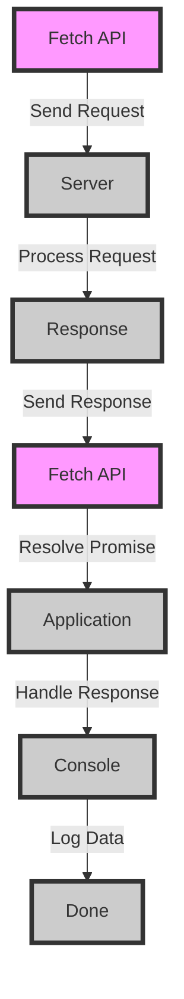

## Introduction
The **Fetch API** is a modern, promise-based interface for making HTTP requests in web applications. It provides a simple, intuitive way to send and receive data from servers, making it a crucial tool for web developers. The Fetch API is built on top of the **XMLHttpRequest** and **JSONP** APIs, but offers a more streamlined and efficient way to handle HTTP requests. With the Fetch API, developers can easily send requests, handle responses, and manage headers, making it an essential part of modern web development.

> **Note:** The Fetch API is supported by most modern browsers, including Google Chrome, Mozilla Firefox, and Microsoft Edge.

## Core Concepts
The Fetch API is based on several key concepts:

* **Request**: A request is an object that represents an HTTP request. It contains properties such as the URL, method, headers, and body.
* **Response**: A response is an object that represents an HTTP response. It contains properties such as the status code, headers, and body.
* **Headers**: Headers are key-value pairs that are sent with an HTTP request or response. They provide additional information about the request or response.

> **Warning:** When working with the Fetch API, it's essential to handle errors and exceptions properly to avoid bugs and performance issues.

## How It Works Internally
When you use the Fetch API to send a request, the following steps occur:

1. The **Fetch API** creates a new request object and sets its properties based on the input parameters.
2. The **request object** is sent to the server, where it is processed and a response is generated.
3. The **response object** is sent back to the client, where it is processed by the Fetch API.
4. The **Fetch API** resolves the promise with the response object, which can then be handled by the application.

> **Tip:** To improve performance, the Fetch API uses **caching** and **connection keep-alive** to reduce the number of requests sent to the server.

## Code Examples
### Example 1: Basic Usage
```javascript
// Send a GET request to the server
fetch('https://example.com/api/data')
  .then(response => response.json())
  .then(data => console.log(data))
  .catch(error => console.error(error));
```

### Example 2: Sending a POST Request
```javascript
// Send a POST request to the server with a JSON body
fetch('https://example.com/api/create', {
  method: 'POST',
  headers: {
    'Content-Type': 'application/json'
  },
  body: JSON.stringify({ name: 'John Doe', age: 30 })
})
  .then(response => response.json())
  .then(data => console.log(data))
  .catch(error => console.error(error));
```

### Example 3: Handling Errors and Exceptions
```javascript
// Send a GET request to the server with error handling
fetch('https://example.com/api/data')
  .then(response => {
    if (!response.ok) {
      throw new Error(`HTTP error! status: ${response.status}`);
    }
    return response.json();
  })
  .then(data => console.log(data))
  .catch(error => console.error(error));
```

## Visual Diagram

The diagram illustrates the flow of a request and response using the Fetch API. The request is sent from the Fetch API to the server, where it is processed and a response is generated. The response is then sent back to the Fetch API, which resolves the promise with the response object.

## Comparison
| Approach | Time Complexity | Space Complexity | Pros | Cons | Best For |
| --- | --- | --- | --- | --- | --- |
| Fetch API | O(1) | O(1) | Simple, intuitive, and efficient | Limited support for older browsers | Modern web applications |
| XMLHttpRequest | O(1) | O(1) | Wide browser support | Verbose and complex | Legacy web applications |
| JSONP | O(1) | O(1) | Simple and efficient | Limited security features | Cross-domain requests |
| Axios | O(1) | O(1) | Simple and intuitive | Additional overhead | Library-based applications |

## Real-world Use Cases
* **Google Maps**: Uses the Fetch API to send requests to the Google Maps API and retrieve location data.
* **Facebook**: Uses the Fetch API to send requests to the Facebook API and retrieve user data.
* **Twitter**: Uses the Fetch API to send requests to the Twitter API and retrieve tweet data.

> **Interview:** Can you explain the difference between the Fetch API and XMLHttpRequest?

## Common Pitfalls
* **Not handling errors**: Failing to handle errors and exceptions can lead to bugs and performance issues.
* **Not checking response status**: Failing to check the response status can lead to incorrect data being processed.
* **Not using caching**: Failing to use caching can lead to unnecessary requests being sent to the server.
* **Not handling CORS**: Failing to handle CORS can lead to security issues and errors.

## Interview Tips
* **What is the Fetch API?**: A promise-based interface for making HTTP requests in web applications.
* **How does the Fetch API work?**: The Fetch API creates a new request object and sends it to the server, where it is processed and a response is generated.
* **What are the benefits of using the Fetch API?**: Simple, intuitive, and efficient way to handle HTTP requests.

## Key Takeaways
* The Fetch API is a modern, promise-based interface for making HTTP requests in web applications.
* The Fetch API provides a simple and intuitive way to send and receive data from servers.
* The Fetch API uses caching and connection keep-alive to reduce the number of requests sent to the server.
* The Fetch API has limited support for older browsers.
* The Fetch API is widely used in modern web applications, including Google Maps, Facebook, and Twitter.
* The Fetch API has a time complexity of O(1) and a space complexity of O(1).
* The Fetch API is more efficient and easier to use than XMLHttpRequest and JSONP.
* The Fetch API provides better security features than JSONP.