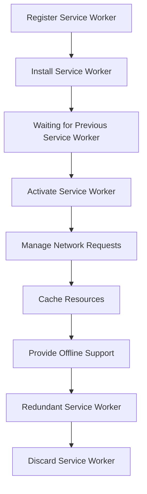

## Introduction
The **Service Worker Lifecycle** is a crucial concept in modern web development, particularly when it comes to Progressive Web Apps (PWAs) and offline-enabled web applications. A Service Worker is a script that runs in the background, allowing web developers to manage network requests, cache resources, and provide a seamless user experience even when the user is offline. In this section, we will delve into the world of Service Workers, exploring their lifecycle, and why they are essential for modern web development.

> **Note:** Service Workers are a key component of PWAs, enabling features like offline support, push notifications, and background synchronization.

The Service Worker Lifecycle consists of four main stages: **Install**, **Waiting**, **Activate**, and **Redundant**. Each stage plays a vital role in ensuring that the Service Worker is properly installed, updated, and activated, providing a smooth user experience. In the following sections, we will dive deeper into each stage, exploring their purpose, and how they work together to manage the Service Worker's lifecycle.

## Core Concepts
To understand the Service Worker Lifecycle, it's essential to grasp the core concepts involved. Here are some key terms and definitions:

* **Service Worker**: A script that runs in the background, managing network requests, caching resources, and providing offline support.
* **Install**: The first stage of the Service Worker Lifecycle, where the Service Worker is installed and caches resources.
* **Waiting**: The second stage, where the Service Worker waits for the previous Service Worker to be terminated before activating.
* **Activate**: The third stage, where the Service Worker is activated, and takes control of the web application.
* **Redundant**: The final stage, where the Service Worker is no longer needed and is discarded.

> **Tip:** When working with Service Workers, it's essential to understand the different stages of the lifecycle and how they interact with each other.

## How It Works Internally
The Service Worker Lifecycle is managed by the browser, which provides a set of APIs and events to control the lifecycle. Here's a step-by-step breakdown of how it works:

1. **Registration**: The web application registers the Service Worker using the `navigator.serviceWorker.register()` method.
2. **Installation**: The Service Worker is installed, and the `install` event is triggered. During this stage, the Service Worker caches resources and prepares for activation.
3. **Waiting**: The Service Worker waits for the previous Service Worker to be terminated before activating. This stage ensures that only one Service Worker is active at a time.
4. **Activation**: The Service Worker is activated, and the `activate` event is triggered. During this stage, the Service Worker takes control of the web application and manages network requests.
5. **Redundant**: The Service Worker is no longer needed and is discarded. This stage occurs when a new Service Worker is installed, and the previous one is no longer required.

> **Warning:** If the Service Worker is not properly installed or activated, it can lead to issues with offline support, caching, and network requests.

## Code Examples
Here are three complete and runnable code examples demonstrating the Service Worker Lifecycle:

### Example 1: Basic Service Worker Installation
```javascript
// Register the Service Worker
navigator.serviceWorker.register('serviceWorker.js')
  .then(registration => {
    console.log('Service Worker registered:', registration);
  })
  .catch(error => {
    console.error('Error registering Service Worker:', error);
  });
```

```javascript
// serviceWorker.js
self.addEventListener('install', event => {
  event.waitUntil(
    caches.open('cache-name').then(cache => {
      return cache.addAll([
        'index.html',
        'styles.css',
        'script.js',
      ]);
    }),
  );
});
```

### Example 2: Service Worker Activation
```javascript
// Register the Service Worker
navigator.serviceWorker.register('serviceWorker.js')
  .then(registration => {
    console.log('Service Worker registered:', registration);
  })
  .catch(error => {
    console.error('Error registering Service Worker:', error);
  });
```

```javascript
// serviceWorker.js
self.addEventListener('activate', event => {
  event.waitUntil(
    caches.keys().then(cacheNames => {
      return Promise.all(
        cacheNames.map(cacheName => {
          if (cacheName !== 'cache-name') {
            return caches.delete(cacheName);
          }
        }),
      );
    }),
  );
});
```

### Example 3: Advanced Service Worker Example
```javascript
// Register the Service Worker
navigator.serviceWorker.register('serviceWorker.js')
  .then(registration => {
    console.log('Service Worker registered:', registration);
  })
  .catch(error => {
    console.error('Error registering Service Worker:', error);
  });
```

```javascript
// serviceWorker.js
self.addEventListener('fetch', event => {
  event.respondWith(
    caches.match(event.request).then(response => {
      if (response) {
        return response;
      }
      return fetch(event.request).then(response => {
        return caches.open('cache-name').then(cache => {
          cache.put(event.request, response.clone());
          return response;
        });
      });
    }),
  );
});
```

## Visual Diagram


The diagram illustrates the Service Worker Lifecycle, from registration to redundancy. Each stage is represented by a node, and the arrows indicate the flow of the lifecycle.

## Comparison
| Approach | Time Complexity | Space Complexity | Pros | Cons | Best For |
| --- | --- | --- | --- | --- | --- |
| Cache-first | O(1) | O(n) | Fast, offline support | Limited cache size | PWAs, offline-enabled web apps |
| Network-first | O(n) | O(1) | Fast, up-to-date data | No offline support | Real-time web apps, live updates |
| Hybrid | O(n) | O(n) | Balances speed and offline support | Complex implementation | Web apps with mixed requirements |
| Service Worker | O(1) | O(n) | Flexible, customizable | Steep learning curve | Modern web apps, PWAs |

The comparison table highlights the trade-offs between different approaches to managing network requests and caching resources. The Service Worker approach offers flexibility and customizability but requires a deeper understanding of the lifecycle and its management.

## Real-world Use Cases
Here are three real-world examples of Service Workers in production:

1. **Google Maps**: Google Maps uses a Service Worker to provide offline support, caching map tiles and data to enable users to navigate even without an internet connection.
2. **Twitter**: Twitter uses a Service Worker to provide a seamless user experience, caching tweets and data to reduce load times and improve performance.
3. **The Washington Post**: The Washington Post uses a Service Worker to provide offline support, caching articles and data to enable users to read news even without an internet connection.

> **Interview:** When asked about Service Workers, be prepared to explain the lifecycle, its stages, and how they interact with each other. Discuss the benefits and challenges of using Service Workers, and provide examples of real-world use cases.

## Common Pitfalls
Here are four common mistakes to avoid when working with Service Workers:

1. **Incorrect Cache Management**: Failing to properly manage the cache can lead to issues with offline support and caching.
2. **Insufficient Error Handling**: Not handling errors properly can cause the Service Worker to fail, leading to a poor user experience.
3. **Inadequate Testing**: Not testing the Service Worker thoroughly can lead to issues with functionality and performance.
4. **Incorrect Service Worker Registration**: Registering the Service Worker incorrectly can prevent it from working properly.

```javascript
// Incorrect Cache Management
self.addEventListener('install', event => {
  event.waitUntil(
    caches.open('cache-name').then(cache => {
      return cache.addAll([
        'index.html',
        'styles.css',
        'script.js',
      ]);
    }),
  );
});

// Correct Cache Management
self.addEventListener('install', event => {
  event.waitUntil(
    caches.open('cache-name').then(cache => {
      return cache.addAll([
        'index.html',
        'styles.css',
        'script.js',
      ]).then(() => {
        return cache.keys().then(cacheNames => {
          return Promise.all(
            cacheNames.map(cacheName => {
              if (cacheName !== 'cache-name') {
                return caches.delete(cacheName);
              }
            }),
          );
        });
      });
    }),
  );
});
```

## Interview Tips
Here are three common interview questions related to Service Workers, along with weak and strong answers:

1. **What is a Service Worker, and how does it work?**
	* Weak answer: "A Service Worker is a script that runs in the background, but I'm not sure how it works."
	* Strong answer: "A Service Worker is a script that runs in the background, managing network requests and caching resources. It's installed, waits for the previous Service Worker to be terminated, and then activates, taking control of the web application."
2. **How do you handle errors in a Service Worker?**
	* Weak answer: "I'm not sure, but I think you just need to catch the error and log it."
	* Strong answer: "You can handle errors in a Service Worker by using try-catch blocks and logging the error. Additionally, you can use the `error` event to catch and handle any errors that occur during the Service Worker's lifecycle."
3. **What are some benefits of using a Service Worker?**
	* Weak answer: "I'm not sure, but I think it's just for offline support."
	* Strong answer: "Some benefits of using a Service Worker include offline support, caching resources, and improving performance. It also provides a flexible and customizable way to manage network requests and caching."

## Key Takeaways
Here are six key takeaways to remember when working with Service Workers:

* **Understand the Service Worker Lifecycle**: The lifecycle consists of four stages: Install, Waiting, Activate, and Redundant.
* **Properly manage the cache**: Ensure that you're caching resources correctly and handling cache updates and deletions.
* **Handle errors correctly**: Use try-catch blocks and log errors to ensure that your Service Worker is robust and reliable.
* **Test your Service Worker thoroughly**: Test your Service Worker in different scenarios and environments to ensure that it's working correctly.
* **Use the correct Service Worker registration**: Register your Service Worker correctly to ensure that it's installed and activated properly.
* **Monitor performance and optimize**: Monitor your Service Worker's performance and optimize it as needed to ensure that it's providing the best user experience possible.

By following these key takeaways and understanding the Service Worker Lifecycle, you'll be well on your way to creating robust and reliable web applications that provide a seamless user experience.