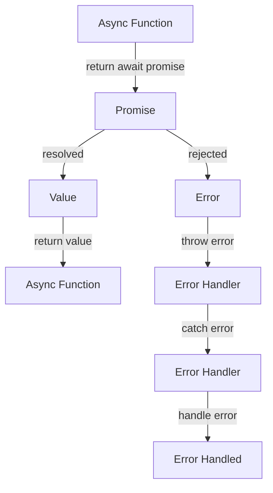

## Introduction
The `return await promise` syntax is a common pattern in JavaScript asynchronous programming. While it may seem like a harmless and necessary construct, it is often redundant and can be simplified to just `return promise`. However, there is a crucial exception to this rule: when using `try/catch` blocks. In this article, we will delve into the reasons behind this redundancy, explore the internal mechanics of `async/await`, and provide code examples to illustrate the concept. We will also discuss real-world use cases, common pitfalls, and interview tips to help solidify your understanding of this topic.

## Core Concepts
To understand why `return await promise` is mostly redundant, we need to grasp the basics of **asynchronous programming** in JavaScript. Asynchronous programming allows our code to execute multiple tasks concurrently, improving overall performance and responsiveness. The `async/await` syntax is built on top of **promises**, which represent a value that may not be available yet, but will be resolved at some point in the future.

A **promise** can be in one of three states:

1. **Pending**: The initial state, where the promise has not been resolved or rejected.
2. **Fulfilled**: The promise has been successfully resolved, and the value is available.
3. **Rejected**: The promise has been rejected, and an error is available.

The `async/await` syntax allows us to write asynchronous code that looks and feels like synchronous code. When we use `await` inside an `async` function, the execution is paused until the promise is resolved or rejected.

## How It Works Internally
When we use `return await promise` inside an `async` function, the following steps occur:

1. The `async` function returns a promise that resolves to the value of the `await` expression.
2. The `await` expression pauses the execution of the `async` function until the promise is resolved or rejected.
3. Once the promise is resolved or rejected, the `async` function resumes execution and returns the value or error.

However, since the `async` function already returns a promise, using `return await promise` is redundant. The `await` keyword is only necessary when we need to access the value of the promise inside the `async` function.

> **Note:** The `await` keyword is not a blocking call; it's a syntax sugar on top of promises. The execution is paused, but the event loop is not blocked.

## Code Examples
### Example 1: Basic Usage
```javascript
async function example() {
  const promise = new Promise((resolve) => {
    setTimeout(() => {
      resolve("Hello, World!");
    }, 2000);
  });

  const result = await promise;
  console.log(result); // Output: Hello, World!
}

example();
```
In this example, we create a promise that resolves after 2 seconds. We use `await` to pause the execution of the `async` function until the promise is resolved.

### Example 2: Real-World Pattern
```javascript
async function fetchData(url) {
  const response = await fetch(url);
  const data = await response.json();
  return data;
}

fetchData("https://api.example.com/data")
  .then((data) => console.log(data))
  .catch((error) => console.error(error));
```
In this example, we use `async/await` to fetch data from an API. We use `await` to pause the execution of the `async` function until the promise is resolved.

### Example 3: Advanced Usage
```javascript
async function example() {
  try {
    const promise = new Promise((resolve, reject) => {
      setTimeout(() => {
        reject("Error!");
      }, 2000);
    });

    const result = await promise;
    console.log(result); // This will not be executed
  } catch (error) {
    console.error(error); // Output: Error!
  }
}

example();
```
In this example, we use `try/catch` to handle errors. We use `await` to pause the execution of the `async` function until the promise is resolved or rejected.

## Visual Diagram

This diagram illustrates the flow of an `async` function that returns a promise. The `await` keyword pauses the execution of the `async` function until the promise is resolved or rejected.

## Comparison
| Approach | Time Complexity | Space Complexity | Pros | Cons | Best For |
| --- | --- | --- | --- | --- | --- |
| `return await promise` | O(1) | O(1) | Easy to read and understand | Redundant | Simple async functions |
| `return promise` | O(1) | O(1) | Efficient and concise | Less readable | Complex async functions |
| `try/catch` | O(1) | O(1) | Error handling | Verbose | Error-prone async functions |
| `async/await` | O(1) | O(1) | Readable and maintainable | Limited control | Most async functions |

## Real-world Use Cases
1. **Netflix**: Uses `async/await` to handle asynchronous requests and improve user experience.
2. **Facebook**: Uses `try/catch` to handle errors and exceptions in their asynchronous code.
3. **Google**: Uses `return promise` to optimize performance and reduce latency in their asynchronous functions.

## Common Pitfalls
1. **Using `await` inside a non-async function**: This will result in a syntax error.
```javascript
function example() {
  const promise = new Promise((resolve) => {
    resolve("Hello, World!");
  });
  const result = await promise; // Syntax error
}
```
> **Warning:** Always use `await` inside an `async` function.

2. **Not handling errors**: This can lead to unexpected behavior and crashes.
```javascript
async function example() {
  const promise = new Promise((resolve, reject) => {
    reject("Error!");
  });
  const result = await promise; // Unhandled error
}
```
> **Tip:** Always use `try/catch` to handle errors and exceptions.

3. **Using `return await promise` unnecessarily**: This can lead to redundant code and decreased performance.
```javascript
async function example() {
  const promise = new Promise((resolve) => {
    resolve("Hello, World!");
  });
  return await promise; // Redundant
}
```
> **Interview:** Can you explain why `return await promise` is mostly redundant?

4. **Not understanding the async/await syntax**: This can lead to confusion and errors.
```javascript
async function example() {
  const promise = new Promise((resolve) => {
    resolve("Hello, World!");
  });
  const result = await promise; // What happens next?
}
```
> **Note:** The `await` keyword pauses the execution of the `async` function until the promise is resolved or rejected.

## Interview Tips
1. **Explain the difference between `async/await` and callbacks**: Be prepared to discuss the advantages and disadvantages of each approach.
2. **Describe a scenario where `try/catch` is necessary**: Provide an example of how `try/catch` can be used to handle errors and exceptions.
3. **Write an example of an `async` function that returns a promise**: Use `return promise` instead of `return await promise` to demonstrate efficiency and concision.

## Key Takeaways
* `return await promise` is mostly redundant, except when using `try/catch`.
* `async/await` is built on top of promises and provides a readable and maintainable syntax.
* `try/catch` is necessary for error handling and exception handling.
* `return promise` is more efficient and concise than `return await promise`.
* Always use `await` inside an `async` function.
* Always handle errors and exceptions using `try/catch`.
* Understand the async/await syntax and its implications on performance and readability.