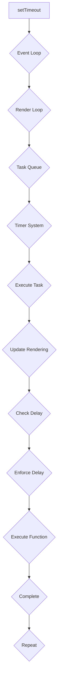

## Introduction
**setTimeout** is a widely used JavaScript function that allows developers to execute a function after a specified delay. However, in browsers, there is a minimum delay constraint of 4ms when using **setTimeout(fn, 0)**. This constraint is often overlooked, but it has significant implications for web application performance and responsiveness. In this section, we will explore the reasons behind this constraint, its real-world relevance, and why every engineer needs to understand it.

The minimum delay constraint of 4ms is a result of the way browsers handle JavaScript execution and the HTML5 specification. According to the specification, the minimum delay for **setTimeout** and **setInterval** is 4ms to prevent abuse and ensure that web pages do not consume excessive CPU resources. This constraint is not unique to **setTimeout**, as it also applies to **setInterval** and other asynchronous functions.

> **Note:** The 4ms delay constraint is a browser-specific limitation and does not apply to Node.js or other non-browser environments.

## Core Concepts
To understand the 4ms delay constraint, it is essential to grasp the core concepts of JavaScript execution, event loops, and browser rendering. Here are some key terms and definitions:

* **Event Loop**: The event loop is a mechanism that allows browsers to handle asynchronous events, such as mouse clicks, keyboard input, and network requests. The event loop is responsible for executing JavaScript code and updating the browser's rendering.
* **Render Loop**: The render loop is a separate loop that is responsible for updating the browser's rendering, including layout, painting, and compositing.
* **JavaScript Execution**: JavaScript execution refers to the process of executing JavaScript code, including parsing, compilation, and execution.
* **Asynchronous Functions**: Asynchronous functions, such as **setTimeout** and **setInterval**, allow developers to execute code after a specified delay or at regular intervals.

> **Tip:** Understanding the event loop and render loop is crucial for optimizing web application performance and responsiveness.

## How It Works Internally
The 4ms delay constraint is enforced by the browser's event loop and render loop. Here is a step-by-step breakdown of how it works:

1. When **setTimeout(fn, 0)** is called, the browser adds the function to the event loop's task queue.
2. The event loop checks the task queue for pending tasks and executes them one by one.
3. Before executing a task, the event loop checks if the render loop has completed its current iteration. If not, the event loop waits until the render loop is complete.
4. Once the render loop is complete, the event loop executes the task and updates the browser's rendering.
5. If the task is an asynchronous function, such as **setTimeout**, the event loop adds a delay to the task to ensure that the minimum delay constraint is enforced.
6. The delay is enforced by the browser's timer system, which schedules the task to be executed after the specified delay.

> **Warning:** Ignoring the 4ms delay constraint can lead to performance issues and unresponsive web applications.

## Code Examples
Here are three complete and runnable code examples that demonstrate the 4ms delay constraint:

### Example 1: Basic Usage
```javascript
console.log('Start');
setTimeout(() => {
  console.log('Timeout');
}, 0);
console.log('End');
// Output: Start, End, Timeout
```
This example demonstrates the basic usage of **setTimeout** with a delay of 0ms. However, due to the 4ms delay constraint, the timeout function is executed after a minimum delay of 4ms.

### Example 2: Real-World Pattern
```javascript
function animate() {
  // Animation code here
  requestAnimationFrame(animate);
}

setTimeout(animate, 0);
```
This example demonstrates a real-world pattern where **setTimeout** is used to initiate an animation. However, due to the 4ms delay constraint, the animation is delayed by at least 4ms.

### Example 3: Advanced Usage
```javascript
function delayedLog(message, delay) {
  setTimeout(() => {
    console.log(message);
  }, delay);
}

delayedLog('Hello', 0);
delayedLog('World', 0);
// Output: Hello, World (after a minimum delay of 4ms)
```
This example demonstrates an advanced usage of **setTimeout** where multiple functions are executed with a delay of 0ms. However, due to the 4ms delay constraint, the functions are executed after a minimum delay of 4ms.

## Visual Diagram

This diagram illustrates the internal workings of the 4ms delay constraint, including the event loop, render loop, task queue, timer system, and execution of the function.

> **Interview:** What is the minimum delay constraint for **setTimeout** in browsers, and why is it enforced?

## Comparison
Here is a comparison table that highlights the differences between **setTimeout**, **setInterval**, and **requestAnimationFrame**:

| Function | Minimum Delay | Purpose |
| --- | --- | --- |
| **setTimeout** | 4ms | Execute a function after a specified delay |
| **setInterval** | 4ms | Execute a function at regular intervals |
| **requestAnimationFrame** | 0ms | Execute a function before the next render |

> **Tip:** Use **requestAnimationFrame** for animations and **setTimeout** for other asynchronous tasks.

## Real-world Use Cases
Here are three real-world examples of companies that use **setTimeout** and other asynchronous functions:

* Google: Google uses **setTimeout** to delay the execution of certain functions, such as loading additional content or updating the user interface.
* Facebook: Facebook uses **setInterval** to update the user's news feed at regular intervals.
* Netflix: Netflix uses **requestAnimationFrame** to render video content smoothly and efficiently.

> **Note:** These companies use a combination of **setTimeout**, **setInterval**, and **requestAnimationFrame** to optimize their web applications for performance and responsiveness.

## Common Pitfalls
Here are four common pitfalls to avoid when using **setTimeout** and other asynchronous functions:

* **Pitfall 1:** Ignoring the 4ms delay constraint can lead to performance issues and unresponsive web applications.
* **Pitfall 2:** Using **setTimeout** with a delay of 0ms can cause the function to be executed multiple times, leading to unexpected behavior.
* **Pitfall 3:** Failing to clear timeouts and intervals can cause memory leaks and performance issues.
* **Pitfall 4:** Using **setTimeout** instead of **requestAnimationFrame** for animations can lead to poor performance and jankiness.

> **Warning:** Avoid using **setTimeout** with a delay of 0ms, as it can lead to unexpected behavior and performance issues.

## Interview Tips
Here are three common interview questions related to **setTimeout** and other asynchronous functions:

* **Question 1:** What is the minimum delay constraint for **setTimeout** in browsers, and why is it enforced?
* **Question 2:** How does **setTimeout** differ from **setInterval**, and when should you use each?
* **Question 3:** What is the purpose of **requestAnimationFrame**, and how does it differ from **setTimeout**?

> **Interview:** Be prepared to explain the differences between **setTimeout**, **setInterval**, and **requestAnimationFrame**, as well as the 4ms delay constraint and its implications for web application performance.

## Key Takeaways
Here are six key takeaways to remember:

* The 4ms delay constraint is enforced by the browser's event loop and render loop.
* **setTimeout** has a minimum delay of 4ms in browsers.
* **setInterval** has a minimum delay of 4ms in browsers.
* **requestAnimationFrame** has a minimum delay of 0ms, but is only suitable for animations.
* Ignoring the 4ms delay constraint can lead to performance issues and unresponsive web applications.
* Using **setTimeout** with a delay of 0ms can cause the function to be executed multiple times, leading to unexpected behavior.

> **Tip:** Always consider the 4ms delay constraint when using **setTimeout** and other asynchronous functions in browsers.