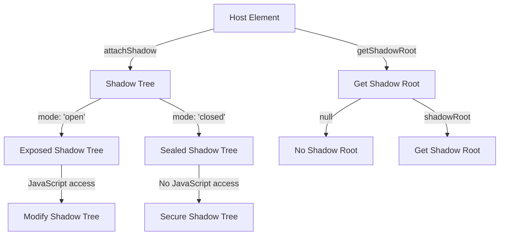

## Introduction
The `attachShadow` method is a crucial part of the **Shadow DOM** API, which allows developers to create a separate, isolated DOM tree for a web component. This isolated tree is known as the **shadow tree**, and it can contain its own elements, styles, and scripts, all of which are separate from the main document DOM. The `attachShadow` method takes an options object with a `mode` property, which can be set to either `'open'` or `'closed'`. Understanding the difference between these two modes is essential for building robust and secure web components.

In real-world applications, the Shadow DOM is used extensively in frameworks like **Angular**, **React**, and **Vue.js** to encapsulate component logic and styles, making it easier to manage complex UI structures. For instance, the **Google Chrome** browser uses the Shadow DOM to implement its custom elements, such as the `chrome://settings` page.

## Core Concepts
To grasp the concept of `attachShadow` and its modes, we need to understand the following key terms:

* **Shadow DOM**: A separate, isolated DOM tree that can be attached to a web component.
* **Shadow tree**: The isolated DOM tree created by the `attachShadow` method.
* **Mode**: The `mode` property of the options object passed to `attachShadow`, which can be either `'open'` or `'closed'`.
* **Open mode**: When the `mode` is set to `'open'`, the shadow tree is exposed to the outside, allowing JavaScript code to access and manipulate it directly.
* **Closed mode**: When the `mode` is set to `'closed'`, the shadow tree is sealed, and its internal structure and content are not accessible from outside.

> **Tip:** When deciding between `'open'` and `'closed'` modes, consider the level of encapsulation and security required for your web component.

## How It Works Internally
When you call `attachShadow` with the `mode` set to `'open'`, the browser creates a new shadow tree and attaches it to the specified host element. The shadow tree is then exposed to the outside, allowing JavaScript code to access and manipulate it directly.

On the other hand, when the `mode` is set to `'closed'`, the browser creates a new shadow tree, but it is sealed, and its internal structure and content are not accessible from outside. This provides an additional layer of encapsulation and security for the web component.

Here's a step-by-step breakdown of the process:

1. The `attachShadow` method is called with the `mode` set to either `'open'` or `'closed'`.
2. The browser creates a new shadow tree and attaches it to the specified host element.
3. If the `mode` is set to `'open'`, the shadow tree is exposed to the outside, allowing JavaScript code to access and manipulate it directly.
4. If the `mode` is set to `'closed'`, the shadow tree is sealed, and its internal structure and content are not accessible from outside.

## Code Examples
### Example 1: Basic usage of `attachShadow` with `'open'` mode
```javascript
// Create a new div element
const div = document.createElement('div');

// Attach a shadow tree to the div element with 'open' mode
const shadowRoot = div.attachShadow({ mode: 'open' });

// Add a paragraph element to the shadow tree
const paragraph = document.createElement('p');
paragraph.textContent = 'Hello, world!';
shadowRoot.appendChild(paragraph);

// Log the shadow tree to the console
console.log(shadowRoot);
```

### Example 2: Using `attachShadow` with `'closed'` mode
```javascript
// Create a new div element
const div = document.createElement('div');

// Attach a shadow tree to the div element with 'closed' mode
const shadowRoot = div.attachShadow({ mode: 'closed' });

// Try to add a paragraph element to the shadow tree (this will throw an error)
try {
  const paragraph = document.createElement('p');
  paragraph.textContent = 'Hello, world!';
  shadowRoot.appendChild(paragraph);
} catch (error) {
  console.error(error);
}
```

### Example 3: Advanced usage of `attachShadow` with event handling
```javascript
// Create a new div element
const div = document.createElement('div');

// Attach a shadow tree to the div element with 'open' mode
const shadowRoot = div.attachShadow({ mode: 'open' });

// Add a button element to the shadow tree
const button = document.createElement('button');
button.textContent = 'Click me!';
shadowRoot.appendChild(button);

// Add an event listener to the button
button.addEventListener('click', () => {
  console.log('Button clicked!');
});
```

## Visual Diagram

The diagram illustrates the process of attaching a shadow tree to a host element using `attachShadow`, and the difference between `'open'` and `'closed'` modes.

## Comparison
| Mode | Description | Security | Performance |
| --- | --- | --- | --- |
| `'open'` | Exposed shadow tree, accessible from outside | Low | Fast |
| `'closed'` | Sealed shadow tree, not accessible from outside | High | Slow |
| `null` | No shadow tree attached | N/A | N/A |
| `undefined` | Invalid mode, throws an error | N/A | N/A |

> **Note:** The performance difference between `'open'` and `'closed'` modes is typically negligible, but it may vary depending on the specific use case and browser implementation.

## Real-world Use Cases
* **Google Chrome**: Uses the Shadow DOM to implement its custom elements, such as the `chrome://settings` page.
* **Angular**: Uses the Shadow DOM to encapsulate component logic and styles.
* **React**: Uses the Shadow DOM to implement its virtual DOM and optimize rendering performance.
* **Vue.js**: Uses the Shadow DOM to implement its template-based rendering system.

## Common Pitfalls
* **Incorrect mode**: Using the wrong mode (`'open'` or `'closed'`) can lead to security vulnerabilities or performance issues.
* **Inconsistent shadow tree**: Failing to properly clean up the shadow tree can lead to memory leaks and performance issues.
* **Invalid shadow root**: Trying to access or manipulate an invalid shadow root can lead to errors and crashes.
* **Shadow tree depth**: Creating too many nested shadow trees can lead to performance issues and complexity.

> **Warning:** Be careful when using the Shadow DOM, as it can introduce additional complexity and security risks if not used correctly.

## Interview Tips
* **What is the difference between `'open'` and `'closed'` modes?**: Be prepared to explain the difference between the two modes and when to use each.
* **How do you optimize rendering performance using the Shadow DOM?**: Be prepared to discuss techniques for optimizing rendering performance, such as using the `attachShadow` method and minimizing the number of shadow trees.
* **What are some common pitfalls when using the Shadow DOM?**: Be prepared to discuss common mistakes and how to avoid them, such as using the wrong mode or failing to properly clean up the shadow tree.

## Key Takeaways
* The `attachShadow` method is used to create a separate, isolated DOM tree for a web component.
* The `mode` property can be set to either `'open'` or `'closed'`, which determines the level of encapsulation and security for the web component.
* The Shadow DOM is used extensively in frameworks like **Angular**, **React**, and **Vue.js** to encapsulate component logic and styles.
* Understanding the difference between `'open'` and `'closed'` modes is essential for building robust and secure web components.
* Be careful when using the Shadow DOM, as it can introduce additional complexity and security risks if not used correctly.
* Optimizing rendering performance using the Shadow DOM can be achieved by minimizing the number of shadow trees and using the `attachShadow` method.
* Common pitfalls when using the Shadow DOM include using the wrong mode, failing to properly clean up the shadow tree, and trying to access or manipulate an invalid shadow root.