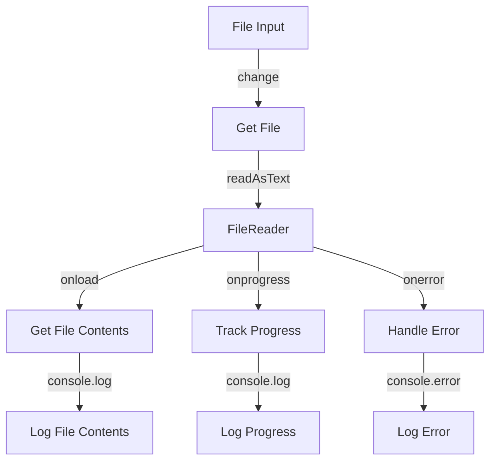

## Introduction
The **FileReader** API is a fundamental component of web development, allowing developers to read the contents of files from the user's system. The API provides a set of events that enable developers to track the progress of file reading, handle errors, and perform actions when the reading is complete. In this section, we will explore the **onload**, **onprogress**, and **onerror** events, which are essential for building robust and efficient file handling systems.

The **FileReader** API is widely used in web applications, such as file uploaders, image editors, and document viewers. Understanding how to use these events is crucial for building high-quality web applications that can handle large files, provide feedback to users, and recover from errors.

> **Note:** The **FileReader** API is part of the Web API, which is supported by most modern browsers, including Google Chrome, Mozilla Firefox, and Microsoft Edge.

## Core Concepts
The **FileReader** API provides three primary events:

*   **onload**: Fired when the file reading is complete, and the data is available.
*   **onprogress**: Fired periodically during the file reading process, indicating the progress of the operation.
*   **onerror**: Fired when an error occurs during the file reading process.

These events are essential for building robust file handling systems, as they enable developers to track the progress of file reading, handle errors, and perform actions when the reading is complete.

> **Tip:** When working with the **FileReader** API, it's essential to check the browser's compatibility and support for the API to ensure that your application works correctly across different browsers.

## How It Works Internally
The **FileReader** API works by creating a **FileReader** object, which is used to read the contents of a file. The object provides methods for reading files, such as **readAsText**, **readAsDataURL**, and **readAsArrayBuffer**.

When a file is read using the **FileReader** API, the browser performs the following steps:

1.  Creates a **FileReader** object.
2.  Calls the **read** method on the **FileReader** object, passing the file to be read.
3.  Fires the **onprogress** event periodically during the file reading process.
4.  Fires the **onload** event when the file reading is complete.
5.  Fires the **onerror** event if an error occurs during the file reading process.

The **FileReader** API uses the browser's internal file reading mechanism, which is optimized for performance and security. The API also provides a set of properties, such as **readyState**, **result**, and **error**, which can be used to track the progress of file reading and handle errors.

> **Warning:** When working with large files, it's essential to consider the performance implications of using the **FileReader** API, as it can consume significant system resources.

## Code Examples
### Example 1: Basic File Reading
```javascript
// Create a FileReader object
const fileReader = new FileReader();

// Define the onload event handler
fileReader.onload = (event) => {
    // Get the file contents
    const fileContents = event.target.result;
    console.log(fileContents);
};

// Define the onerror event handler
fileReader.onerror = (event) => {
    console.error('Error reading file:', event);
};

// Read a file
const fileInput = document.getElementById('fileInput');
fileInput.addEventListener('change', (event) => {
    const file = event.target.files[0];
    fileReader.readAsText(file);
});
```
### Example 2: Progress Tracking
```javascript
// Create a FileReader object
const fileReader = new FileReader();

// Define the onload event handler
fileReader.onload = (event) => {
    // Get the file contents
    const fileContents = event.target.result;
    console.log(fileContents);
};

// Define the onprogress event handler
fileReader.onprogress = (event) => {
    // Get the progress
    const progress = event.loaded / event.total;
    console.log(`Progress: ${progress * 100}%`);
};

// Define the onerror event handler
fileReader.onerror = (event) => {
    console.error('Error reading file:', event);
};

// Read a file
const fileInput = document.getElementById('fileInput');
fileInput.addEventListener('change', (event) => {
    const file = event.target.files[0];
    fileReader.readAsText(file);
});
```
### Example 3: Error Handling
```javascript
// Create a FileReader object
const fileReader = new FileReader();

// Define the onload event handler
fileReader.onload = (event) => {
    // Get the file contents
    const fileContents = event.target.result;
    console.log(fileContents);
};

// Define the onerror event handler
fileReader.onerror = (event) => {
    // Get the error
    const error = event.target.error;
    console.error('Error reading file:', error);
};

// Read a file
const fileInput = document.getElementById('fileInput');
fileInput.addEventListener('change', (event) => {
    const file = event.target.files[0];
    fileReader.readAsText(file);
});
```
## Visual Diagram

The diagram illustrates the workflow of reading a file using the **FileReader** API, including the **onload**, **onprogress**, and **onerror** events.

## Comparison
| Approach | Time Complexity | Space Complexity | Pros | Cons | Best For |
| --- | --- | --- | --- | --- | --- |
| **FileReader** | O(n) | O(n) | Easy to use, supports multiple file types | Can be slow for large files, limited control over reading process | Small to medium-sized files |
| **Blob** | O(n) | O(n) | Provides more control over reading process, supports streaming | More complex to use, limited browser support | Large files, streaming |
| **Fetch API** | O(n) | O(n) | Provides more control over reading process, supports streaming, modern API | Limited browser support, more complex to use | Large files, streaming, modern browsers |
| **XMLHttpRequest** | O(n) | O(n) | Provides more control over reading process, supports streaming, wide browser support | More complex to use, outdated API | Large files, streaming, older browsers |

The comparison table highlights the trade-offs between different approaches to reading files, including the **FileReader** API, **Blob**, **Fetch API**, and **XMLHttpRequest**.

## Real-world Use Cases
1.  **Google Drive**: Google Drive uses the **FileReader** API to read files uploaded by users, providing a seamless and efficient file handling experience.
2.  **Dropbox**: Dropbox uses the **FileReader** API to read files uploaded by users, allowing for real-time preview and sharing of files.
3.  **Microsoft OneDrive**: Microsoft OneDrive uses the **FileReader** API to read files uploaded by users, providing a robust and secure file handling experience.

## Common Pitfalls
1.  **Not handling errors**: Failing to handle errors can lead to unexpected behavior and crashes.
2.  **Not tracking progress**: Not tracking progress can lead to a poor user experience, as users may not be aware of the status of the file reading process.
3.  **Not checking browser support**: Not checking browser support can lead to compatibility issues and errors.
4.  **Using outdated APIs**: Using outdated APIs can lead to security vulnerabilities and compatibility issues.

> **Interview:** When asked about file reading in a web application, be prepared to discuss the **FileReader** API, including its events, methods, and properties. Be sure to emphasize the importance of error handling, progress tracking, and browser support.

## Interview Tips
1.  **What is the **FileReader** API, and how does it work?**: Be prepared to explain the **FileReader** API, including its events, methods, and properties.
2.  **How do you handle errors when reading files using the **FileReader** API?**: Be prepared to discuss error handling strategies, including using the **onerror** event and checking the **error** property.
3.  **How do you track progress when reading files using the **FileReader** API?**: Be prepared to discuss progress tracking strategies, including using the **onprogress** event and checking the **loaded** and **total** properties.

## Key Takeaways
*   The **FileReader** API provides a set of events, including **onload**, **onprogress**, and **onerror**, which enable developers to track the progress of file reading, handle errors, and perform actions when the reading is complete.
*   The **FileReader** API uses the browser's internal file reading mechanism, which is optimized for performance and security.
*   Error handling is essential when using the **FileReader** API, and developers should use the **onerror** event and check the **error** property to handle errors.
*   Progress tracking is also essential when using the **FileReader** API, and developers should use the **onprogress** event and check the **loaded** and **total** properties to track progress.
*   The **FileReader** API is widely supported by modern browsers, but developers should check browser support to ensure compatibility.
*   The **FileReader** API is suitable for small to medium-sized files, but may not be suitable for large files or streaming.
*   The **Blob** and **Fetch API** provide more control over the reading process and are suitable for large files and streaming.
*   The **XMLHttpRequest** is an outdated API and should not be used for new development.