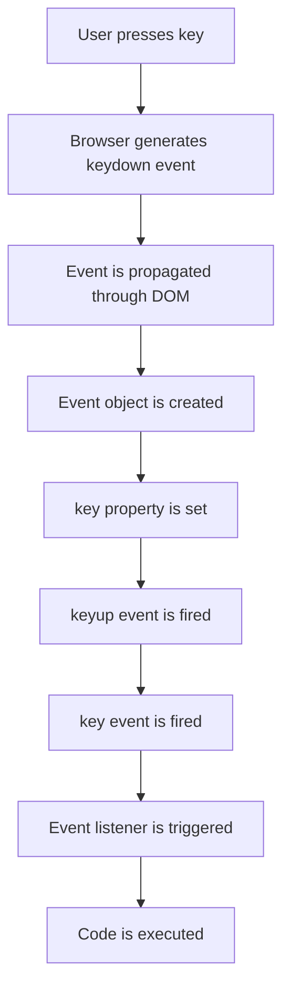

## Introduction
Keyboard events are a crucial aspect of web development, enabling developers to respond to user input and create interactive web applications. The `keydown`, `keyup`, and `key` events are three fundamental events that occur when a user presses or releases a key on their keyboard. Understanding the differences between these events and how to use them effectively is essential for building responsive and engaging web applications. In this section, we will delve into the world of keyboard events, exploring their importance, real-world relevance, and the problems they solve.

## Core Concepts
To grasp keyboard events, it's essential to understand the following core concepts:
* **keydown event**: Fired when a key is pressed.
* **keyup event**: Fired when a key is released.
* **key event**: Fired when a key is pressed, but only if the key has a character associated with it (e.g., letters, numbers, symbols).
* **keyCode**: A deprecated property that returns a numeric code representing the key pressed.
* **key**: A property that returns a string representing the key pressed.

> **Note:** The `keyCode` property is deprecated and should be avoided in favor of the `key` property, which provides more accurate and consistent results.

## How It Works Internally
When a user presses a key, the browser generates a `keydown` event, which is then propagated through the DOM. The event object contains information about the key pressed, including the `key` property, which returns a string representing the key. The `keyup` event is fired when the key is released. The `key` event is fired when a key with a character associated with it is pressed.

Here's a step-by-step breakdown of the process:
1. The user presses a key.
2. The browser generates a `keydown` event.
3. The event is propagated through the DOM.
4. The event object is created, containing information about the key pressed.
5. The `key` property is set to a string representing the key.
6. The `keyup` event is fired when the key is released.
7. The `key` event is fired when a key with a character associated with it is pressed.

## Code Examples
### Example 1: Basic keydown event handling
```javascript
// Add an event listener to the document
document.addEventListener('keydown', (event) => {
  // Log the key pressed to the console
  console.log(`Key pressed: ${event.key}`);
});
```
This example demonstrates how to add an event listener to the document and log the key pressed to the console.

### Example 2: keyup event handling with key code
```javascript
// Add an event listener to the document
document.addEventListener('keyup', (event) => {
  // Check if the key pressed was the Enter key
  if (event.key === 'Enter') {
    // Log a message to the console
    console.log('Enter key pressed');
  }
});
```
This example shows how to add an event listener to the document and check if the key pressed was the Enter key.

### Example 3: Advanced key event handling with multiple event listeners
```javascript
// Add an event listener to the document for keydown events
document.addEventListener('keydown', (event) => {
  // Check if the key pressed was the Shift key
  if (event.key === 'Shift') {
    // Log a message to the console
    console.log('Shift key pressed');
  }
});

// Add an event listener to the document for keyup events
document.addEventListener('keyup', (event) => {
  // Check if the key released was the Shift key
  if (event.key === 'Shift') {
    // Log a message to the console
    console.log('Shift key released');
  }
});
```
This example demonstrates how to add multiple event listeners to the document and handle different key events.

## Visual Diagram

This diagram illustrates the process of keyboard events, from the user pressing a key to the event listener being triggered.

## Comparison
| Approach | Time Complexity | Space Complexity | Pros | Cons | Best For |
| --- | --- | --- | --- | --- | --- |
| keydown event | O(1) | O(1) | Captures all key presses | May capture unwanted key presses | General key press handling |
| keyup event | O(1) | O(1) | Captures key releases | May not capture all key presses | Key release handling |
| key event | O(1) | O(1) | Captures key presses with characters | May not capture all key presses | Character-based key handling |
| keyCode property | O(1) | O(1) | Provides numeric key code | Deprecated and inconsistent | Legacy code or specific use cases |

> **Warning:** The `keyCode` property is deprecated and should be avoided in favor of the `key` property.

## Real-world Use Cases
1. **Google Search**: Google uses keyboard events to provide instant search results as the user types.
2. **Facebook**: Facebook uses keyboard events to provide real-time updates and notifications.
3. **GitHub**: GitHub uses keyboard events to provide keyboard shortcuts for common actions, such as navigating to different pages or creating new issues.

## Common Pitfalls
1. **Using the deprecated keyCode property**: The `keyCode` property is deprecated and should be avoided in favor of the `key` property.
```javascript
// Wrong: Using the deprecated keyCode property
document.addEventListener('keydown', (event) => {
  if (event.keyCode === 13) {
    // Log a message to the console
    console.log('Enter key pressed');
  }
});

// Right: Using the key property
document.addEventListener('keydown', (event) => {
  if (event.key === 'Enter') {
    // Log a message to the console
    console.log('Enter key pressed');
  }
});
```
2. **Not handling keyup events**: Failing to handle keyup events can lead to unwanted behavior, such as multiple key presses being registered as a single key press.
```javascript
// Wrong: Not handling keyup events
document.addEventListener('keydown', (event) => {
  // Log a message to the console
  console.log('Key pressed');
});

// Right: Handling keyup events
document.addEventListener('keyup', (event) => {
  // Log a message to the console
  console.log('Key released');
});
```
3. **Not checking for key presses**: Failing to check for key presses can lead to unwanted behavior, such as executing code when a key is not pressed.
```javascript
// Wrong: Not checking for key presses
document.addEventListener('keydown', (event) => {
  // Log a message to the console
  console.log('Key pressed');
});

// Right: Checking for key presses
document.addEventListener('keydown', (event) => {
  if (event.key === 'Enter') {
    // Log a message to the console
    console.log('Enter key pressed');
  }
});
```
4. **Not handling multiple event listeners**: Failing to handle multiple event listeners can lead to unwanted behavior, such as multiple event listeners being triggered for a single key press.
```javascript
// Wrong: Not handling multiple event listeners
document.addEventListener('keydown', (event) => {
  // Log a message to the console
  console.log('Key pressed');
});

document.addEventListener('keydown', (event) => {
  // Log a message to the console
  console.log('Key pressed again');
});

// Right: Handling multiple event listeners
document.addEventListener('keydown', (event) => {
  if (event.key === 'Enter') {
    // Log a message to the console
    console.log('Enter key pressed');
  }
});

document.addEventListener('keydown', (event) => {
  if (event.key === 'Space') {
    // Log a message to the console
    console.log('Space key pressed');
  }
});
```

## Interview Tips
1. **What is the difference between the keydown and keyup events?**: The `keydown` event is fired when a key is pressed, while the `keyup` event is fired when a key is released.
2. **How do you handle multiple key presses?**: You can handle multiple key presses by checking the `key` property of the event object and executing code accordingly.
3. **What is the purpose of the key event?**: The `key` event is fired when a key with a character associated with it is pressed, and is used to handle character-based key presses.

> **Interview:** Be prepared to explain the differences between the `keydown`, `keyup`, and `key` events, as well as how to handle multiple key presses and character-based key presses.

## Key Takeaways
* **The `keydown` event is fired when a key is pressed**: Use this event to capture all key presses.
* **The `keyup` event is fired when a key is released**: Use this event to capture key releases.
* **The `key` event is fired when a key with a character associated with it is pressed**: Use this event to handle character-based key presses.
* **The `keyCode` property is deprecated and should be avoided**: Use the `key` property instead.
* **Handling multiple event listeners is crucial**: Make sure to handle multiple event listeners to avoid unwanted behavior.
* **Checking for key presses is essential**: Always check for key presses to avoid executing code when a key is not pressed.
* **The `key` property provides a string representing the key pressed**: Use this property to get the key pressed.
* **The `keydown` event has a time complexity of O(1)**: This event is efficient and can be used in performance-critical code.
* **The `keyup` event has a space complexity of O(1)**: This event is memory-efficient and can be used in memory-constrained environments.
* **The `key` event has a time complexity of O(1)**: This event is efficient and can be used in performance-critical code.