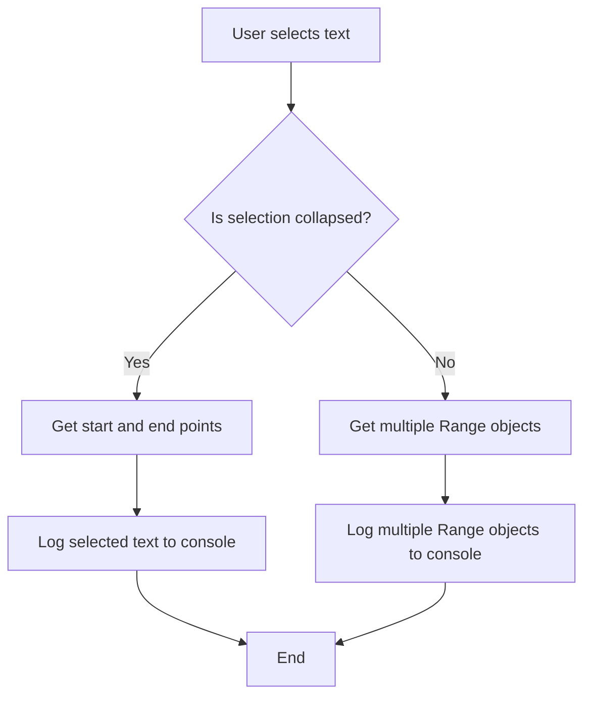

## Introduction
The `window.getSelection()` method and the **Selection API** are crucial components of the web's **DOM** (Document Object Model) and **BOM** (Browser Object Model). They enable developers to interact with the user's selection of text within a web page, providing a way to manipulate and analyze the selected content. This functionality is essential for various web applications, such as text editors, content management systems, and web-based word processors. In this section, we will delve into the world of `window.getSelection()` and the Selection API, exploring their core concepts, internal workings, and practical applications.

> **Note:** The Selection API is a W3C standard, ensuring cross-browser compatibility and consistency across different devices and platforms.

## Core Concepts
To work with `window.getSelection()` and the Selection API, it's essential to understand the following key concepts:

* **Selection**: A selection is a sequence of characters or nodes within a document that are highlighted or marked by the user.
* **Selection object**: The Selection object represents the current selection within a document. It provides methods and properties to manipulate and analyze the selected content.
* **Range**: A Range object represents a contiguous portion of a document, including its start and end points. Ranges are used to define the boundaries of a selection.
* **Node**: A Node is an element or a character within a document. Nodes can be text nodes, element nodes, or other types of nodes.

> **Tip:** When working with the Selection API, it's crucial to understand the differences between **text nodes** and **element nodes**, as they have distinct properties and behaviors.

## How It Works Internally
When a user selects text within a web page, the browser creates a Selection object to represent the selection. The Selection object contains a list of Range objects, which define the boundaries of the selection. The Range objects, in turn, contain references to the start and end nodes of the selection.

Here's a step-by-step breakdown of how `window.getSelection()` works:

1. The user selects text within a web page.
2. The browser creates a Selection object to represent the selection.
3. The Selection object contains a list of Range objects, which define the boundaries of the selection.
4. The Range objects contain references to the start and end nodes of the selection.
5. The `window.getSelection()` method returns the Selection object, which can be used to manipulate and analyze the selected content.

> **Warning:** When working with the Selection API, be aware of the differences between **collapsed** and **expanded** selections. A collapsed selection has a single Range object, while an expanded selection has multiple Range objects.

## Code Examples
### Example 1: Basic Selection
```javascript
// Get the current selection
const selection = window.getSelection();

// Log the selected text to the console
console.log(selection.toString());
```
This example demonstrates how to use `window.getSelection()` to retrieve the current selection and log the selected text to the console.

### Example 2: Manipulating the Selection
```javascript
// Get the current selection
const selection = window.getSelection();

// Remove all ranges from the selection
selection.removeAllRanges();

// Create a new Range object
const range = document.createRange();

// Set the start and end points of the Range object
range.setStart(document.body.firstChild, 0);
range.setEnd(document.body.firstChild, 10);

// Add the Range object to the selection
selection.addRange(range);
```
This example shows how to manipulate the selection by removing all ranges and adding a new Range object.

### Example 3: Advanced Selection Handling
```javascript
// Get the current selection
const selection = window.getSelection();

// Check if the selection is collapsed
if (selection.isCollapsed) {
  // Log a message to the console
  console.log('The selection is collapsed.');
} else {
  // Log a message to the console
  console.log('The selection is expanded.');
}

// Get the start and end points of the selection
const startContainer = selection.anchorNode;
const startOffset = selection.anchorOffset;
const endContainer = selection.focusNode;
const endOffset = selection.focusOffset;

// Log the start and end points to the console
console.log(`Start: ${startContainer}, ${startOffset}`);
console.log(`End: ${endContainer}, ${endOffset}`);
```
This example demonstrates how to handle advanced selection scenarios, including checking if the selection is collapsed and retrieving the start and end points of the selection.

## Visual Diagram

This diagram illustrates the flow of events when working with the Selection API.

## Comparison
| Approach | Time Complexity | Space Complexity | Pros | Cons | Best For |
| --- | --- | --- | --- | --- | --- |
| `window.getSelection()` | O(1) | O(1) | Easy to use, cross-browser compatible | Limited functionality | Basic selection scenarios |
| `document.createRange()` | O(1) | O(1) | More flexible than `window.getSelection()`, allows for custom Range objects | Requires more code and understanding of the DOM | Advanced selection scenarios |
| `selection.removeAllRanges()` | O(1) | O(1) | Allows for easy removal of all ranges from the selection | May not be suitable for all scenarios | Removing all ranges from the selection |
| `selection.addRange()` | O(1) | O(1) | Allows for easy addition of a new Range object to the selection | May not be suitable for all scenarios | Adding a new Range object to the selection |

## Real-world Use Cases
1. **Google Docs**: Google Docs uses the Selection API to enable users to select and manipulate text within documents.
2. **Microsoft Word Online**: Microsoft Word Online uses the Selection API to enable users to select and manipulate text within documents.
3. **Medium**: Medium uses the Selection API to enable users to select and manipulate text within articles.

> **Tip:** When working with the Selection API, consider using a library like **Rangy** to simplify the process and provide cross-browser compatibility.

## Common Pitfalls
1. **Not checking if the selection is collapsed**: Failing to check if the selection is collapsed can lead to incorrect behavior or errors.
2. **Not removing all ranges from the selection**: Failing to remove all ranges from the selection can lead to incorrect behavior or errors.
3. **Not adding a new Range object to the selection**: Failing to add a new Range object to the selection can lead to incorrect behavior or errors.
4. **Not handling multiple Range objects**: Failing to handle multiple Range objects can lead to incorrect behavior or errors.

> **Warning:** When working with the Selection API, be aware of the differences between **text nodes** and **element nodes**, as they have distinct properties and behaviors.

## Interview Tips
1. **What is the Selection API?**: Be prepared to explain the Selection API and its purpose.
2. **How do you use `window.getSelection()`?**: Be prepared to demonstrate how to use `window.getSelection()` to retrieve the current selection.
3. **How do you manipulate the selection?**: Be prepared to demonstrate how to manipulate the selection using `selection.removeAllRanges()` and `selection.addRange()`.

> **Interview:** When answering questions about the Selection API, be sure to emphasize your understanding of the core concepts, including **selection**, **Range**, and **Node**.

## Key Takeaways
* The Selection API provides a way to interact with the user's selection of text within a web page.
* `window.getSelection()` returns the current selection, which can be used to manipulate and analyze the selected content.
* The Selection object contains a list of Range objects, which define the boundaries of the selection.
* Range objects contain references to the start and end nodes of the selection.
* The Selection API provides methods to manipulate the selection, including `removeAllRanges()` and `addRange()`.
* The Selection API is essential for various web applications, including text editors, content management systems, and web-based word processors.
* When working with the Selection API, be aware of the differences between **text nodes** and **element nodes**, as they have distinct properties and behaviors.
* The Selection API is a W3C standard, ensuring cross-browser compatibility and consistency across different devices and platforms.