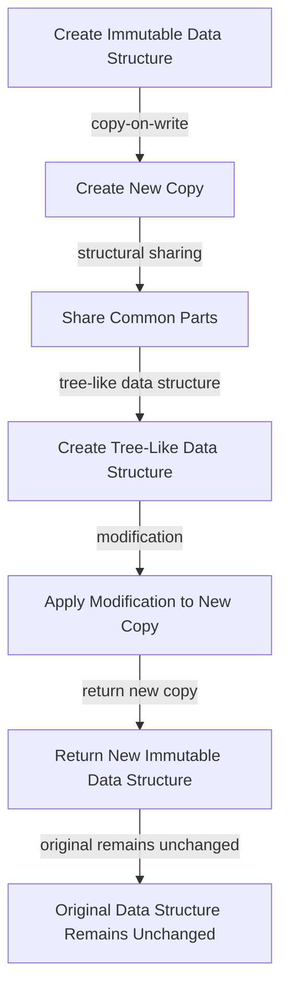

## Introduction
Immutability libraries, such as Immutable.js and Immer, are designed to help developers manage complex state changes in their applications by providing a way to work with immutable data structures. **Immutability** refers to the concept of treating data as unchangeable, once it is created. This approach has several benefits, including easier debugging, improved code predictability, and better support for parallel processing. In real-world applications, immutability libraries are commonly used in state management systems, such as Redux, to manage global state and ensure predictable behavior. Every engineer needs to know about immutability libraries because they provide a powerful tool for managing complex state changes and improving code quality.

## Core Concepts
At the core of immutability libraries are several key concepts:
- **Immutable data structures**: These are data structures that cannot be modified once created. Examples include immutable arrays, objects, and maps.
- **Persistent data structures**: These are data structures that preserve their previous versions when modified. This allows for efficient implementation of immutable data structures.
- **Structural sharing**: This refers to the technique of sharing common parts of data structures to reduce memory usage and improve performance.
- **Tree-like data structures**: These are data structures that have a tree-like shape, with each node having a fixed number of children. Examples include immutable trees and graphs.

> **Note:** Immutable data structures are not the same as **constant** data structures. While constant data structures cannot be reassigned, immutable data structures cannot be modified in-place.

## How It Works Internally
Immutability libraries typically use a combination of techniques to provide immutable data structures:
1. **Copy-on-write**: When a modification is made to an immutable data structure, a new copy of the data structure is created, and the modification is applied to the new copy.
2. **Structural sharing**: To reduce memory usage, immutability libraries use structural sharing to share common parts of data structures.
3. **Tree-like data structures**: Immutability libraries often use tree-like data structures to implement immutable data structures, as these data structures can be efficiently updated using structural sharing.

Here is a high-level overview of how Immer works internally:
```javascript
// Create an immutable object
const original = { a: 1, b: 2 };

// Create a new draft of the object
const draft = immer.produce(original, (draft) => {
  // Modify the draft
  draft.a = 3;
});

// The original object remains unchanged
console.log(original); // { a: 1, b: 2 }

// The new draft is returned
console.log(draft); // { a: 3, b: 2 }
```

## Code Examples
### Example 1: Basic Usage of Immutable.js
```javascript
// Import Immutable.js
const { Map } = require('immutable');

// Create an immutable map
const original = Map({ a: 1, b: 2 });

// Modify the map
const modified = original.set('a', 3);

// The original map remains unchanged
console.log(original.get('a')); // 1

// The modified map has the new value
console.log(modified.get('a')); // 3
```

### Example 2: Real-World Pattern with Immer
```javascript
// Import Immer
const immer = require('immer');

// Create an immutable object
const original = { a: 1, b: 2, c: { d: 3 } };

// Create a new draft of the object
const draft = immer.produce(original, (draft) => {
  // Modify the draft
  draft.a = 3;
  draft.c.d = 4;
});

// The original object remains unchanged
console.log(original); // { a: 1, b: 2, c: { d: 3 } }

// The new draft is returned
console.log(draft); // { a: 3, b: 2, c: { d: 4 } }
```

### Example 3: Advanced Usage with Immutable.js and Immer
```javascript
// Import Immutable.js and Immer
const { List } = require('immutable');
const immer = require('immer');

// Create an immutable list
const original = List([1, 2, 3]);

// Create a new draft of the list using Immer
const draft = immer.produce(original.toJS(), (draft) => {
  // Modify the draft
  draft[0] = 4;
});

// Convert the draft back to an immutable list
const modified = List(draft);

// The original list remains unchanged
console.log(original.get(0)); // 1

// The modified list has the new value
console.log(modified.get(0)); // 4
```

## Visual Diagram

The diagram illustrates the internal workings of immutability libraries, including the use of copy-on-write, structural sharing, and tree-like data structures.

## Comparison
| Approach | Time Complexity | Space Complexity | Pros | Cons | Best For |
|----------|----------------|-----------------|------|------|----------|
| Immutable.js | O(1) for most operations | O(n) for creating new copies | Easy to use, high performance | Can be memory-intensive | Real-time applications, gaming |
| Immer | O(1) for most operations | O(n) for creating new copies | Easy to use, high performance | Can be memory-intensive | Real-time applications, gaming |
| Manual Implementation | O(n) for most operations | O(1) for in-place modification | Low memory usage | Error-prone, low performance | Small-scale applications, prototyping |
| Mutable Data Structures | O(1) for most operations | O(1) for in-place modification | Low memory usage, high performance | Can lead to bugs, difficult to debug | Small-scale applications, prototyping |

## Real-world Use Cases
1. **Facebook's Flux Architecture**: Facebook uses Immutable.js to manage the global state of their applications, ensuring predictable behavior and easy debugging.
2. **Netflix's State Management**: Netflix uses Immer to manage the state of their applications, providing a high-performance and scalable solution.
3. **Reddit's Comment System**: Reddit uses a combination of Immutable.js and Immer to manage the state of their comment system, ensuring fast and predictable performance.

## Common Pitfalls
1. **Not using immutable data structures**: Failing to use immutable data structures can lead to bugs and unpredictable behavior.
```javascript
// Wrong way: using mutable data structures
let data = { a: 1, b: 2 };
data.a = 3; // modifies the original data
```
```javascript
// Right way: using immutable data structures
const data = { a: 1, b: 2 };
const modified = { ...data, a: 3 }; // creates a new copy
```
2. **Not using structural sharing**: Failing to use structural sharing can lead to high memory usage and poor performance.
```javascript
// Wrong way: not using structural sharing
const data = { a: 1, b: 2 };
const modified = { a: 3, b: 2 }; // creates a new copy without sharing
```
```javascript
// Right way: using structural sharing
const data = { a: 1, b: 2 };
const modified = immer.produce(data, (draft) => {
  draft.a = 3; // modifies the draft, sharing common parts
});
```
3. **Not handling edge cases**: Failing to handle edge cases can lead to bugs and unpredictable behavior.
```javascript
// Wrong way: not handling edge cases
const data = { a: 1, b: 2 };
const modified = data.a === undefined ? { ...data, a: 3 } : data; // does not handle null or NaN cases
```
```javascript
// Right way: handling edge cases
const data = { a: 1, b: 2 };
const modified = immer.produce(data, (draft) => {
  if (draft.a === undefined || draft.a === null || isNaN(draft.a)) {
    draft.a = 3; // handles edge cases
  }
});
```
4. **Not using immutability libraries**: Failing to use immutability libraries can lead to low performance and high memory usage.
```javascript
// Wrong way: not using immutability libraries
const data = [1, 2, 3];
const modified = data.slice(); // creates a new copy without sharing
modified[0] = 4; // modifies the copy
```
```javascript
// Right way: using immutability libraries
const data = List([1, 2, 3]);
const modified = data.set(0, 4); // creates a new copy with sharing
```

## Interview Tips
1. **What is immutability, and how does it benefit applications?**: The interviewer wants to hear that immutability provides predictable behavior, easy debugging, and high performance.
2. **How do you implement immutability in your applications?**: The interviewer wants to hear that you use immutability libraries, such as Immutable.js or Immer, and that you follow best practices, such as using structural sharing and handling edge cases.
3. **What are some common pitfalls when using immutability libraries?**: The interviewer wants to hear that you are aware of common pitfalls, such as not using structural sharing, not handling edge cases, and not using immutability libraries.

> **Interview:** The interviewer may ask you to write a simple example of using an immutability library, such as Immutable.js or Immer. Be prepared to write a complete and runnable example, and to explain the benefits of using immutability libraries.

## Key Takeaways
* Immutability libraries provide a way to work with immutable data structures, ensuring predictable behavior and high performance.
* Immutable.js and Immer are popular immutability libraries that use copy-on-write, structural sharing, and tree-like data structures to provide high-performance immutable data structures.
* Immutability libraries can be used in a variety of applications, including real-time applications, gaming, and state management systems.
* Common pitfalls when using immutability libraries include not using structural sharing, not handling edge cases, and not using immutability libraries.
* Best practices when using immutability libraries include using structural sharing, handling edge cases, and following the principles of immutability.
* Immutability libraries can provide a high-performance and scalable solution for managing complex state changes in applications.
* Immutability libraries can be used in conjunction with other libraries and frameworks, such as React and Redux, to provide a comprehensive solution for managing state and props in applications.