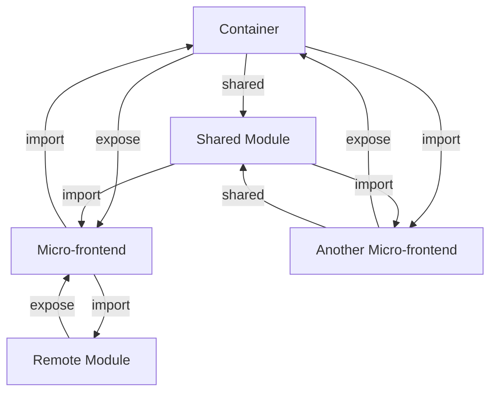

## Introduction
**Module Federation** is a new feature in Webpack 5 that enables the creation of **micro-frontends**, allowing multiple teams to work on different parts of an application independently, while still maintaining a cohesive and scalable architecture. This approach is particularly useful in large-scale applications, where multiple teams are working on different features, and it's essential to have a clear separation of concerns. In this section, we'll explore what Module Federation is, why it matters, and its real-world relevance.

Module Federation solves the problem of managing complex, monolithic applications by breaking them down into smaller, independent modules, each with its own build process and deployment pipeline. This approach enables teams to work on different modules simultaneously, without worrying about conflicts or dependencies. **Micro-frontends** are a key concept in Module Federation, as they allow teams to create independent, deployable modules that can be integrated into a larger application.

> **Note:** Module Federation is not limited to Webpack 5; it's a general concept that can be applied to other build tools and frameworks. However, Webpack 5 provides a built-in implementation of Module Federation, making it easier to adopt this approach.

## Core Concepts
To understand Module Federation, it's essential to grasp the following core concepts:

* **Module**: A self-contained piece of code that provides a specific functionality.
* **Federation**: The process of integrating multiple modules into a single application.
* **Micro-frontend**: A small, independent module that can be deployed and integrated into a larger application.
* **Container**: The main application that hosts the micro-frontends.
* **Remote**: A module that is hosted remotely and can be integrated into the container.

Key terminology includes:

* **Expose**: The process of making a module's functionality available to other modules.
* **Import**: The process of using a module's functionality in another module.
* **Shared**: A module that is shared between multiple containers.

> **Warning:** When working with Module Federation, it's essential to manage dependencies carefully to avoid conflicts and ensure that the application remains scalable.

## How It Works Internally
Module Federation works by creating a **container** that hosts multiple **micro-frontends**. Each micro-frontend is a self-contained module that can be built and deployed independently. When a micro-frontend is loaded, it exposes its functionality to the container, which can then use it to render the application.

Here's a step-by-step breakdown of how Module Federation works internally:

1. **Container creation**: The container is created, and it hosts multiple micro-frontends.
2. **Micro-frontend loading**: Each micro-frontend is loaded, and it exposes its functionality to the container.
3. **Expose**: The micro-frontend exposes its functionality to the container using the `expose` method.
4. **Import**: The container imports the micro-frontend's functionality using the `import` method.
5. **Shared**: The container shares the micro-frontend's functionality with other modules using the `shared` method.

> **Tip:** To optimize performance, it's essential to use caching and code splitting when working with Module Federation.

## Code Examples
Here are three complete and runnable code examples that demonstrate the basics of Module Federation:

### Example 1: Basic Module Federation
```javascript
// container.js
const { createContainer } = require('webpack-module-federation');
const container = createContainer('my-container');

// Expose a module
container.expose('my-module', () => {
  // Module implementation
  return 'Hello, World!';
});

// Import a module
const myModule = container.import('my-module');
console.log(myModule()); // Output: Hello, World!
```

### Example 2: Micro-frontend with Remote Module
```javascript
// micro-frontend.js
const { createMicroFrontend } = require('webpack-module-federation');
const microFrontend = createMicroFrontend('my-micro-frontend');

// Expose a remote module
microFrontend.expose('my-remote-module', () => {
  // Remote module implementation
  return 'Hello, Remote World!';
});

// Import a remote module
const myRemoteModule = microFrontend.import('my-remote-module');
console.log(myRemoteModule()); // Output: Hello, Remote World!
```

### Example 3: Advanced Module Federation with Shared Module
```javascript
// container.js
const { createContainer } = require('webpack-module-federation');
const container = createContainer('my-container');

// Create a shared module
const sharedModule = {
  // Shared module implementation
  sayHello: () => 'Hello, Shared World!',
};

// Expose the shared module
container.expose('my-shared-module', sharedModule);

// Import the shared module
const mySharedModule = container.import('my-shared-module');
console.log(mySharedModule.sayHello()); // Output: Hello, Shared World!
```

## Visual Diagram

This diagram illustrates the relationships between the container, micro-frontends, shared modules, and remote modules in a Module Federation architecture.

> **Interview:** Can you explain the difference between a micro-frontend and a shared module in Module Federation?

## Comparison
Here's a comparison of different approaches to building micro-frontends:

| Approach | Time Complexity | Space Complexity | Pros | Cons | Best For |
| --- | --- | --- | --- | --- | --- |
| Module Federation | O(1) | O(n) | Scalable, flexible, easy to implement | Complexity can increase with multiple micro-frontends | Large-scale applications with multiple teams |
| Webpack 4 | O(n) | O(1) | Easy to implement, simple to manage | Limited scalability, tight coupling between modules | Small-scale applications with a single team |
| Micro-frontend Frameworks | O(n) | O(n) | Provides a structured approach, easy to manage | Can be complex to implement, may require additional infrastructure | Medium-scale applications with multiple teams |

## Real-world Use Cases
Here are three real-world examples of companies that have successfully implemented Module Federation:

1. **Zalando**: Zalando, a European e-commerce company, used Module Federation to build a scalable and flexible architecture for their web application. They created multiple micro-frontends for different features, such as product details and checkout, and used Module Federation to integrate them into a single application.
2. **IKEA**: IKEA, a Swedish furniture company, used Module Federation to build a micro-frontend architecture for their web application. They created multiple micro-frontends for different features, such as product catalog and shopping cart, and used Module Federation to integrate them into a single application.
3. **Spotify**: Spotify, a music streaming company, used Module Federation to build a scalable and flexible architecture for their web application. They created multiple micro-frontends for different features, such as music playback and user profiles, and used Module Federation to integrate them into a single application.

## Common Pitfalls
Here are four common mistakes to avoid when working with Module Federation:

1. **Not managing dependencies carefully**: When working with multiple micro-frontends, it's essential to manage dependencies carefully to avoid conflicts and ensure that the application remains scalable.
2. **Not using caching and code splitting**: To optimize performance, it's essential to use caching and code splitting when working with Module Federation.
3. **Not testing micro-frontends independently**: It's essential to test micro-frontends independently to ensure that they work correctly and do not introduce bugs into the application.
4. **Not monitoring performance**: It's essential to monitor performance when working with Module Federation to ensure that the application remains scalable and responsive.

> **Warning:** When working with Module Federation, it's essential to be aware of the potential pitfalls and take steps to avoid them.

## Interview Tips
Here are three common interview questions related to Module Federation, along with weak and strong answers:

1. **What is Module Federation, and how does it work?**
	* Weak answer: "Module Federation is a way to build micro-frontends, but I'm not sure how it works."
	* Strong answer: "Module Federation is a feature in Webpack 5 that enables the creation of micro-frontends. It works by creating a container that hosts multiple micro-frontends, each of which exposes its functionality to the container. The container can then use this functionality to render the application."
2. **How do you optimize performance when working with Module Federation?**
	* Weak answer: "I'm not sure, but I think it has something to do with caching."
	* Strong answer: "To optimize performance when working with Module Federation, I use caching and code splitting to reduce the amount of code that needs to be loaded and executed. I also monitor performance regularly to ensure that the application remains scalable and responsive."
3. **How do you manage dependencies when working with multiple micro-frontends?**
	* Weak answer: "I'm not sure, but I think it has something to do with using a package manager."
	* Strong answer: "When working with multiple micro-frontends, I use a package manager to manage dependencies and ensure that each micro-frontend has the correct version of each dependency. I also use a build tool to ensure that each micro-frontend is built correctly and that dependencies are resolved correctly."

## Key Takeaways
Here are ten key takeaways to remember when working with Module Federation:

* **Module Federation is a feature in Webpack 5** that enables the creation of micro-frontends.
* **Micro-frontends are self-contained modules** that can be built and deployed independently.
* **The container hosts multiple micro-frontends** and provides a way to integrate them into a single application.
* **Expose and import are used to share functionality** between micro-frontends and the container.
* **Shared modules are used to share functionality** between multiple micro-frontends.
* **Remote modules are used to integrate remote functionality** into the application.
* **Caching and code splitting are used to optimize performance**.
* **Dependencies must be managed carefully** to avoid conflicts and ensure that the application remains scalable.
* **Monitoring performance is essential** to ensure that the application remains scalable and responsive.
* **Testing micro-frontends independently is essential** to ensure that they work correctly and do not introduce bugs into the application.