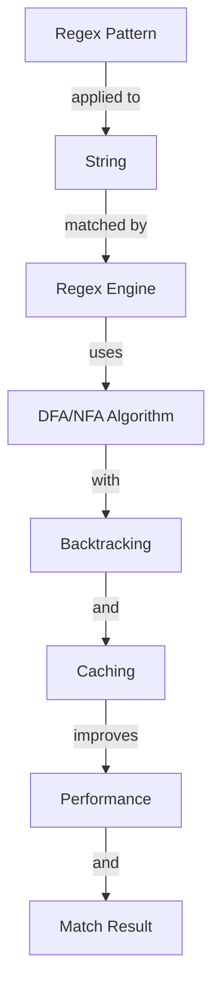

## Introduction
Regular expressions, commonly referred to as regex, are a sequence of characters that define a search pattern used for string matching. They are a powerful tool for text processing and are widely used in various programming languages, including JavaScript. Regex is essential for tasks such as data validation, text extraction, and string manipulation. Every engineer should have a solid understanding of regex fundamentals, including syntax, flags, groups, lookahead, and lookbehind. In real-world scenarios, regex is used in web development, data analysis, and security applications.

> **Tip:** When working with regex, it's essential to use online tools or regex editors to test and refine your patterns.

## Core Concepts
Regex patterns consist of special characters, character classes, and modifiers. **Character classes** are used to match specific sets of characters, such as digits, letters, or whitespace. **Modifiers** are used to specify the scope of the match, such as case sensitivity or global matching. **Groups** are used to capture and reference parts of the match. **Lookahead** and **lookbehind** are used to assert the presence or absence of a pattern without including it in the match.

> **Note:** Regex patterns can be complex and difficult to read, so it's essential to use clear and concise naming conventions when defining regex patterns.

## How It Works Internally
When a regex pattern is applied to a string, the regex engine performs a step-by-step search for matches. The engine uses a **deterministic finite automaton (DFA)** or **non-deterministic finite automaton (NFA)** algorithm to match the pattern. The ** DFA** algorithm is more efficient but less powerful than the **NFA** algorithm. The regex engine also uses **backtracking** to handle ambiguous patterns and **caching** to improve performance.

> **Warning:** Using regex patterns with excessive backtracking can lead to performance issues and even crashes.

## Code Examples
### Example 1: Basic Regex Pattern
```javascript
const regex = /\d+/;
const str = '123-456-7890';
const match = str.match(regex);
console.log(match); // Output: [ '123', index: 0, input: '123-456-7890', groups: undefined ]
```
This example demonstrates a basic regex pattern that matches one or more digits.

### Example 2: Regex Pattern with Groups
```javascript
const regex = /(\d{3})-(\d{3})-(\d{4})/;
const str = '123-456-7890';
const match = str.match(regex);
console.log(match); // Output: [ '123-456-7890', '123', '456', '7890', index: 0, input: '123-456-7890', groups: [ '123', '456', '7890' ] ]
```
This example demonstrates a regex pattern that uses groups to capture and reference parts of the match.

### Example 3: Regex Pattern with Lookahead
```javascript
const regex = /\d+(?=\/)/;
const str = '123/456';
const match = str.match(regex);
console.log(match); // Output: [ '123', index: 0, input: '123/456', groups: undefined ]
```
This example demonstrates a regex pattern that uses lookahead to assert the presence of a forward slash without including it in the match.

## Visual Diagram

This diagram illustrates the internal workings of the regex engine and how it applies the regex pattern to the input string.

## Comparison
| Approach | Time Complexity | Space Complexity | Pros | Cons | Best For |
| --- | --- | --- | --- | --- | --- |
| DFA | O(n) | O(1) | Efficient, fast | Less powerful, complex implementation | Simple regex patterns |
| NFA | O(2^n) | O(n) | Powerful, flexible | Slow, complex implementation | Complex regex patterns |
| Backtracking | O(2^n) | O(n) | Flexible, easy to implement | Slow, inefficient | Ambiguous regex patterns |
| Caching | O(1) | O(n) | Fast, efficient | Limited cache size, complex implementation | Frequent regex pattern matching |

## Real-world Use Cases
1. **Data validation**: Regex is used to validate user input data, such as email addresses, phone numbers, and passwords.
2. **Text extraction**: Regex is used to extract specific data from text files, such as log files or CSV files.
3. **Security applications**: Regex is used in security applications, such as intrusion detection systems and firewall rules.

> **Interview:** Can you explain the difference between a DFA and an NFA regex engine?

## Common Pitfalls
1. **Excessive backtracking**: Using regex patterns with excessive backtracking can lead to performance issues and even crashes.
2. **Incorrect character classes**: Using incorrect character classes can lead to incorrect matches and unexpected behavior.
3. **Inefficient caching**: Using inefficient caching can lead to slow performance and high memory usage.
4. **Complex regex patterns**: Using complex regex patterns can lead to difficult maintenance and debugging.

> **Warning:** Using regex patterns with excessive backtracking can lead to performance issues and even crashes.

## Interview Tips
1. **What is the difference between a DFA and an NFA regex engine?**: A DFA regex engine is more efficient but less powerful than an NFA regex engine.
2. **How do you optimize regex patterns for performance?**: You can optimize regex patterns by using efficient character classes, reducing backtracking, and using caching.
3. **What is the purpose of lookahead and lookbehind in regex patterns?**: Lookahead and lookbehind are used to assert the presence or absence of a pattern without including it in the match.

## Key Takeaways
* Regex patterns consist of special characters, character classes, and modifiers.
* The regex engine uses a DFA or NFA algorithm to match the pattern.
* Backtracking and caching are used to improve performance.
* Regex patterns can be complex and difficult to read.
* DFA regex engines are more efficient but less powerful than NFA regex engines.
* Lookahead and lookbehind are used to assert the presence or absence of a pattern without including it in the match.
* Regex patterns are widely used in web development, data analysis, and security applications.
* Excessive backtracking can lead to performance issues and even crashes.
* Incorrect character classes can lead to incorrect matches and unexpected behavior.