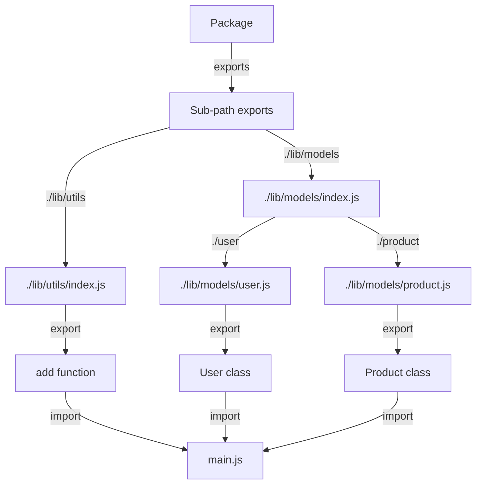

## Introduction
The `package.json` `exports` field is a feature introduced in Node.js 14.13.0, allowing developers to specify subpath exports for their packages. This feature is essential for creating modular and maintainable codebases, as it enables developers to expose specific parts of their package's API while keeping others internal. In this section, we will explore the importance of the `exports` field, its real-world relevance, and why every engineer should understand how to use it effectively.

The `exports` field is particularly useful when creating large-scale applications or libraries, where a single entry point may not be sufficient. By specifying subpath exports, developers can create a more modular and flexible architecture, making it easier to manage and maintain their codebase. For example, a package may have multiple sub-modules, each with its own set of exports, allowing developers to import only the necessary parts of the package.

> **Note:** The `exports` field is an alternative to the `main` field in `package.json`, which specifies the entry point of a package. While the `main` field is still supported, the `exports` field provides more flexibility and control over the exports of a package.

## Core Concepts
To understand the `exports` field, it's essential to grasp the following core concepts:

* **Subpath exports**: The ability to specify exports for specific sub-paths within a package.
* **Package entry points**: The points of entry for a package, which can be specified using the `exports` field.
* **Module resolution**: The process of resolving module imports to their corresponding exports.

The `exports` field is an object that maps sub-paths to their corresponding exports. For example, a package may have an `exports` field like this:
```json
{
  "exports": {
    "./lib/utils": "./lib/utils/index.js",
    "./lib/models": "./lib/models/index.js"
  }
}
```
This specifies that the `./lib/utils` sub-path exports the `./lib/utils/index.js` file, and the `./lib/models` sub-path exports the `./lib/models/index.js` file.

> **Tip:** When using the `exports` field, it's essential to keep in mind that the sub-paths are relative to the package's root directory.

## How It Works Internally
Under the hood, the `exports` field works by modifying the package's module resolution behavior. When a module imports a sub-path of a package, Node.js checks the `exports` field to see if there's a matching sub-path export. If there is, Node.js resolves the import to the corresponding export.

Here's a step-by-step breakdown of how it works:

1. A module imports a sub-path of a package, e.g., `import { utils } from 'my-package/lib/utils';`.
2. Node.js checks the `exports` field of the `my-package` package to see if there's a matching sub-path export.
3. If there is, Node.js resolves the import to the corresponding export, e.g., `./lib/utils/index.js`.
4. Node.js loads the resolved export and returns it to the importing module.

> **Warning:** If the `exports` field is not properly configured, it can lead to unexpected behavior or errors. For example, if a sub-path export is missing, Node.js may throw a `MODULE_NOT_FOUND` error.

## Code Examples
Here are three complete and runnable code examples that demonstrate the use of the `exports` field:

### Example 1: Basic Usage
```javascript
// package.json
{
  "name": "my-package",
  "version": "1.0.0",
  "exports": {
    "./lib/utils": "./lib/utils/index.js"
  }
}

// lib/utils/index.js
export function add(a, b) {
  return a + b;
}

// main.js
import { add } from 'my-package/lib/utils';
console.log(add(2, 3)); // Output: 5
```
This example demonstrates a basic usage of the `exports` field, where a package exports a single sub-path.

### Example 2: Real-World Pattern
```javascript
// package.json
{
  "name": "my-package",
  "version": "1.0.0",
  "exports": {
    "./lib/models": "./lib/models/index.js",
    "./lib/utils": "./lib/utils/index.js"
  }
}

// lib/models/index.js
export class User {
  constructor(name, email) {
    this.name = name;
    this.email = email;
  }
}

// lib/utils/index.js
export function validateEmail(email) {
  return /^[a-zA-Z0-9._%+-]+@[a-zA-Z0-9.-]+\.[a-zA-Z]{2,}$/.test(email);
}

// main.js
import { User } from 'my-package/lib/models';
import { validateEmail } from 'my-package/lib/utils';
const user = new User('John Doe', 'johndoe@example.com');
console.log(validateEmail(user.email)); // Output: true
```
This example demonstrates a real-world pattern, where a package exports multiple sub-paths, each with its own set of exports.

### Example 3: Advanced Usage
```javascript
// package.json
{
  "name": "my-package",
  "version": "1.0.0",
  "exports": {
    "./lib/utils": "./lib/utils/index.js",
    "./lib/models": {
      "./user": "./lib/models/user.js",
      "./product": "./lib/models/product.js"
    }
  }
}

// lib/utils/index.js
export function add(a, b) {
  return a + b;
}

// lib/models/user.js
export class User {
  constructor(name, email) {
    this.name = name;
    this.email = email;
  }
}

// lib/models/product.js
export class Product {
  constructor(name, price) {
    this.name = name;
    this.price = price;
  }
}

// main.js
import { add } from 'my-package/lib/utils';
import { User } from 'my-package/lib/models/user';
import { Product } from 'my-package/lib/models/product';
console.log(add(2, 3)); // Output: 5
const user = new User('John Doe', 'johndoe@example.com');
const product = new Product('Example Product', 19.99);
```
This example demonstrates an advanced usage of the `exports` field, where a package exports multiple sub-paths with nested exports.

## Visual Diagram

This diagram illustrates the exports field and its corresponding sub-path exports.

> **Note:** The diagram shows a simplified example of how the exports field works. In a real-world scenario, the diagram may be more complex, with multiple sub-paths and exports.

## Comparison
| Approach | Time Complexity | Space Complexity | Pros | Cons | Best For |
| --- | --- | --- | --- | --- | --- |
| Using the `exports` field | O(1) | O(1) | Flexible, modular, and maintainable codebase | Can be complex to configure | Large-scale applications or libraries |
| Using the `main` field | O(1) | O(1) | Simple and easy to use | Limited flexibility, may lead to tight coupling | Small-scale applications or scripts |
| Using ES6 imports | O(1) | O(1) | Simple and easy to use, flexible | May lead to namespace pollution | Small-scale applications or scripts |
| Using CommonJS modules | O(1) | O(1) | Simple and easy to use, flexible | May lead to namespace pollution, not compatible with ES6 imports | Legacy applications or scripts |

> **Tip:** When choosing an approach, consider the size and complexity of your application, as well as the trade-offs between flexibility, maintainability, and simplicity.

## Real-world Use Cases
Here are three real-world use cases that demonstrate the use of the `exports` field:

* **React**: React uses the `exports` field to specify sub-path exports for its various modules, such as `react-dom` and `react-router-dom`.
* **Angular**: Angular uses the `exports` field to specify sub-path exports for its various modules, such as `@angular/core` and `@angular/common`.
* **Express.js**: Express.js uses the `exports` field to specify sub-path exports for its various modules, such as `express` and `express-session`.

> **Interview:** When asked about the `exports` field in an interview, be sure to explain its purpose, how it works, and its benefits. You can also mention real-world use cases, such as React or Angular, to demonstrate your knowledge and experience.

## Common Pitfalls
Here are four common pitfalls to watch out for when using the `exports` field:

* **Incorrect sub-path exports**: Make sure to specify the correct sub-path exports in the `exports` field. Incorrect exports can lead to errors or unexpected behavior.
* **Namespace pollution**: Be careful not to pollute the namespace with unnecessary exports. This can lead to naming conflicts and make the code harder to maintain.
* **Tight coupling**: Avoid tight coupling between modules by using the `exports` field to specify sub-path exports. This can make the code more modular and maintainable.
* **Inconsistent exports**: Make sure to use consistent exports throughout the application. Inconsistent exports can lead to confusion and make the code harder to maintain.

> **Warning:** When using the `exports` field, make sure to test your application thoroughly to ensure that the exports are correct and working as expected.

## Interview Tips
Here are three common interview questions related to the `exports` field, along with weak and strong answers:

* **What is the purpose of the `exports` field in `package.json`?**
	+ Weak answer: "It's used to specify the entry point of a package."
	+ Strong answer: "The `exports` field is used to specify sub-path exports for a package, allowing for more flexibility and modularity in the codebase."
* **How do you use the `exports` field to specify sub-path exports?**
	+ Weak answer: "You just add the sub-path to the `exports` field and it works."
	+ Strong answer: "You specify the sub-path exports in the `exports` field using a mapping of sub-paths to their corresponding exports. For example, you can specify `./lib/utils` as a sub-path export and map it to `./lib/utils/index.js`."
* **What are the benefits of using the `exports` field?**
	+ Weak answer: "It's just a way to specify exports."
	+ Strong answer: "The `exports` field provides more flexibility and modularity in the codebase, making it easier to maintain and scale. It also allows for more precise control over what is exported and what is not."

> **Tip:** When answering interview questions, make sure to provide clear and concise answers that demonstrate your knowledge and experience. Avoid weak answers that lack depth or clarity.

## Key Takeaways
Here are six key takeaways to remember when using the `exports` field:

* The `exports` field is used to specify sub-path exports for a package.
* The `exports` field provides more flexibility and modularity in the codebase.
* The `exports` field allows for more precise control over what is exported and what is not.
* The `exports` field can be used to specify multiple sub-path exports.
* The `exports` field can be used to specify nested exports.
* The `exports` field is an alternative to the `main` field in `package.json`.

> **Note:** When using the `exports` field, make sure to keep these key takeaways in mind to ensure that you are using it effectively and efficiently.