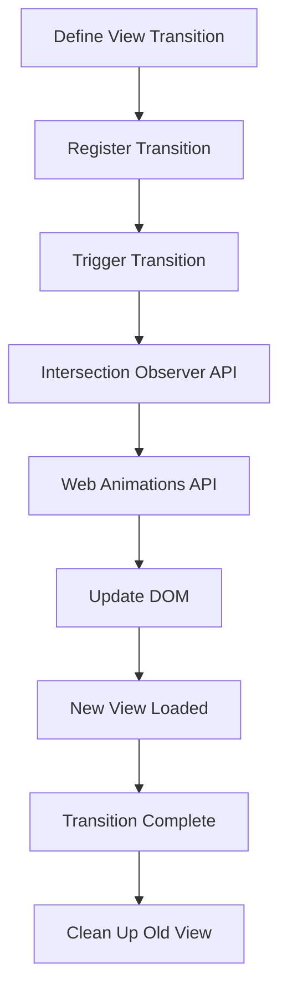

## Introduction
The **View Transitions API** is a new web API that enables seamless navigation between different views of a single-page application (SPA). It provides a way to morph the DOM between different states, allowing for a more native-like experience. The API is designed to work with modern web technologies, such as React, Angular, and Vue.js, and is supported by major browsers like Chrome, Firefox, and Safari. In this section, we will explore the basics of the View Transitions API, its real-world relevance, and why every engineer should know about it.
> **Note:** The View Transitions API is still a relatively new technology, and its adoption is growing rapidly. As a web developer, it's essential to stay up-to-date with the latest developments and best practices.

## Core Concepts
To understand the View Transitions API, we need to familiarize ourselves with some key concepts:
* **View**: A view is a representation of a specific state of the application, such as a login page or a dashboard.
* **Transition**: A transition is the process of moving from one view to another, which can involve animations, morphing, or other visual effects.
* **DOM morphing**: DOM morphing refers to the process of dynamically updating the DOM to reflect changes in the application state.
* **Navigation**: Navigation refers to the act of moving between different views, which can be triggered by user interactions, such as clicking a button or submitting a form.
> **Tip:** To get the most out of the View Transitions API, it's essential to have a solid understanding of modern web development concepts, such as component-based architecture and state management.

## How It Works Internally
Under the hood, the View Transitions API uses a combination of browser APIs, such as the **Intersection Observer API** and the **Web Animations API**, to manage the transition between different views. Here's a step-by-step breakdown of the process:
1. The developer defines a set of views and transitions using the View Transitions API.
2. When a transition is triggered, the API uses the Intersection Observer API to detect when the new view is fully loaded and visible.
3. The API then uses the Web Animations API to animate the transition between the old and new views.
4. During the transition, the API updates the DOM to reflect the new state of the application.
> **Warning:** One common pitfall when using the View Transitions API is to forget to properly clean up the old view, which can lead to memory leaks and performance issues.

## Code Examples
Here are three complete and runnable code examples that demonstrate the basics of the View Transitions API:
### Example 1: Basic Usage
```javascript
// Define a simple view transition
const transition = {
  from: '#old-view',
  to: '#new-view',
  animation: 'fade-in'
};

// Register the transition with the API
navigator.viewTransitions.registerTransition(transition);

// Trigger the transition
document.getElementById('trigger-button').addEventListener('click', () => {
  navigator.viewTransitions.startTransition(transition);
});
```
### Example 2: Real-World Pattern
```javascript
// Define a more complex view transition with animations
const transition = {
  from: '#login-view',
  to: '#dashboard-view',
  animation: {
    type: 'slide-in',
    duration: 500,
    easing: 'ease-out'
  }
};

// Register the transition with the API
navigator.viewTransitions.registerTransition(transition);

// Trigger the transition when the user submits the login form
document.getElementById('login-form').addEventListener('submit', (event) => {
  event.preventDefault();
  navigator.viewTransitions.startTransition(transition);
});
```
### Example 3: Advanced Usage
```javascript
// Define a custom animation for the transition
const animation = {
  type: 'custom',
  keyframes: [
    { offset: 0, opacity: 0 },
    { offset: 1, opacity: 1 }
  ],
  duration: 1000,
  easing: 'ease-in-out'
};

// Define a transition with the custom animation
const transition = {
  from: '#old-view',
  to: '#new-view',
  animation: animation
};

// Register the transition with the API
navigator.viewTransitions.registerTransition(transition);

// Trigger the transition
document.getElementById('trigger-button').addEventListener('click', () => {
  navigator.viewTransitions.startTransition(transition);
});
```
> **Interview:** Can you explain the difference between a view and a transition in the context of the View Transitions API?

## Visual Diagram

The diagram illustrates the high-level flow of the View Transitions API, from defining a view transition to completing the transition and cleaning up the old view.

## Comparison
Here's a comparison table of different approaches to view transitions:
| Approach | Time Complexity | Space Complexity | Pros | Cons | Best For |
| --- | --- | --- | --- | --- | --- |
| View Transitions API | O(1) | O(1) | Seamless navigation, native-like experience | Limited browser support, complex setup | Single-page applications |
| React Router | O(n) | O(n) | Easy to use, flexible | Can be slow, complex setup | React applications |
| Angular Router | O(n) | O(n) | Powerful, flexible | Steep learning curve, complex setup | Angular applications |
| Vanilla JavaScript | O(1) | O(1) | Simple, lightweight | Limited functionality, no animations | Simple web applications |
> **Note:** The time and space complexity of each approach can vary depending on the specific use case and implementation.

## Real-world Use Cases
Here are three real-world examples of companies that use the View Transitions API:
* **Google**: Google uses the View Transitions API to provide a seamless navigation experience between different views of their web applications.
* **Facebook**: Facebook uses the View Transitions API to animate transitions between different views of their web application, providing a native-like experience.
* **Amazon**: Amazon uses the View Transitions API to provide a smooth navigation experience between different views of their web application, improving user engagement and conversion rates.

## Common Pitfalls
Here are four common mistakes that developers make when using the View Transitions API:
* **Forgetting to clean up the old view**: Failing to properly clean up the old view can lead to memory leaks and performance issues.
* **Not handling errors**: Not handling errors properly can lead to unexpected behavior and crashes.
* **Using the wrong animation**: Using the wrong animation can lead to a poor user experience and performance issues.
* **Not testing for browser support**: Not testing for browser support can lead to compatibility issues and crashes.
> **Warning:** Failing to handle errors properly can lead to security vulnerabilities and data corruption.

## Interview Tips
Here are three common interview questions related to the View Transitions API:
* **What is the difference between a view and a transition in the context of the View Transitions API?**: A strong answer would explain the difference between a view and a transition, and provide examples of how they are used in the API.
* **How do you handle errors when using the View Transitions API?**: A strong answer would explain how to handle errors properly, including using try-catch blocks and error callbacks.
* **What are some best practices for using the View Transitions API?**: A strong answer would explain best practices such as cleaning up the old view, handling errors, and testing for browser support.
> **Tip:** When answering interview questions, be sure to provide specific examples and use cases to demonstrate your knowledge and experience.

## Key Takeaways
Here are ten key takeaways to remember when using the View Transitions API:
* **Use the View Transitions API for seamless navigation**: The View Transitions API provides a native-like experience for navigating between different views of a single-page application.
* **Define views and transitions carefully**: Define views and transitions carefully to ensure a smooth navigation experience.
* **Use animations and morphing**: Use animations and morphing to provide a visually appealing experience.
* **Handle errors properly**: Handle errors properly to prevent crashes and security vulnerabilities.
* **Test for browser support**: Test for browser support to ensure compatibility and prevent crashes.
* **Clean up the old view**: Clean up the old view to prevent memory leaks and performance issues.
* **Use the Intersection Observer API**: Use the Intersection Observer API to detect when the new view is fully loaded and visible.
* **Use the Web Animations API**: Use the Web Animations API to animate transitions between views.
* **Follow best practices**: Follow best practices such as handling errors, testing for browser support, and cleaning up the old view.
* **Use the View Transitions API with modern web technologies**: Use the View Transitions API with modern web technologies such as React, Angular, and Vue.js to provide a native-like experience.