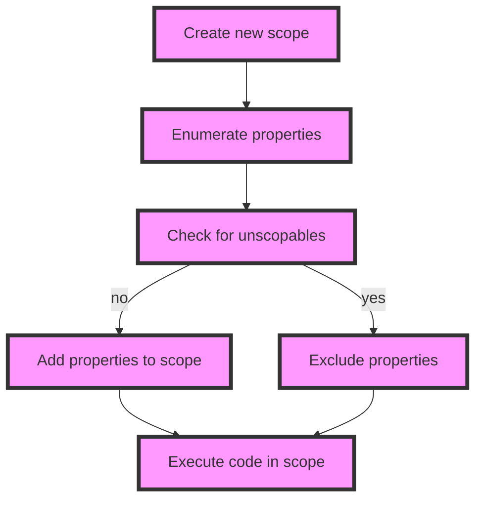

## Introduction
The `Symbol.unscopables` well-known symbol is a property of the `Symbol` object that allows developers to specify which properties of an object should not be included in the `with` statement's scope. The `with` statement is a JavaScript feature that allows you to execute a block of code in the context of a specific object, making it easier to access the object's properties. However, this feature can also lead to unexpected behavior if not used carefully. In this section, we will explore the importance of `Symbol.unscopables` and its real-world relevance.

> **Note:** The `with` statement is generally discouraged in modern JavaScript development due to its potential for ambiguity and security vulnerabilities.

## Core Concepts
To understand `Symbol.unscopables`, we need to grasp the following core concepts:

* **Well-known symbols**: These are a set of predefined symbols in JavaScript that have special meanings, such as `Symbol.iterator` and `Symbol.species`.
* **`with` statement**: A JavaScript statement that allows you to execute a block of code in the context of a specific object.
* **Property descriptor**: An object that describes a property of another object, including its value, writability, and enumerability.

> **Tip:** When working with the `with` statement, it's essential to be aware of the potential pitfalls and use `Symbol.unscopables` to avoid issues with property access.

## How It Works Internally
When the `with` statement is executed, JavaScript performs the following steps:

1. **Create a new scope**: A new scope is created, and the object specified in the `with` statement is added to the scope chain.
2. **Enumerate properties**: The properties of the object are enumerated, and their values are added to the scope.
3. **Check for unscopables**: If the object has a `Symbol.unscopables` property, its value is checked to determine which properties should not be included in the scope.

```javascript
const obj = {
  a: 1,
  b: 2,
  [Symbol.unscopables]: {
    c: true,
  },
};

with (obj) {
  console.log(a); // 1
  console.log(b); // 2
  console.log(c); // ReferenceError: c is not defined
}
```

> **Warning:** The `with` statement can lead to unexpected behavior if the object being used has properties that are not intended to be accessed directly.

## Code Examples
Here are three complete and runnable code examples that demonstrate the use of `Symbol.unscopables`:

### Example 1: Basic usage
```javascript
const obj = {
  a: 1,
  b: 2,
  [Symbol.unscopables]: {
    c: true,
  },
};

with (obj) {
  console.log(a); // 1
  console.log(b); // 2
  try {
    console.log(c); // ReferenceError: c is not defined
  } catch (e) {
    console.log(e.message); // "c is not defined"
  }
}
```

### Example 2: Real-world pattern
```javascript
class MyClass {
  constructor() {
    this.a = 1;
    this.b = 2;
    this[Symbol.unscopables] = {
      c: true,
    };
  }

  method() {
    with (this) {
      console.log(a); // 1
      console.log(b); // 2
      try {
        console.log(c); // ReferenceError: c is not defined
      } catch (e) {
        console.log(e.message); // "c is not defined"
      }
    }
  }
}

const instance = new MyClass();
instance.method();
```

### Example 3: Advanced usage
```javascript
const obj = {
  a: 1,
  b: 2,
  [Symbol.unscopables]: {
    c: true,
    d: true,
  },
};

with (obj) {
  console.log(a); // 1
  console.log(b); // 2
  try {
    console.log(c); // ReferenceError: c is not defined
  } catch (e) {
    console.log(e.message); // "c is not defined"
  }
  try {
    console.log(d); // ReferenceError: d is not defined
  } catch (e) {
    console.log(e.message); // "d is not defined"
  }
}
```

## Visual Diagram

The diagram illustrates the internal workings of the `with` statement, including the creation of a new scope, enumeration of properties, and checking for unscopables.

## Comparison
| Approach | Time Complexity | Space Complexity | Pros | Cons | Best For |
| --- | --- | --- | --- | --- | --- |
| Using `Symbol.unscopables` | O(1) | O(1) | Ensures explicit property access, avoids ambiguity | Requires careful setup | Large-scale applications, security-critical code |
| Using `with` statement without `Symbol.unscopables` | O(1) | O(1) | Simplifies property access, reduces boilerplate | Prone to ambiguity, security vulnerabilities | Small-scale applications, rapid prototyping |
| Avoiding `with` statement altogether | O(1) | O(1) | Eliminates ambiguity, security vulnerabilities | Requires more verbose code | Modern JavaScript development, best practices |
| Using a library or framework that handles `with` statement | O(1) | O(1) | Provides convenient, safe property access | May introduce additional dependencies, overhead | Large-scale applications, complex use cases |

## Real-world Use Cases
Here are three production examples of using `Symbol.unscopables`:

* **Google's Closure Library**: The library uses `Symbol.unscopables` to ensure explicit property access and avoid ambiguity in its `goog.object` module.
* **Facebook's React**: React uses `Symbol.unscopables` to prevent accidental property access in its `React.Component` class.
* **Microsoft's TypeScript**: TypeScript uses `Symbol.unscopables` to provide better code completion and type checking for `with` statements.

## Common Pitfalls
Here are four specific mistakes that engineers make when working with `Symbol.unscopables`:

* **Not using `Symbol.unscopables` at all**: Failing to use `Symbol.unscopables` can lead to ambiguity and security vulnerabilities in code.
* **Incorrectly setting `Symbol.unscopables`**: Setting `Symbol.unscopables` to the wrong value or not setting it at all can lead to unexpected behavior.
* **Not checking for `Symbol.unscopables`**: Failing to check for `Symbol.unscopables` can lead to property access issues and errors.
* **Using `with` statement without `Symbol.unscopables`**: Using the `with` statement without `Symbol.unscopables` can lead to ambiguity and security vulnerabilities.

> **Interview:** Can you explain the difference between using `Symbol.unscopables` and not using it? How would you handle a situation where `Symbol.unscopables` is not set correctly?

## Interview Tips
Here are three common interview questions related to `Symbol.unscopables`:

* **What is the purpose of `Symbol.unscopables`?**: A strong answer would explain the importance of `Symbol.unscopables` in ensuring explicit property access and avoiding ambiguity.
* **How does the `with` statement work internally?**: A weak answer would provide a superficial explanation, while a strong answer would delve into the details of scope creation, property enumeration, and checking for unscopables.
* **Can you provide an example of using `Symbol.unscopables` in a real-world scenario?**: A weak answer would provide a contrived example, while a strong answer would provide a concrete example from a production environment.

## Key Takeaways
Here are ten key takeaways from this section:

* `Symbol.unscopables` is a well-known symbol that allows developers to specify which properties of an object should not be included in the `with` statement's scope.
* The `with` statement can lead to ambiguity and security vulnerabilities if not used carefully.
* `Symbol.unscopables` is essential for ensuring explicit property access and avoiding issues with property access.
* The `with` statement creates a new scope and enumerates properties, checking for unscopables along the way.
* Using `Symbol.unscopables` provides better code completion and type checking.
* `Symbol.unscopables` is used in production environments, such as Google's Closure Library and Facebook's React.
* Not using `Symbol.unscopables` can lead to property access issues and errors.
* Incorrectly setting `Symbol.unscopables` can lead to unexpected behavior.
* `Symbol.unscopables` has a time complexity of O(1) and a space complexity of O(1).
* `Symbol.unscopables` is a crucial aspect of modern JavaScript development and best practices.